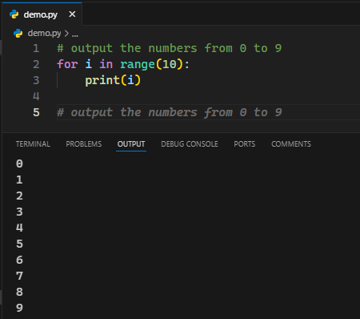
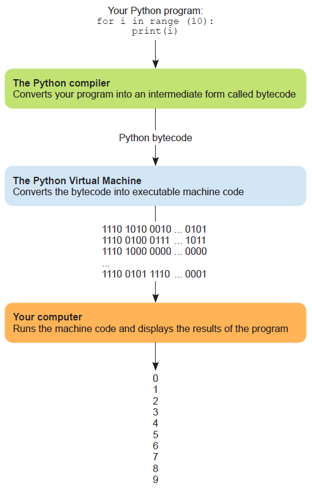
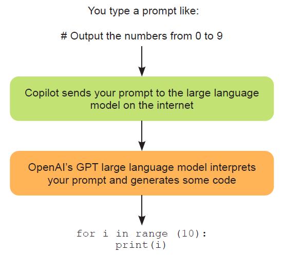

# Ch01: Introducing AI-assisted programming with GitHub Copilot

> **本章概要**
>
> - AI 助手对新手程序员学习方式的改造
> - 编程同以往究竟有何不同
> - GitHub Copilot 等 AI 助手的工作原理
> - AI 辅助编程的潜在危害（perils）


## 1 人机交互模式的转变

以从 0 到 9 数数为例，最早的汇编语言实现如下：

```bash
section .text 
global _start 
_start: 
    mov ecx, 10 
    mov eax, '0' 
    l1: 
    mov [num], eax 
    mov eax, 4 
    mov ebx, 1 
    push ecx 
    mov ecx, num 
    mov edx, 1 
    int 0x80 
    mov eax, [num] 
    inc eax 
    pop ecx 
    loop l1 
    mov eax, 1 
    int 0x80 
section .bss 
    num resb 1
```

引入 AI 前的版本如下：

```python
for num in range(0, 9):
    print(num)
```

引入 AI 后的版本如下（只需一段提示词注释）：

```python
# Output the numbers from 0 to 9
```

回车后不到一秒，Copilot 就能自动生成相关代码：

```python
for i in range(10):
    print(i)
```

实测效果：



**图 1.1 用 GitHub Copilot 提示词（注释）实现从 0 到 9 数数**

可以看到，人机交互从本质上讲还无法实现完全用自然语言交流，还需要从当前的高级编程语言借道而行。至于原因也很简单——当前的计算机能力还不够强。


## 2 AI 助手底层技术简介

上述 AI 辅助编程的处理流程如下图 1.2 所示：



**图 1.2 从 0 到 9 数数的后台处理流程示意图**

从上图可知，一个简单的数数小程序还是走了很多 “弯路” 的：人们真正想要的是输入一段自然语言，直接打印出 0 到 9 这 10 个数。然而事实上整个流程却多了至少三个环节：先得到 Python 代码，再从编译器转为字节码，最后交给虚拟机生成可运行的二进制机器码。

为什么不能绕开这些中间环节呢？因为 AI 助手的本质是一个概率模型，当前的应答能力还无法通过一句模糊的自然语言描述直接生成符合预期的机器码（即便生成出来大家也看不懂）。对于 AI 生成的代码，目前也只有我们自己知道该代码是否符合我们的真实意图，所以只能先给出 Python 代码让人确认；等确定是提问者本意后再进行下一步，如图 1.2 所示：



**图 1.3 从提示词到 Copilot 大模型生成代码的中间过程示意图**

或许随着 AI 大模型的飞速发展，没准真的会有完全用自然语言实现所有编程工作的那一天。但就目前的能力水平来看，这一天的到来还十分遥远。


## 3 AI 对传统编程方式的颠覆

以前：先花大量时间研究编程语言（Python）的基础语法和数据结构，然后再花数周到数月时间从头到尾练习敲代码，最后在大量实践的基础上精进自己的编程水平。

现在：基本概念还是得了解，但出发点不再是为了自己写代码，而是为了更好地明白 AI 生成的代码逻辑。通过提示词与 AI 高效交互，让人们有更多精力去关注更有意思的方面，快速写出更大规模的软件产品。

可以说，AI 助手从根本上改变了学习编程需要的技能版图。


## 4 AI 代码助手的主要用途

以 Copilot 为例，除了通过对话得到对应的代码片段，诸如此类的 AI 代码助手主要还有以下用途：

1. 代码解释：让曾经艰涩难懂的项目源码变得通俗易懂。
2. 重构代码：同一个功能点通常有多种实现方案，越通俗易懂的方案越有利于后期维护。
3. 修复 Bug：旨在大幅减少代码 Bug 的查找与调试所耗费的时间和精力。
4. 解释报错：针对运行过程中的报错信息，快速给出应对措施。
5. 查找现成的模块和依赖：如数据分析、游戏开发、图像处理方向的现成的第三方库等。


## 5 使用 Copilot 的风险与挑战

主要问题如下：

1. 代码确权难题：Copilot 基于 GitHub 开源代码进行训练，虽然当前并没有直接证据大段引用他人代码，但这种风险始终是存在的。如果引用的代码对应不同的开源许可，生成的代码就存在确权和归属问题。目前还没有公认合理的解决方案。需要谨慎应对。
2. 对教育的冲击：根据 2022 年发表在 `arXiv` 上的 [一篇论文](https://arxiv.org/abs/2210.15157)，Copilot 在对 166 个常见编程任务的处理过程中表现出色，最终通过率能达到 80%。业界对大模型的态度也褒贬不一，系统评估 LLM 对计算机教育的影响为时尚早，但已带来显著冲击。
3. 代码质量不一：Copilot 生成的代码并不完美，涉及敏感信息和核心安全的代码需要慎之又慎，
4. 代码安全问题：Copilot 生成的代码无法确保代码安全，仍然需要严格的安全审核。
5. AI 并非真正的专家：真正的专家知道自己的能力边界，并且知道如何拓宽这一边界；而 AI 目前还不具备这样的能力，有时甚至会胡编乱造。因此 AI 助手的工作仍然离不开人类的监督。
6. 结果存在偏差：由于预训练的本质特征，AI 生成的内容将复现训练过程中的类似偏差。例如让其生成一个人名清单，大概率会得到一组英文名，因为训练使用的语料库绝大部分是基于英文的数据；同理，生成的代码也会存在特定偏差。这将进一步加剧计算机科学和软件工程多样性的缺失。但 Copilot 或可通过降低编程门槛来提高多样性，具体措施还有点研究。


## 6 AI 时代需要的编程技能

- 代码调试能力：Copilot 给出的代码可能语法正确，但效果未必符合预期，需要及时纠正；
- 精确描述问题的能力；笼统描述得到笼统回复；精确描述得到精确回复。AI 遇强则强的特性屡试不爽。
- 问题拆解能力：能否将一个大而笼统的任务拆解成一系列小而可行的任务，将成为与 AI 高效交互的关键；
- 代码测试能力：尤其是 AI 语境下的全新测试能力是今后构建高质量代码的核心。
- 提示词相关的能力：目前只能依靠提问者的精确对抗 AI 助手的不精确。提示词工程是 AI 时代精确指导工作的又一全新能力。


## 7 回应社会各界对 AI 的担忧

> **问：有了 Copilot 这样的 AI 工具，技术和编程相关的工作岗位会越来越少吗？**
> 答：大概率不会。Copilot 目前只擅长处理初级编程任务，但并不代表这些工作会全部让位于 AI 工具而消失；只是今后的程序员会利用越来越先进的 AI 工具来完成包括初级编程在内的更多工作，AI 转变的其实是这些技术岗位的工作性质。

> **问：Copilot 会扼杀人类的创造力吗？它是否只会重复利用人类写好的代码，从而制约新创意的诞生？**
> 答：应该不会。Copilot 可以帮助人们在更高的抽象层次上完成工作，进一步脱离底层机器码、汇编语言和像 Python 这样的高级编程语言的束缚。计算机领域常用 **抽象（abstraction）** 这一概念来表征人类可以摆脱计算机底层细节的程度。抽象层次的提高并没有限制人的创造力，反而让人可以忽略已经解决的问题，聚焦更普遍、更宽泛的问题。事实上正因为高级编程语言的诞生，很多优质且功能强大的软件才得以问世，例如谷歌搜索、电商购物平台、甚至是 MacOS 这样的操作系统都是其中的典型代表。

> **问：经常听闻 ChatGPT 这个词，它究竟是什么？和 Copilot 一样吗？**
> 答：ChatGPT 与 Copilot 不同，只是基于相同的底层技术。相比 Copilot，ChatGPT 的应用范围更广，例如智能问答、论文撰写、甚至用来拿沃顿商学院 MBA 学位。它的极端通用性也引起了教育、金融、医疗保健、出版等行业的震动。目前业内外充斥着各种炒作的声音，真假难辨。没人知道 ChatGPT 给人类文明带来长期影响究竟是什么，但我们需要以更理性和长远的视角看待技术发展，避免被短期的情绪或预测所左右，同时为可能的长期变革做好准备。正如著名的 **阿马拉定律（Amara’s Law）** 所言：
>
> > *We tend to overestimate the effect of a technology in the short run and underestimate the effect in the long run.*
> > 人们往往会高估某项技术的短期影响，而低估其长期影响。


## 本章小结

- Copilot 是一个 AI 人工智能助手，一个能帮助你完成工作的智能体（AI agent）。
- Copilot 改变了人机交互模式，以及人们以往的编程方式。
- Copilot 改写了人们需要重点磨练的技能（更少关注语法，更多聚焦问题的分解和测试）。
- Copilot 是不确定的；生成的代码有时正确，有时错误，需要人们时刻保持警惕。
- 代码版权、教育和职业培训以及 Copilot 结果中的偏见等问题仍待解决。
