# Ch02: Getting started with Copilot


> **本章概要**
>
> - 本地环境搭建
> - Copilot 工作流
> - 理解 Copilot 在数据处理任务中的价值

---


## 1 本地环境搭建

配合本书内容的基础环境只需要三个工具：

1. `Python`：只要是 Python3 就行（安装地址：`https://www.python.org/downloads/`）；
2. `VSCode`：与 Copilot 集成良好，且对编程入门者友好（安装地址：`https://code.visualstudio.com/download`）；
3. `GitHub Copilot`：一个有效的 `GitHub` 帐号即可。`Copilot` 对新用户有 30 天试用期，之后按 \$10/月或 \$100/年收费。

另外，为了方便调试，还要在 `VSCode` 安装以下扩展插件（extensions）：

1. `GitHub Copilot`：`Copilot` 官方插件。
2. `GitHub Copilot Chat`：安装最新版 VSCode 会自动安装的第三方插件，方便打开聊天窗口。
3. `Python`（by Microsoft）：其实可以一键安装 `Python Extension Pack`，里面包含该插件在内的常用扩展工具。

截图如下：


**图 2.1 VSCode 的 Python 扩展包，包含 7 个常用扩展工具**

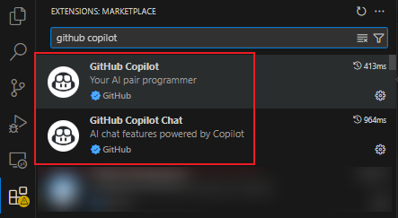

**图 2.2 与 Copilot 相关的第三方扩展工具**


## 2 手动运行代码

先用 `VSCode` 打开桌面上的一个空文件夹（例如 `ai-demo`），然后用刚才装好的 `Python` 扩展新建一个虚拟环境：

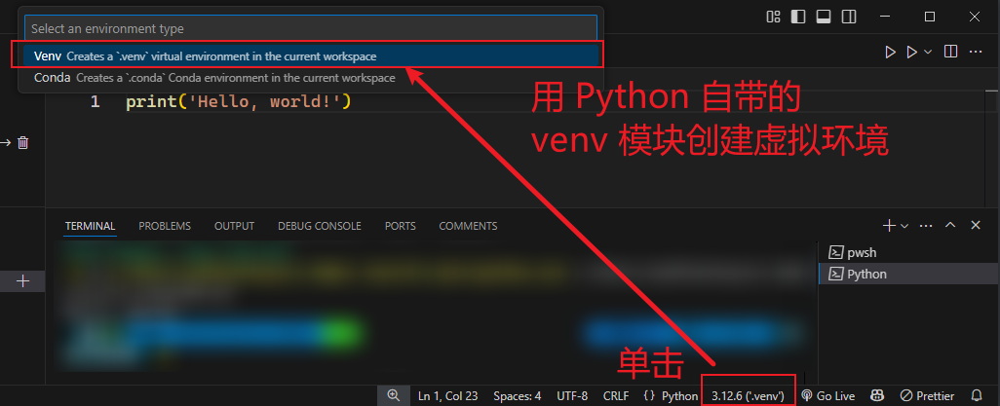

**图 2.3 用 Python 自带的 venv 模块在 VSCode 界面操作下创建虚拟环境**

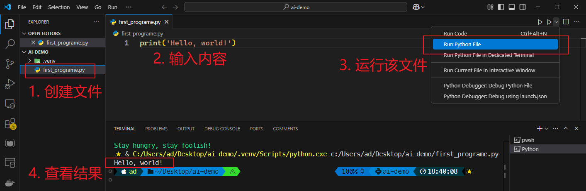

**图 2.4 手动创建第一个测试文件并通过 Python 扩展工具运行的实测效果图**


## 3 检查 Copilot 是否就绪

清空刚才的代码内容，重新输入以下注释内容后回车：

```python
# output "Hello Copilot" to the screen
```

如果看到下面的自动提示内容，则表明 Copilot 配置成功：

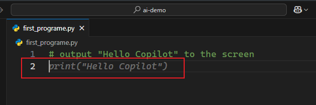

**2.5 Copilot 配置成功后根据 Python 注释自动生成的提示内容**

此时按 <kbd>Tab</kbd> 键正式写入相关代码：

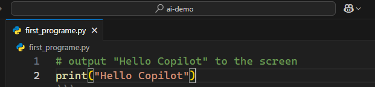

**图 2.6 按 Tab 键后自动录入 Copilot 提示代码**

再举一个计算正方形面积的例子。输入以下内容后回车：

```python
side = 5
area = side * side
# Print the side length is *** and the area is ***
```

`Copilot` 会根据注释中的提示词自动填空，最终生成语法正确的代码：

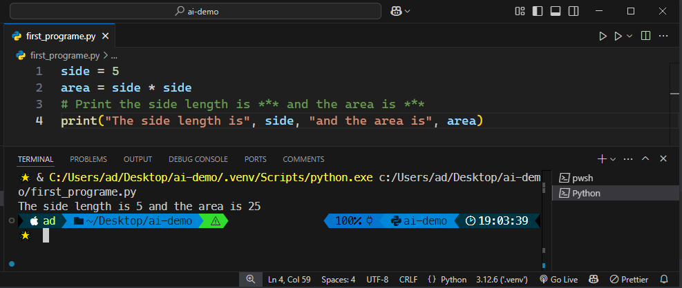

**图 2.7 实测 Copilot 自动填充占位符并生成相关代码的截图**


## 4 Copilot 常见问题排查清单

问题1：回车后继续保持注释状态

解决方法有四：

1. 再多按一次回车换行；
2. 输入提示的前两个字符（迫使 `Copilot` 按正常代码处理）；
3. 将 `#` 标记改写为文档字符串（即 `"""`，推荐）；
4. 按 `Ctrl-Enter` 查看相关建议。


问题2：代码提示有误

常见解决方法如下：

1. 修改提示词，重新生成代码；
2. 按 `Ctrl-Enter` 查看其他提示结果；
3. 清除 `Copilot` 缓存：关闭 `VSCode`，稍等片刻后重启，再重新生成代码；
4. 将问题拆解为更小的步骤（第 7 章详述）；
5. 直接调试代码；
6. 求助其他 AI 工具（如 `ChatGPT`、`DeepSeek` 等）。


问题3：输入回车后生成一句新注释：`# YOUR CODE HERE`（在此处输入你的代码）

解决方案：这是 `Copilot` 早期容易见到的问题，可能在让 `Copilot` 解决一个类似课堂练习的问题时出现。最新的版本几乎很少出现这种状况。解决办法也很简单，通过 `Ctrl-Enter` 选择其他版本的提示内容即可。


问题4：代码依赖模块缺失

解决方案：用提示词让 `Copilot` 补齐所需依赖即可。


> [!tip]
>
> **DIY补充：切换 Copilot 的底层模型**
>
> 在 VSCode 中输入组合键 <kbd>Ctrl</kbd> + <kbd>I</kbd>（小写即可），会弹出一个用于提问的临时对话框。此时点击右边的下拉图标，即可切换不同的底层 LLM 大语言模型：
>
> 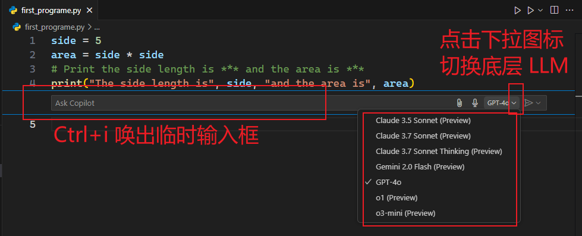
>
> **图 2.8 利用临时对话框切换 Copilot 底层模型的实测截图**


## 5 Copilot 的基本工作流程

全书遵循的 `Copilot` 基本工作流程如下：

1. 用注释标记 `#` 或文档字符串 `"""` 录入提示词；
2. 让 `Copilot` 根据提示词生成相应回复；
3. 通读并测试回复内容，确保代码符合预期；
   1. 检查无误，则转到第 1 步，完成下一步操作；
   2. 检查有误，则先删除回复内容，再返回第 1 步，修改提示词重新生成。


## 6 实例验证 Copilot 提示的不确定性

本节通过一个简单的数据分析案例来验证 `Copilot` 固有的不确定性。

先从 [kaggle](https://www.kaggle.com/datasets/dtrade84/nfl-offensive-stats-2019-2022?resource=download) 下载测试数据集（2019 - 2022 年度美国橄榄球联盟攻防统计数据），格式为 `CSV` 文件：

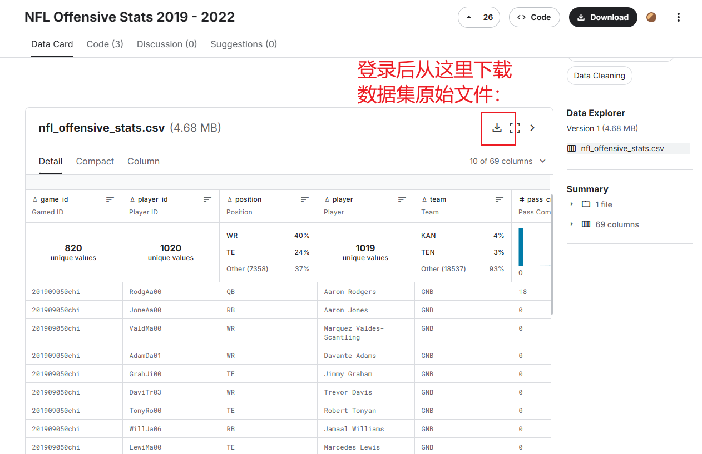

**图 2.9 从 Kaggle 官网下载测试数据集（CSV 格式文件）**

需求其实很简单，就是对数据集中的指定站位（四分卫 `QB`）进行分类汇总，看看每名队员的传球总距离是多少，最后按倒序输出结果。

### 6.1 原始对照组

先将数据集文件 `nfl_offensive_stats.csv` 复制到当前工作目录下，然后按书中给出的如下回复内容运行一遍代码作为参照组：

```python
"""
open the csv file called "nfl_offensive_stats.csv" and    
read in the csv data from the file                        
"""                                                       

# import the csv module
import csv

# open the csv file
with open('nfl_offensive_stats.csv', 'r') as f:
    # read the csv data
    data = list(csv.reader(f))

"""
the 3rd column in data is player position, the fourth
column is the player, and the 8th column is the
passing yards. For each player whose position in
column 3 is "QB", determine the sum of yards from
column 8
"""

# create a dictionary to hold the player name and passing yards
passing_yards = {}
# loop through the data
for row in data:
    # check if the player is a quarterback
    if row[2] == 'QB':
        # check if the player is already in the dictionary
        if row[3] in passing_yards:
            # add the passing yards to the existing value
            passing_yards[row[3]] += int(row[7])
        else:
            # add the player to the dictionary
            passing_yards[row[3]] = int(row[7])

"""
print the sum of the passing yards sorted by sum
of passing yards in descending order
"""
for player in sorted(passing_yards, key=passing_yards.get, reverse=True):
    print(player, passing_yards[player])
```

运行结果如下：

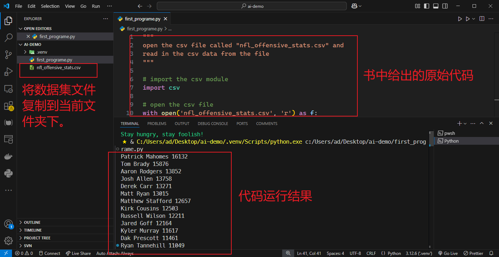

**图 2.10 按照书中给出的完整提示代码得到的运行结果**


### 6.2 基于 o3-mini 大模型的第一版实测

接着，删除原始代码，将全过程需要的三段提示词合在一起（第 1 至 5 行 [^1]），底层调用 `o3-mini` 模型，得到如下结果：

```python
"""
1. open the csv file called "nfl_offensive_stats.csv" and read in the csv data from the file
2. the 3rd column in data is player position, the fourth column is the player, and the 8th column is the passing yards. For each player whose position in column 3 is "QB", determine the sum of yards from column 8
3. print the sum of the passing yards sorted by sum of passing yards in descending order
"""

import csv

# open the csv file called "nfl_offensive_stats.csv" and read in the csv data from the file
with open("nfl_offensive_stats.csv", "r") as file:
    reader = csv.reader(file)
    data = list(reader)
    
# the 3rd column in data is player position, the fourth column is the player, and the 8th column is the passing yards. For each player whose position in column 3 is "QB", determine the sum of yards from column 8
qb_passing_yards = {}
for row in data[1:]:
    if row[2] == "QB":
        if row[3] in qb_passing_yards:
            qb_passing_yards[row[3]] += int(row[7])
        else:
            qb_passing_yards[row[3]] = int(row[7])
            
# print the sum of the passing yards sorted by sum of passing yards in descending order
sorted_qb_passing_yards = sorted(qb_passing_yards.items(), key=lambda x: x[1], reverse=True)
for player, yards in sorted_qb_passing_yards:
    print(f"{player}: {yards}")

```

运行结果：

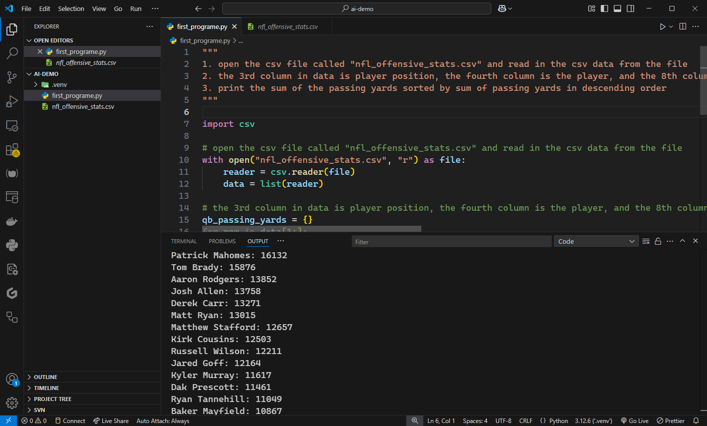

**图 2.11 组合三个提示词后利用 o3-mini 模型生成的提示代码与运行结果截图**


### 6.3 基于【Ctrl + I】临时对话框的第二版实测

如果通过 <kbd>Ctrl</kbd> + <kbd>I</kbd> 产生的临时对话框分别输三次提示词，最后得到的结果如下（效果和合并后的 `docstring` 版本类似）：

```python
import csv

with open("nfl_offensive_stats.csv", mode="r", newline="") as file:
    csv_reader = csv.reader(file)
    qb_yards = {}
    # Skip header row if there is one
    # next(csv_reader)

    for row in csv_reader:
        if row[2] == "QB":
            player = row[3]
            try:
                yards = float(row[7])
            except ValueError:
                yards = 0.0
            qb_yards[player] = qb_yards.get(player, 0) + yards 
        
    sorted_qb_yards = sorted(qb_yards.items(), key=lambda item: item[1], reverse=True)
    for player, total_yards in sorted_qb_yards:
        print(f"{player}: {total_yards}")
```


### 6.4 基于 docstring 文档字符串的第三版实测

但是，如果完全按前后三个 `docstring` 的方式输入提示词，得到的结果差别较大：

```python
"""
open the csv file called "nfl_offsensive_stats.csv" and 
read in the csv data from the file
"""
import csv

# open the csv file
with open("nfl_offensive_stats.csv") as csvfile:
    # read in the csv data from the file
    nfl_data = csv.reader(csvfile)
    # print the data to the console
    for row in nfl_data:
        print(row)
        
"""
the 3rd column in data is player position, the fourth
column is player, and the 8th column is the passing yards.
For each player whose position in column 3 is 'QB', determine
the sum of yards from column 8.
"""
# open the csv file
with open("nfl_offensive_stats.csv") as csvfile:
    # read in the csv data from the file
    nfl_data = csv.reader(csvfile)
    # initialize the sum of passing yards
    sum_passing_yards = 0
    # iterate through the data
    for row in nfl_data:
        # check if the player position is 'QB'
        if row[2] == 'QB':
            # add the passing yards to the sum
            sum_passing_yards += int(row[7])
    # print the sum of passing yards
    print(sum_passing_yards)
    
    
"""
print the sum of the passing yards sorted by sum of 
passing yards in descending order
"""
# open the csv file
with open("nfl_offensive_stats.csv") as csvfile:
    # read in the csv data from the file
    nfl_data = csv.reader(csvfile)
    # initialize the sum of passing yards
    sum_passing_yards = 0
    # create a dictionary to store the sum of passing yards
    passing_yards = {}
    # iterate through the data
    for row in nfl_data:
        # check if the player position is 'QB'
        if row[2] == 'QB':
            # add the passing yards to the sum
            sum_passing_yards = passing_yards.get(row[3], 0)
            sum_passing_yards += int(row[7])
            passing_yards[row[3]] = sum_passing_yards
    # sort the dictionary by the sum of passing yards
    sorted_passing_yards = sorted(passing_yards.items(), key=lambda x: x[1], reverse=True)
    # print the sorted dictionary
    print(sorted_passing_yards)
```

只运行最后一段代码，结果虽然和前两个一致，但输出格式明显不同了：

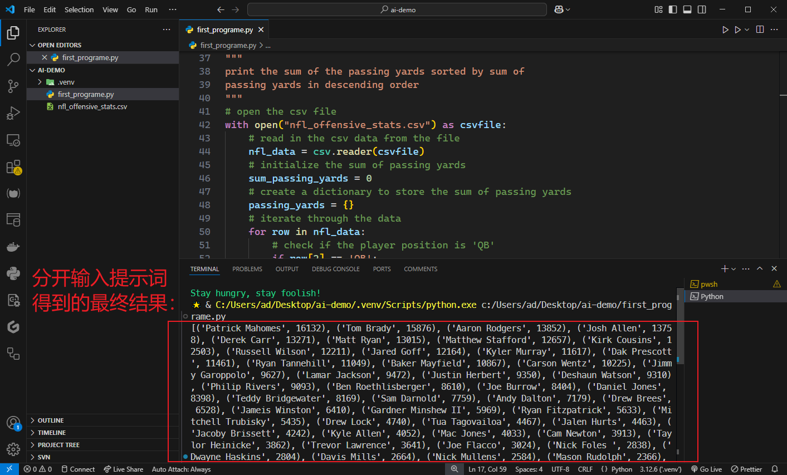

**图 2.12 分开输入提示词得到的回复内容以及运行结果（格式完全不同前两版）**


### 6.5 实测需求变更后的 Copilot 相应情况

如果倒序输出结果时想屏蔽掉某个队员的数据（例如 `Tom Brady`），则需要对上述代码引入一段新提示词，并在指定位置进行修改：

```python
# open the csv file
with open("nfl_offensive_stats.csv") as csvfile:
    # read in the csv data from the file
    nfl_data = csv.reader(csvfile)
    # initialize the sum of passing yards
    sum_passing_yards = 0
    # create a dictionary to store the sum of passing yards
    passing_yards = {}
    # iterate through the data
    for row in nfl_data:
        # check if the player position is 'QB'
        if row[2] == 'QB':
            # add the passing yards to the sum
            sum_passing_yards = passing_yards.get(row[3], 0)
            sum_passing_yards += int(row[7])
            passing_yards[row[3]] = sum_passing_yards
    """
    print the sum of the passing yards sorted by sum
    of passing yards in descending order 
    Do not include Tom Brady because he wins too much
    """
    # sort the passing yards in descending order
    sorted_passing_yards = sorted(passing_yards.items(), key=lambda x: x[1], reverse=True)
    # print the sorted passing yards
    for player, yards in sorted_passing_yards:
        if player != 'Tom Brady':
            print(player, yards)
            
```

运行结果如下（符合预期）：

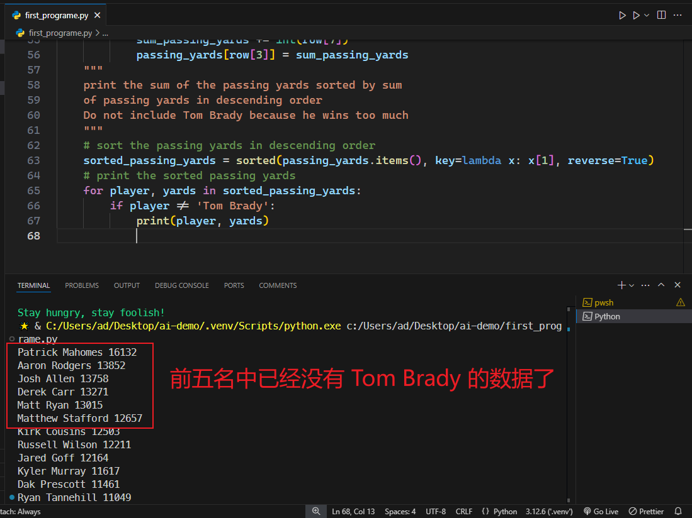

**图 2.13 人为筛除某名队员的数据后得到的实测结果（符合预期）**


## 本章小结

本章介绍了学习 `Copilot` 辅助编程的本地环境搭建方法，并给出了全书遵循的 `Copilot` 基本工作流程，最后通过一个简单的数据分析案例验证了 `Copilot` 提示内容的不确定性。由于该案例的参考代码并未展开讲解，这里也只列出本地实测结果。

综上也可以得出以下认知：

1. Copilot 功能十分强大：提问者无需手写代码也能解决实际问题；
2. 问题的拆解十分关键：小巧而明确的问题描述总是优于大而笼统的提示词；
3. 提问者仍需要对代码语法有一定了解：否则变更需求时新增代码不知道放哪儿；
4. 代码测试环节非常重要：因为 Copilot 的不确定性，完全相同的提示词生成的代码可能千差万别；
5. Python 的功能同样强大：主要体现在各种现成的模块，无需重复造轮子。
