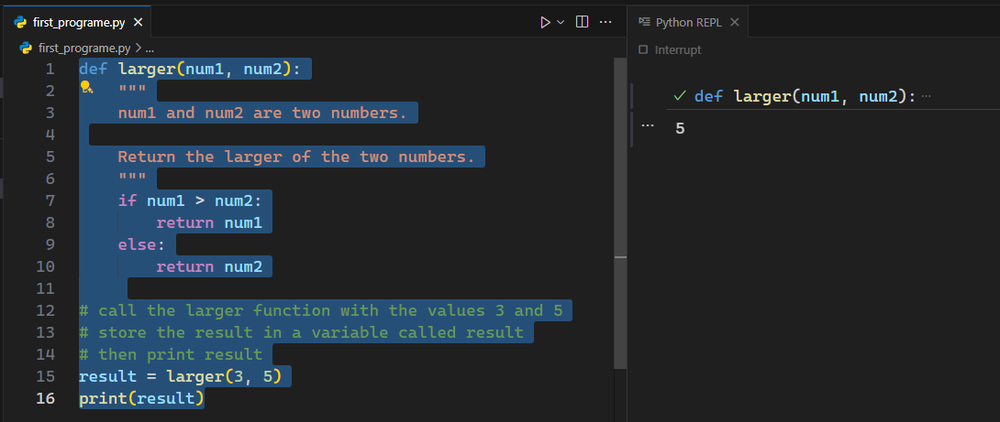
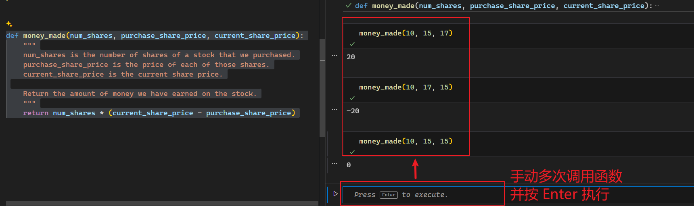
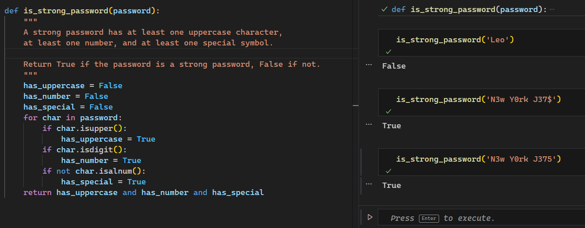
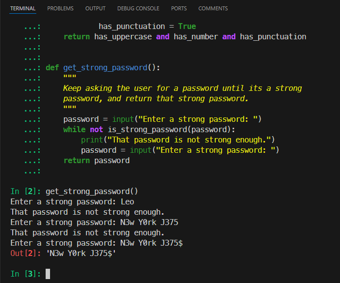
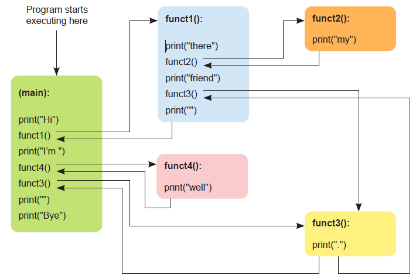

# Ch03: Designing functions


> **本章概要**
>
> - Python 函数的概念及其在软件设计中的作用
> - 用 Copilot 设计函数的标准工作流
> - 用 Copilot 编写优质函数的几个案例
> - Copilot 要解决的合理化任务的相关概念

---

本章从 Python 函数切入，进一步介绍了 Copilot 提示词的写法，内容组织上也对上一版做了较大调整。由于内容过于基础，本篇仅梳理要点，不全面展开。


## 1 Copilot 提效的关键

即确定交给 Copilot 的任务是 **合理的**（`reasonable`）。

具体方法：利用 **函数** 将复杂问题分解为若干个简单可行的小任务。这样的函数应至少具备两个特点：

1. 每个函数只完成一个任务；
2. 函数的内部逻辑容易理解。

由于本书的重点在于 Copilot 辅助编程，因此没有直接介绍 Python 的函数语法，而是通过几个小案例进一步演示 Copilot 的用法。


### 1.1 找单词游戏

从下列字符中找出指定的单词：


**图 3.1 示例一：找单词游戏**

目标单词有：`CAT`、`DOG`、`FUNCTION`、`HELLO`、`TASK`。

总思路：将原问题按行、列进行分解，同时配合检索顺序（从左至右？还是从上到下？）将复杂问题进行合理的分解。


### 1.2 返回两个数中的较大值

沿用 `#` 注释的旧方案提示词（前三行）：

```python
# write a function that returns the larger of two numbers
# input is two numbers
# output is the larger of the two numbers
def larger(num1, num2):
    if num1 > num2:
        return num1
    else:
        return num2
```

在 Copilot 给出的函数完整定义中——

- 第 4 行定义了函数名 `larger` 和所需的两个参数 `num1`、`num2`；
- 第 5 至 8 行为 **函数体**（function body）

如果一个函数因为实现的任务过多而难以快速命名，通常是设计过于复杂的信号。

为避免 Copilot 在按回车后继续提示注释内容，推荐使用 Python 的文档字符串（`docstring`）作提示词，改为如下版本（前 6 行）：

```python
def larger(num1, num2): 
    """
    num1 and num2 are two numbers.

    Return the larger of the two numbers.
    """
    if num1 > num2:
        return num1
    else:
        return num2
```

可以看到，新版提示词需要手写第一行的函数签名（即自行确定函数名、参数列表、以及各参数名称），然后在文档字符串中对该签名作进一步说明：

1. 先描述各参数的类型、含义；
2. 再确定函数返回的内容。

至于生成的函数体是否正确，可以用另一段提示词让 Copilot 生成测试代码（前三行）：

```python
# call the larger function with the values 3 and 5
# store the result in a variable called result
# then print result
result = larger(3, 5)
print(result)
```

这里就不用刻意使用 `docstring` 了。选中所有代码，按 <kbd>Shift</kbd> + <kbd>Enter</kbd> 快速执行代码：



**图 3.2 改为函数签名 + docstring 提示词后的 larger 函数实测情况**


## 2 用 Copilot 设计函数的标准工作流

如图所示：


**图 3.3 用 Copilot 设计函数的标准工作流**

写成文字版就是——

1. 确定函数的预期行为；
2. 根据需求写出提示词，尽可能清晰描述该函数具备的功能；
3. 让 Copilot 根据提示词生成代码；
4. 通读代码确保逻辑合理；
5. 测试代码——
   1. 多次测试后均正确，则转到下一步；
   2. 若测试报错，则返回步骤 2，修改提示词重走流程。


### 2.1 演示一：股票盈利函数

需求：根据持股数、买入价格、当前价格计算股票盈利情况。

函数签名 + 提示词（最后一行除外）：

```python
def money_made(num_shares, purchase_share_price, current_share_price):
    """
    num_shares is the number of shares of a stock that we purchased.
    purchase_share_price is the price of each of those shares.
    current_share_price is the current share price.

    Return the amount of money we have earned on the stock.
    """
    return num_shares * (current_share_price - purchase_share_price)
```

实测情况：



**图 3.4 股票盈利函数实测截图（含手动测试情况）**


### 2.2 演示二：密码强弱判定

需求：判定一个密码的强弱，只要不是 `password` 或 `qwerty` 就视为强密码。

函数签名 + 提示词（前 7 行）：

```python
def is_strong_password(password):
    """
    A strong password is not the word 'password'
    and is not the word 'qwerty'.

    Return True if the password is a strong password, False if not.
    """
    return password != 'password' and password != 'qwerty'
```


升级版需求：所谓强密码，是指：至少有一个大写字符、且至少有一个数字、且至少包含一个特殊符号。

升级版提示词：

```python
def is_strong_password(password):
    """
    A strong password has at least one uppercase character,
    at least one number, and at least one special symbol.
 
    Return True if the password is a strong password, False if not.
    """
    has_uppercase = False
    has_number = False
    has_special = False
    for char in password:
        if char.isupper():
            has_uppercase = True
        if char.isdigit():
            has_number = True
        if not char.isalnum():
            has_special = True
    return has_uppercase and has_number and has_special
```

实测情况：



**图 3.5 新版强密码判定函数实测情况**

这里的代码比原书可读性更强，但依旧没能正确理解 **特殊字符** 的含义，需要进一步明确：

```python
def is_strong_password(password):
    """
    A strong password has at least one uppercase character,
    at least one number, and at least one punctuation.
 
    Return True if the password is a strong password, False if not.
    """
    has_uppercase = False
    has_number = False
    has_punctuation = False
    for char in password:
        if char.isupper():
            has_uppercase = True
        elif char.isdigit():
            has_number = True
        elif char in "!@#$%^&*()_+-=[]{}|;:,.<>?":
            has_punctuation = True
    return has_uppercase and has_number and has_punctuation
```

这次，Copilot 没有使用书中的 `string` 模块，而是直接给出了标点符号序列，勉强算是一次改进吧。

此时再进一步，要求用户反复输入一个密码，直到该密码为强密码才终止（同时输出该密码）。提示词就可以写成下面的形式（前五行）：

```python
def get_strong_password():
    """
    Keep asking the user for a password until it’s a strong 
    password, and return that strong password.
    """
    password = input("Enter a strong password: ")
    while not is_strong_password(password):
        print("That password is not strong enough.")
        password = input("Enter a strong password: ")
    return password
```

在 `ipython` 交互式命令行中进行测试：



**图 3.6 实测循环输入测试密码在 ipython 交互式命令行的运行情况**


### 2.3 演示三：拼字游戏得分统计

需求：给定一个单词，根据每个字母的分值计算总得分。

提示词（L1 ~ L14）：

```python
def num_points(word): 
    """ 
    Each letter is worth the following points: 
    a, e, i, o, u, l, n, s, t, r: 1 point 
    d, g: 2 points 
    b, c, m, p: 3 points 
    f, h, v, w, y: 4 points 
    k: 5 points 
    j, x: 8 points 
    q, z: 10 points 

    word is a word consisting of lowercase characters. 
    Return the sum of points for each letter in word. 
    """
    points = 0
    for letter in word:
        if letter in "aeioulnstr":
            points += 1
        elif letter in "dg":
            points += 2
        elif letter in "bcmp":
            points += 3
        elif letter in "fhvwy":
            points += 4
        elif letter == "k":
            points += 5
        elif letter in "jx":
            points += 8
        elif letter in "qz":
            points += 10
    return points
```

测试无误后，就可以据此创建一个函数，用来选出一组单词中分值最高的那个单词：

```python
def best_word(word_list):
    """
    word_list is a list of words.
    
    Return the word worth the most points.
    """
    best_word = ""
    best_points = 0
    for word in word_list:
        points = num_points(word)
        if points > best_points:
            best_word = word
            best_points = points
    return best_word
```


## 3 引入函数的好处

主要好处有——

1. 减轻认知负担；
2. 避免冗余和重复；
3. 改进测试：复杂任务经过合理的函数拆分更容易测试；
4. 提高代码可靠性；
5. 提高代码可读性。

关于第四条与第五条，看似相似却完全是两个维度。可靠性是只代码不出错的概率，和健壮性相关。

书中还提到一个很反直觉的事实：如果每行代码的平均正确率高达 95%，连续写上 14 行从概率上讲也会有至少一行代码出错！（`N_min > ln0.5/ln0.95 ≈ 13.51`）。

可读性则主要从后期维护的角度而言的，无论是 AI 生成的代码还是开发者手写的代码，引入优质函数均能显著提高代码的可读性。


## 4 函数的职能

书中举了一个例子：

```python
def funct1():
    print("there")
    funct2()
    print("friend")
    funct3()
    print("")

def funct2():
    print("my")

def funct3():
    print(".")

def funct4():
    print("well")
print("Hi")      # 函数的起点，类似其他编程语言中的 main 函数
funct1()
print("I'm")
funct4()
funct3()
print("")
print("Bye.")
```

可以结合下图进行理解：



**图 3.7 示例：函数的不同职能示意图**

本例中的函数具体职能包括：

1. 调度（或调用）其他子函数，实现更高层面的抽象（`funct1`）
2. 提高代码复用性（`funct3`）
3. 封装部分底层逻辑（`funct2`、`funct4`）


> [!tip]
>
> **辅助函数 vs 叶子函数**
>
> **辅助函数（helper function）**：只要是分担另一个函数的工作，减轻其压力的函数都可视为辅助函数。最好的辅助函数，必定是定义明确、完成子任务又好又快的函数（例如上面演示二和演示三中的辅助函数）。
>
> **叶子函数（leaf function）**：无需调用其他函数的独立函数（调用 Python 内置函数除外）。


## 5 函数设计的合理性问题

想要合理设计函数，需要明确优质函数的基本特征：

1. 任务明确；
2. 预期行为清晰无误；
3. 代码行数不多：通常 12 至 20 行不等；
4. 通用性优于特殊性；
5. 输入与输出清晰明了。


## 本章小结

- 问题的分解就是将大而笼统的复杂问题分解为多个小而容易的子任务。
- 问题分解的具体做法是在程序中引入函数的概念。
- 每个函数都必须解决一个定义明确的小任务。
- 函数抬头（header）或签名即函数的第一行代码。
- 函数参数（parameters）用于向函数提供信息。
- 函数抬头包含函数名称及其参数名称。
- Python 函数使用 `return` 语句将值从函数传回其调用方。
- 文档字符串 `docstring` 需要用到每个函数参数的名称来描述函数的用途。
- 要让 Copilot 生成函数体，我们来提供函数抬头与文档字符串。
- 要测试某个函数的正确性，需要通过不同类型的输入来调用该函数。
- 变量即某个值的名称。
- 每个 Python 值都有一个数据类型，如数字型、文本（字符串）型、`True` / `False` 布尔值，或者值的集合（列表、字典等）。
- 提示词工程可以理解为对 Copilot 提示词的修改，使其影响最终生成的结果代码。
- 必要时，需要检查代码导入了所需的任何模块（例如 `string` 字符串模块）。
- 函数可用于减少代码冗余，令代码更易于测试，降低出错的可能性。
- 单元测试是指检查函数是否对各种不同类型的输入都能执行人们期望的操作。
- 辅助函数是一个更轻量的子函数，可用于更轻松地构建更复杂的函数。
- 叶子函数是不调用任何其他函数、能独立完成其工作任务的函数。
