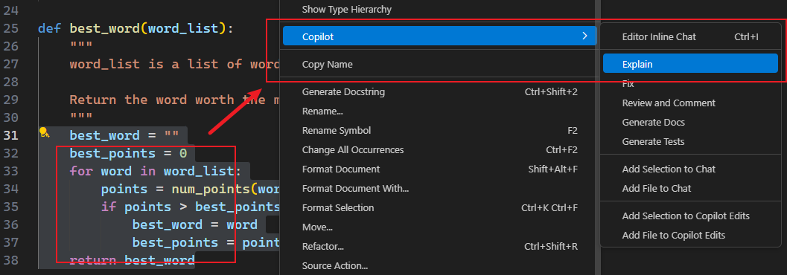
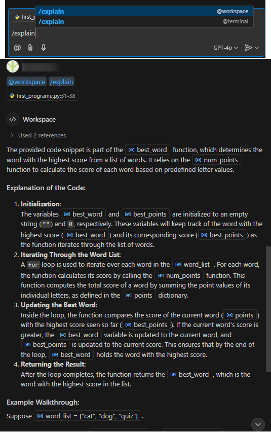

# Ch04: Reading Python code: Part 1

> **本章概要**
>
> - 为什么理解代码很重要
> - 让 `Copilot` 解释代码
> - 用函数来分解大型问题
> - 使用变量来存值
> - 用 `if` 语句来做决策
> - 用字符串存储和操作文本
> - 用列表来收集和操作多个值


## 1 开宗明义：为什么要读懂代码

这里的 **懂** 分两个层面：

1. 知道每句代码的具体功能和作用；
2. 知道整段代码的目的。

和现实生活中一样，从基层提拔的干部往往更能胜任工作，`Copilot` 辅助编程更是如此。当提供的程序达不到预期时，与其一味去优化提示词工程直到 `Copilot` 纠正问题，还不如自己懂点代码，略加修改就能符合要求。

书中给出了读懂代码的三个好处：

1. 判定代码的准确性：预先排除存在问题的代码；
2. 提高测试效率：提高测试的针对性和有效性；
3. 提高 `AI` 辅助编程的水平：真正擅于利用 `Cursor` 等 AI 辅助编程工具的人，绝大部分是很懂代码的高级程序员，知道大模型提供的代码能干什么，还缺什么，应该怎么完善等。

正因如此，本书接下来的两章将重点介绍 `Python` 的核心语法，为后续 `Copilot` 工具的高级用法作铺垫。


## 2 让 Copilot 解释代码

主要有三种方式：

1. 借助右键菜单：选中代码后，从右键菜单选 `Copilot` :arrow_right: `explain`（如图 4.1 所示）；
2. 使用 `/explain` 指令：如图 4.2 所示；
3. 自行设计解释提示词：适用于需求较复杂、`Copilot` 不能完全理解你的意图的情况。



**图 4.1 利用 VSCode 右键菜单的 Copilot 解释功能**



**图 4.2 实测 Copilot 的 explain 指令解释所选代码段**


> [!tip]
>
> **关于 Copilot 可能出错的问题**
>
> 诚然 `Copilot` 并不完美，无法保证每一次给出的代码都是百分百正确的，但就算自己手动上网查找资料，也不能保证百分百正确。若实在信不过 `Copilot` 给出的回复内容，可以从不同角度多次提问，出错的概率相对更低。


## 3 Python 基本语法简介（上）

这部分内容非常浅显，主要分五个主题展开：

1. 函数
2. 变量
3. 条件语句
4. 字符串
5. 列表

这里仅梳理最关键的知识点。

函数的主要作用是拆解问题，每个函数执行特定的代码块，并将处理结果用 `return` 语句返回（通常由某个变量接收处理结果）。

除了自定义函数，`Python` 还提供了大量内置函数以及第三方库函数，其调用和传参方式和自定义函数一致。

在 `Python` 中一个等号代表赋值操作符，两个等号才表示相等。

`if` 语句用于处理逻辑分支，多种情况用 `if` 和用 `elif` 书写效果不尽相同：

- 多个 `if` 语句在 `Python` 中会依次执行，只要满足条件即可执行对应的代码块；
- 多个 `elif` 组合的语句只是一个独立的 `if` 语句，一旦满足前面某个条件，后续分支将不再执行。

`if` 分支语句和函数定义一样，都是通过代码缩进来标识代码块的，即便在 `REPL` 命令行环境也要确保缩进量的一致。

字符串（`String`）具有很多内置方法：

```python
>>> 'abc'.isupper()
False                   
>>> 'Abc'.isupper()
False                   
>>> 'ABC'.isupper()
True                    
>>> 'abc'.isdigit()
False
>>> '345bc'.isdigit()
False
>>> '345'.isdigit()
True
>>> 'abc6'.isalnum()
True
>>> 'abc def'.isalnum()
False
>>> 'abcdef#'.isalnum()
False
```

列表用于操作和管理一组具有某种具体含义和功能的值。列表中的元素值可通过索引（index，从 0 开始计数）来访问。

和字符串一样，列表也有很多内置方法：

```python
>>> books = ['The Invasion', 'The Encounter', 'The Message']
>>> books
['The Invasion', 'The Encounter', 'The Message']
>>> books.append('The Predator')
>>> books
['The Invasion', 'The Encounter', 'The Message', 'The Predator']
>>> books.reverse()
>>> books
['The Predator', 'The Message', 'The Encounter', 'The Invasion']
>>> books[0]
'The Predator'
>>> books[1]
'The Message'
>>> books[2]
'The Encounter'
>>> books[3]
'The Invasion'
>>> books[4]
Traceback (most recent call last):
  File "<stdin>", line 1, in <module>
IndexError: list index out of range
>>> books[-1]
'The Invasion'
>>> books[-2]
'The Encounter'
>>> books[1:3]
['The Message', 'The Encounter']
>>> books[:3]
['The Predator', 'The Message', 'The Encounter']
>>> books[1:]
['The Message', 'The Encounter', 'The Invasion']
>>> books
['The Predator', 'The Message', 'The Encounter', 'The Invasion']
>>> books[0] = 'The Android'
>>> books[0]
'The Android'
>>> books[1] = books[1].upper()
>>> books[1]
'THE MESSAGE'
>>> books
['The Android', 'THE MESSAGE', 'The Encounter', 'The Invasion']
```

但需要注意的是，列表的值是可变的（`mutable`），而字符串是不可变的（`immutable value`）：

```python
>>> title = 'The Invasion'
>>> title[0]
'T'
>>> title[1]
'h'
>>> title[-1]
'n'
>>> title[0] = 't'
Traceback (most recent call last):
  File "<stdin>", line 1, in <module>
TypeError: 'str' object does not support item assignment
```

