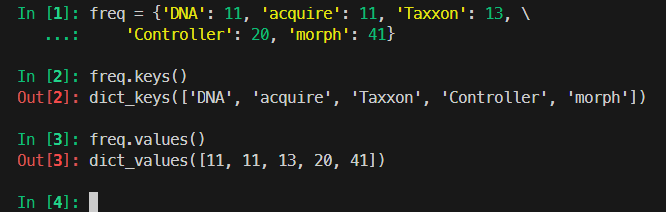

# Ch05: Reading Python code: Part 2


> **本章概要**
>
> - 用循环控制代码重复执行的次数
> - 用缩进组织 Python 代码
> - 建立字典来保存成对关联的值
> - 设置文件来读取和处理数据的方法
> - 用模块开辟新的工作领域

本章接上一章介绍的 Python 基础，主要从循环、缩进、字典、文件和模块五个方面进一步介绍了 Python 十大基础语法的后半部分。


## 1 循环

分类：

- `for` 循环：循环次数确定；
- `while` 循环：循环次数不确定；

### 1.1 for 循环

`for` 循环通过 `for-in` 结构运行，可作用于字符串：

```python
s = 'vacation'
for char in s:
    print('Next letter is', char)

Next letter is v
Next letter is a
Next letter is c
Next letter is a
Next letter is t
Next letter is i
Next letter is o
Next letter is n
```

也可以作用于列表：

```python
>>> lst = ['cat', 'dog', 'bird', 'fish']
>>> for animal in lst:
...     print('Got', animal)
...     print('Hello,', animal)
...
Got cat
Hello, cat
Got dog
Hello, dog
Got bird
Hello, bird
Got fish
Hello, fish
```

此外还能借助索引值遍历列表：

```python
>>> for index in range(0, len(lst)):
...     print('Got', lst[index])
...     print('Hello,', lst[index])
...
Got cat
Hello, cat
Got dog
Hello, dog
Got bird
Hello, bird
Got fish
Hello, fish
```

其中 `range(start, end)` 为 `Python` 内置方法，用于生成 `[start, end)` 区间内的索引值序列。`range(5)` 是 `range(0, 5)` 的简写形式。


### 1.2 while 循环

当循环次数不确定时，通常用 `while` 循环控制具体逻辑：

```python
def get_strong_password():
    """
    Keep asking the user for a password until it’s a strong password,
    and return that strong password.
    """
    password = input("Enter a strong password: ")
    while not is_strong_password(password):
        password = input("Enter a strong password: ")
    return password
```

其中的 `is_strong_password()` 函数是第三章演示过的密码强弱判定函数（根据最新版 `Copilot` 回复）：

```python
def is_strong_password(password):
    """
    A strong password has at least one uppercase character,
    at least one number, and at least one punctuation.
 
    Return True if the password is a strong password, False if not.
    """
    has_uppercase = False
    has_number = False
    has_punctuation = False
    for char in password:
        if char.isupper():
            has_uppercase = True
        elif char.isdigit():
            has_number = True
        elif char in "!@#$%^&*()_+-=[]{}|;:,.<>?":
            has_punctuation = True
    return has_uppercase and has_number and has_punctuation
```

只要输入的密码其强度不符合要求，程序就会一直循环，反复提示用户重新输入，直至读到一个强密码。

为防止 `while` 陷入死循环，也可以人为设置退出条件：

```python
lst = ['cat', 'dog', 'bird', 'fish'] 
index = 0
while index < len(lst):
    print('Got', lst[index])
    print('Hello,', lst[index])
    index += 1

# 运行结果
Got cat
Hello, cat
Got dog
Hello, dog
Got bird
Hello, bird
Got fish
Hello, fish
```


## 2 缩进

必须缩进的语法结构：

- `if` 语句
- 函数体
- 循环体

例如：

```python
hour = int(input('Please enter the current hour from 0 to 23: '))

if hour < 12:
    print('Good morning!')
    print('Have a nice day.')
elif hour < 18:
    print('Good afternoon!')
else:
    print('Good evening!')
	print('Have a good night.')
```

```python
def larger(num1, num2):
    if num1 > num2:
        return num1
    else:
        return num2
```

```python
lst = ['cat', 'dog', 'bird', 'fish'] 
index = 0
while index < len(lst):
    print('Got', lst[index])
    print('Hello,', lst[index])
    index += 1
```

上述结果通过相互嵌套，还能形成更复杂的业务逻辑：

```python
def num_points(word): 
    """ 
    Each letter is worth the following points: 
    a, e, i, o, u, l, n, s, t, r: 1 point 
    d, g: 2 points 
    b, c, m, p: 3 points 
    f, h, v, w, y: 4 points 
    k: 5 points 
    j, x: 8 points 
    q, z: 10 points 

    word is a word consisting of lowercase characters. 
    Return the sum of points for each letter in word. 
    """
    points = 0
    for char in word:  # 函数内的缩进
        if char in "aeioulnstr":  # for 循环内的缩进
            points += 1  # if 语句内的缩进
        elif char in "dg":
            points += 2
        elif char in "bcmp":
            points += 3
        elif char in "fhvwy":
            points += 4
        elif char == "k":
            points += 5
        elif char in "jx":
            points += 8
        elif char in "qz":
            points += 10
    return points
```

> [!tip]
>
> **出于可读性考虑的缩进**
>
> 有些结构不必缩进，但为了美观和方便阅读，也会引入缩进。常见的有长内容行的换行缩进、大段字典声明中的换行缩进等。
>
> 例如：
>
> ```python
> def is_strong_password(password):
>     """
>     A strong password has at least one uppercase character,
>     at least one number, and at least one punctuation.
>  
>     Return True if the password is a strong password, 
>     False if not.
>     """
>     return any(char.isupper() for char in password) and \   # 行尾的反斜杠表示续行
>            any(char.isdigit() for char in password) and \   # 此处缩进不作要求，仅方便阅读
>            any(char in string.punctuation for char in password)
> ```
>
> 再如：
>
> ```python
> def num_points(word): 
>     """ 
>     Each letter is worth the following points: 
>     a, e, i, o, u, l, n, s, t, r: 1 point 
>     d, g: 2 points 
>     b, c, m, p: 3 points 
>     f, h, v, w, y: 4 points 
>     k: 5 points 
>     j, x: 8 points 
>     q, z: 10 points 
> 
>     word is a word consisting of lowercase characters. 
>     Return the sum of points for each letter in word. 
>     """ 
>     points = {'a': 1, 'e': 1, 'i': 1, 'o': 1, 'u': 1, 'l': 1,     # 字典天然支持多行输入
>               'n': 1, 's': 1, 't': 1, 'r': 1,        # 此处缩进不作要求，仅提高可读性
>               'd': 2, 'g': 2,
>               'b': 3, 'c': 3, 'm': 3, 'p': 3,
>               'f': 4, 'h': 4, 'v': 4, 'w': 4, 'y': 4,
>               'k': 5,
>               'j': 8, 'x': 8,
>               'q': 10, 'z': 10}
>     return sum(points[char] for char in word)
> ```


### 2.1 循环嵌套中的多级缩进

```python
countries = ['Canada', 'USA', 'Japan']
for country1 in countries:
    for country2 in countries:     # 外层循环所需缩进
        print(country1, country2)  # 内层循环所需缩进
# 运行结果：
Canada Canada
Canada USA
Canada Japan
USA Canada
USA USA
USA Japan
Japan Canada
Japan USA
Japan Japan
```


### 2.2 二维列表的遍历

利用 `range` 和循环嵌套，还能实现二维列表的遍历：

```python
medals = [[2, 0, 2],
          [1, 2, 0],
          [1, 1, 0],
          [0, 1, 0],
          [1, 0, 0]]

for i in range(len(medals)):
    for j in range(len(medals[i])):
        print(i, j, medals[i][j])
# 运行结果：
0 0 2
0 1 0
0 2 2
1 0 1
1 1 2
1 2 0
2 0 1
2 1 1
2 2 0
3 0 0
3 1 1
3 2 0
4 0 1
4 1 0
4 2 0
```

可见，只有内层循环结束后，外层循环才会开始下一个新值的迭代。


## 3 字典

字典与列表同样都是可变更值的数据类型，其写法类似 `JavaScript` 中的对象和 `JSON`。字典自带两个遍历方法：

```python
freq = {'DNA': 11, 'acquire': 11, 'Taxxon': 13, \
    'Controller': 20, 'morph': 41}
freq.keys()
freq.values()
```

实测结果：



字典的删除用 `freq.pop(key)` 完成（务必注意大小写）：

```python
>>> freq.pop('Controller')
20
>>> freq
{'DNA': 11, 'acquire': 11, 'Taxxon': 13, 'morph': 41}
```

字典也可参数 `for-in` 遍历：

```python
>>> for word in freq:
...     print('Word', word, 'has frequency', freq[word])
...
Word DNA has frequency 11
Word acquire has frequency 11
Word Taxxon has frequency 13
Word morph has frequency 6
```


## 4 文件操作

两种方式：

- `nfl_file = open('nfl_offensive_stats.csv')`
- `with open('nfl_offensive_stats.csv', 'r') as f:`（推荐）

第一种写法需要手动关闭文件；第二种会自动关闭。


## 5 模块

常见的 `Python` 模块如下：

|      模块      | 内置模块 | 描述                                                         |
| :------------: | :------: | ------------------------------------------------------------ |
|     `csv`      |    是    | 帮助读写和分析 `CSV` 格式文件                                |
|   `zipfile`    |    是    | 帮助创建和解压 `zip` 格式文件                                |
|  `matplotlib`  |    否    | 用于绘图的图形模块，可作为其他图形库的基础，并提供高级定制功能 |
|    `plotly`    |    否    | 用于创建交互式网络图形的绘图模块                             |
|   `seaborn`    |    否    | 建立在 `matplotlib` 模块基础上的图形模块，较之 `matplotlib` 更容易创建高质量的图形 |
|    `pandas`    |    否    | 数据处理模块，专门处理与电子表格类似的数据帧（`data frame`） |
| `scikit-learn` |    否    | 包含机器学习（从数据中学习并进行预测）的基础工具模块         |
|    `numpy`     |    否    | 提供高效数据处理的工具模块                                   |
|    `pygame`    |    否    | 游戏编程模块，可用 `Python` 构建交互式图形类游戏             |
|    `django`    |    否    | 有助于设计网站及 Web 应用的网络开发模块                      |

内置模块需 `import` 引入后使用；其他模块则需要先安装再导入使用。

借助模块可简化文件读写操作：

```python
>>> import zipfile
>>> zf = zipfile.ZipFile('my_stuff.zip', 'w', zipfile.ZIP_DEFLATED)
>>> zf.write('nfl_offensive_stats.csv')
>>> zf.write('actors.csv')
>>> zf.write('chores.csv')
>>> zf.close()
```

再如：

```python
def create_zip_file(file_name):
    """
    Add all of the csv files in the current directory to a zip file named file_name.
    If file_name already exists, it will be overwritten. Not included the csv files in the subdirectories.
    The zip file will be created in the current directory.

    Args:
        file_name (str): the name of the zip file to create.
    """
    
    import os
    import zipfile

    # Get the list of all files in the current directory
    files = os.listdir('.')

    # Create a zip file with the specified name
    with zipfile.ZipFile(file_name, 'w') as zipf:
        for file in files:
            # Check if the file is a CSV file
            if file.endswith('.csv'):
                # Add the CSV file to the zip file
                zipf.write(file)
                print(f'Added {file} to {file_name}') 
                
    print(f'Created {file_name} with all CSV files in the current directory.')
    
create_zip_file('my_stuff.zip')
```

