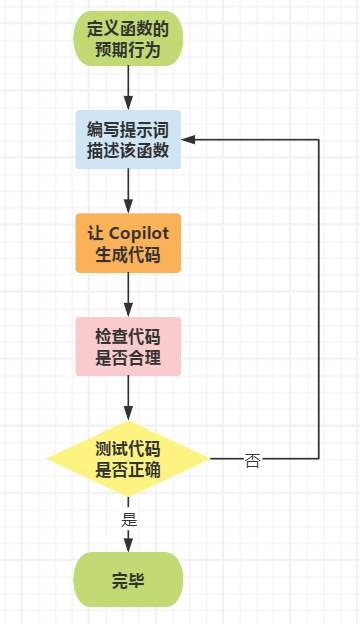
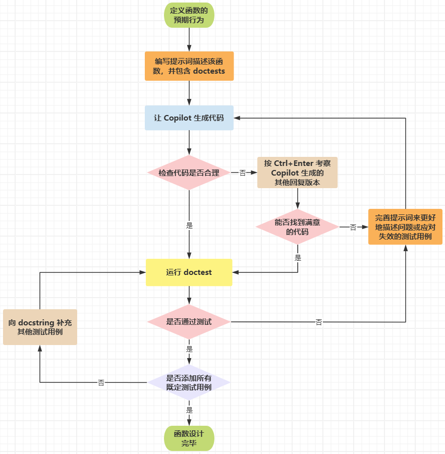
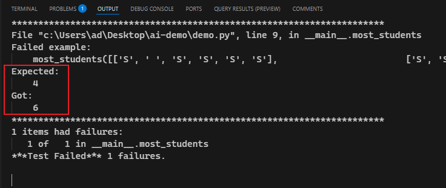
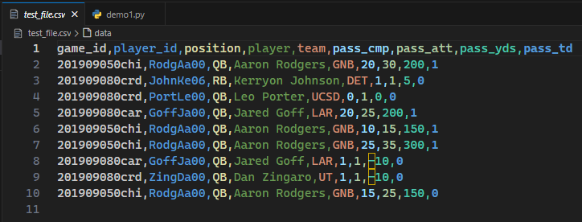
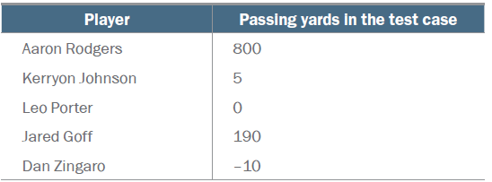
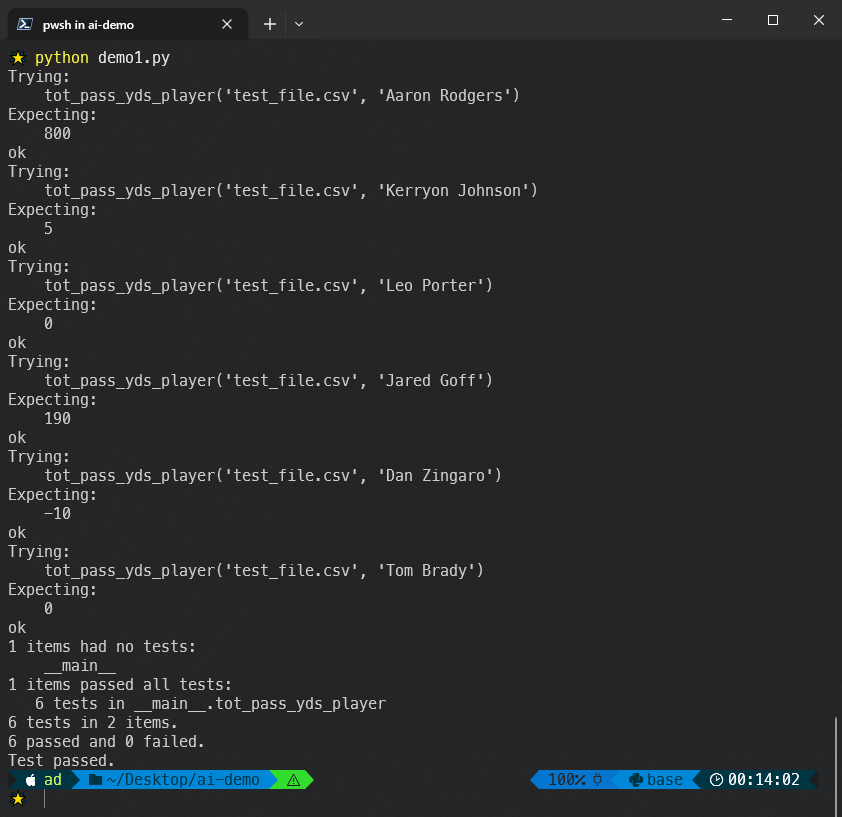

# Ch06: Testing and prompt engineering


> **本章概要**
>
> - 深刻理解测试 `Copilot` 代码的重要性
> - 黑盒测试与白盒测试的用法
> - 通过修改提示词纠正 `Copilot` 错误的方法
> - 通过示例测试 `Copilot` 生成的代码

本章详细阐述了代码测试在 `Copilot` 辅助编程中的极端重要性，并通过重构函数设计的基础工作流，从两个具体案例为读者演示了不同的软件测试方法在 `Copilot` 生成代码中的具体应用。从作者的介绍中不难看出，`AI` 编程想要完全取代人类程序员还有相当长的路要走。

---


## 1 为什么测试依然至关重要

尽管 `Copilot` 一直在完善，也可以生成一部分测试用例，但软件测试的工作还得首先自己知道原理和方法才行，不然，怎么鉴别 `AI` 生成的测试代码是否正确？

不仅代码测试如此，与编程相关的几乎所有核心技能都应该自己先掌握：问题分解、代码测试及后期调试……

对测试的重视程度几乎是和开发者及团队的开发水平成相关关系的：

- 入门级程序员：通常反感测试，总认为自己的代码不可能出错，计算机应该能自动识别人的意图并纠正错误（`Superbug`）；进而，在坚信自己没问题的前提下，一旦测出问题反而让人不安。
- 专业级程序员：极端重视测试，代码不经测试就不予交付，不愿因为自己的疏忽而背锅。
- 高水平的团队：通常会测试先行（TDD），提前明确要实现的功能和注意事项。

因为 `AI` 会犯错，所以任何时候，都不能对 `Copilot` 生成的代码心存侥幸。


## 2 黑盒测试与白盒测试

**黑盒测试（Closed-box testing）**：无需了解内部实现细节，聚焦不同的输入和输出情况。

**白盒测试（Open-box testing）**：通过查看内部细节，了解可能出错的地方，从而设计出针对性更强的测试用例。

|                 黑盒测试                 |                        白盒测试                        |
| :--------------------------------------: | :----------------------------------------------------: |
|          了解待测的功能规范即可          |           不仅了解功能规范，还需知晓内部实现           |
|        无需了解实现代码的具体作用        |             测试用例应围绕实现代码有的放矢             |
|        无需具备所测代码的专业知识        |        必须充分了解代码意图，确定测试的重点环节        |
| 通过调整输入、检查预期结果来测试某功能点 | 在黑盒测试的基础上，能深入功能点内部实现更细粒度的测试 |

`Python` 中的测试用例简写形式（假如需测试函数 `def longest_word(words)`）：

```python
>>> longest_word(['a', 'bb', 'ccc'])
'ccc'
```

测试用例的两大分类：

- **普通用例（common use cases）**：一些常见的示例和结果
- **边界条件（edge cases）**：聚焦特殊情况下的输入输出

实际测试中，不正确的输入也属于测试的一部分，但如何测试、测到什么程度需结合实际情况综合考虑。


## 3 关于黑盒测试中用例的正确分类问题

第三章曾提过，良好的测试需要对函数的调用分不同情况讨论。其中一种有效方式就是充分利用参数类型，并尝试不同类型的参数值。

另一种划分不同类型的方法需要结合具体的测试任务。例如 `longest_word(words)` 函数，除了引入普通的用例，还要考虑多个单词长度都是最长的特殊情况，此时应该按要求返回第一次（或最后一次）出现的单词。

> [!tip]
>
> 软件测试领域对于如何有效的设计测试用例有一套系统的方法论，例如经典的 **等价类划分法（Equivalence Partitioning）**、**边界值分析法（Boundary Value Analysis, BVA）**、**状态转换测试（State Transition Testing）** 等。这部分知识可能过于专业，书中并未展开。感兴趣的朋友可能留意我的软件测试相关专栏。


## 4 具体测试方法

鉴于本书针对的是入门级 `Python` 爱好者，本章并不考虑专业的软件测试工具（如 `pytest`）和测试最佳实践（如大型回归测试套件），而是基于 `Copilot` 辅助编程提供了两种具体的测试方法——

1. 在 `Python` 命令行手动测试；
2. 利用 `doctest` 模块进行半自动测试；

第一种方法过于简单，不再展开。主要梳理一下第二种：`doctest` 模块的使用。


### 4.1. doctest 模块的用法

`doctest` 模块是 `Python` 的内置模块，通过在 `docstring` 文档字符串中加入测试用例、并在主程序中调用模块方法 `doctest.testmod()` 来完成简单的功能测试。这样做的好处是，既可以快速引入测试用例，又能不干扰主程序的核心处理逻辑，还不用引入第三方模块（无需单独安装）。

具体操作步骤如下：

1. 按前面介绍的方法，写出函数签名和 `docstring` 作提示词；
2. `docstring` 中必须包含该函数的功能描述，以及各参数即返回值的文档说明；
3. 根据 `Copilot` 自动生成的不同版本代码，选择一个最满意的版本作为函数实现；
4. 按照合理的分类设计测试用例，并用正确的格式加入 `docstring` 字符串中；
5. 在主逻辑中引入 `doctest` 模块，并根据需要调用 `doctest.testmod()` 方法（例如 `verbose` 参数的配置）；
6. 观测测试结果，及时更正代码中的问题。

例如：

```python
def longest_word(words): 
    ''' 
    words is a list of words

    return the word from the list with the most characters
    if multiple words are the longest, return the first 
    such word

    >>> longest_word(['cat', 'dog', 'bird'])
    'bird'

    >>> longest_word(['happy', 'birthday', 'my', 'cat'])
    'birthday'

    >>> longest_word(['happy'])
    'happy'

    >>> longest_word(['cat', 'dog', 'me'])
    'cat'

    >>> longest_word(['', ''])
    ''
    '''
    longest = ''
    for word in words:
        if len(word) > len(longest):
            longest = word
    return longest

import doctest
doctest.testmod(verbose = True)
```

实际运行情况（如果在 `VSCode` 中安装了 `Code Runner` 扩展，可以按 `Ctrl-Alt-n` 快速运行代码）：

```python
Trying:
    longest_word(['cat', 'dog', 'bird'])
Expecting:
    'bird'
ok
Trying:
    longest_word(['happy', 'birthday', 'my', 'cat'])
Expecting:
    'birthday'
ok
Trying:
    longest_word(['happy'])
Expecting:
    'happy'
ok
Trying:
    longest_word(['cat', 'dog', 'me'])
Expecting:
    'cat'
ok
Trying:
    longest_word(['', ''])
Expecting:
    ''
ok
1 items had no tests:
    __main__
1 items passed all tests:
   5 tests in __main__.longest_word
5 tests in 2 items.
5 passed and 0 failed.
Test passed.
```


> [!note]
>
> **关于 `__main__` 模块级测试的补充说明**
>
> 在 `Python` 中，`doctest` 的设计目标是通过 **文档和测试一体化** 来提升代码的可维护性和可读性。它不仅支持在函数/类的 `docstring` 中嵌入测试用例，还会自动检测模块的 `if __name__ == "__main__":` 块中的测试用例。其核心逻辑的设计意义在于：
>
> 1. 确保文档与示例的统一性：`__main__` 块通常包含 **示例用法** 或 **快速测试逻辑**，嵌入基于 `doctest` 的用例可以实现文档的即时验证，同时简化用户的学习成本；
> 2. 提供轻量级测试的便捷性：在 `__main__` 块中直接编写 `doctest` 测试用例，可一键运行测试（如：`python -m doctest module.py`）；
> 3. 实现交互式示例的自动化：`doctest` 鼓励开发者将 `REPL` 中的实验性代码直接转化为测试用例，并放置在 `__main__` 块中；
>
> 因此，可以在 `__main__` 代码块加入下列测试内容：
>
> ```python
> if __name__ == "__main__":
>     """
>     Example usage:
>     >>> import module
>     >>> module.add(10, 20)
>     30
>     """
>     # 或者直接调用测试
>     import doctest
>     doctest.testmod()
> ```
>
> 或者在文件开头引入模块级 `docstring`。


### 4.2 基于 Copilot 和 doctest 的函数设计基本流程（改进版）

根据上述演示，第三章介绍的 `Python` 函数设计基本流程（如图 6.1 所示）：



**图 6.1 基于 Copilot 的 Python 函数设计流程（简易版）**

引入 `doctest` 模块后，基于 `Copilot` 的函数设计流程可以扩充为图 6.2 所示的形式：



**图 6.2 基于 doctest 和 Copilot 的 Python 函数设计流程（改良版）**


## 5 示例演示

有了上述改良版设计流程，本章后续给出了两个完整示例来进一步阐明该流程的用法。

### 5.1 演示一：找出每排能坐下新同学的人数最大值

需求很简单，设计一个函数 `def most_students(classroom)`，其中的 `classroom` 参数代表某教室每排入座情况的列表。要求 Copilot 给出实现代码，算出其中各排空座位的最大值。但这里作者卖了个关子，故意提供很模糊的提示词（且不带测试用例），结果当时的 `Copilot`（大概率为 2023 年初发布的 `GPT-3.5`）因为推理能力有限，无法准确理解出题人的真实意图：

```python
def most_students(classroom):
    '''
    classroom is a list of lists
    Each ' ' is an empty seat
    Each 'S' is a student
    How many new students can sit in a row?     # This is a somewhat ambiguous part of the prompt.
    '''
    max_students = 0
    for row in classroom:
        students = 0
        for seat in row:
            if seat == 'S':
                students += 1
            else:
                students = 0
            if students > max_students:
                max_students = students
    return max_students
```

可以看到 `Copilot` 完全回错了意：它计算的是各排连续入座的学生人数的最大值。究其原因，一是 `Copilot` 无法从新学生入座迁移到空座位数的计算（推理能力不足）；二是在算学生人数时，由于将连续入座视为某种合理的默认组合方式（大概率与 `LeetCode` 题库有关）。因此这个例子也说明了准确描述问题的重要性。

如果看不懂代码，只能寄希望于引入测试用例并执行 `doctest` 加以验证：

```python
def most_students(classroom):
    '''
    classroom is a list of lists
    Each ' ' is an empty seat
    Each 'S' is a student
    
    How many new students can sit in a row?
    
    >>> most_students([['S', ' ', 'S', 'S', 'S', 'S'], \
                       ['S', 'S', 'S', 'S', 'S', 'S'], \
                       [' ', 'S', ' ', 'S', ' ', ' ']])
    4
    '''
    max_students = 0
    for row in classroom:
        students = 0
        for seat in row:
            if seat == 'S':
                students += 1
            else:
                students = 0
            if students > max_students:
                max_students = students
    return max_students

import doctest
doctest.testmod(verbose=False)
```

实际运行情况：



**图 6.2 引入测试用例后的本地验证情况截图**

由于测试用例报错，在不理解代码的情况下只能继续调整测试用例，用试错法定位问题，费时费力。这个反例说明，**必要的代码识读能力** 对于高效的代码测试而言依然是非常关键的。

一旦理解了 `Copilot` 给出的代码逻辑，就能对症下药，例如完善提示词：

```python
def most_students(classroom):
    '''
    classroom is a list of lists #1
    Each ' ' is an empty seat #1
    Each 'S' is a student #1
     #1
    Return the maximum total number of ' ' characters 
    In a given row.                                     
    
    >>> most_students([['S', ' ', 'S', 'S', 'S', 'S'], \
                       [' ', 'S', 'S', 'S', 'S', 'S'], \
                       [' ', 'S', ' ', 'S', ' ', ' ']])
    4
    '''
    max_seats = 0
    for row in classroom:
        seats = row.count(' ')
        if seats > max_seats:
            max_seats = seats
    return max_seats

import doctest
doctest.testmod(verbose=False)
```

配合测试用例，这一次就没问题了，但还需补全其他边界条件下的测试用例，进一步作证代码的正确性：

```python
def most_students(classroom):
    '''
    classroom is a list of lists
    Each ' ' is an empty seat
    Each 'S' is a student
    
    Return the maximum total number of ' ' characters in a 
    given row. 
    
    >>> most_students([['S', ' ', 'S’, 'S', 'S', 'S'], \
                       [' ', 'S', 'S', 'S', 'S', 'S'], \
                       [' ', 'S', ' ', 'S', ' ', ' ']])
    4
    >>> most_students([['S', 'S', 'S'], \
                       ['S', 'S', 'S'], \
                       ['S', 'S', 'S']])
    0
    >>> most_students([['S', 'S', 'S'], \
                       [' ', ' ', ' '], \
                       ['S', 'S', 'S']])
    3
    >>> most_students([[' ', ' ', 'S'], \
                       ['S', ' ', ' '], \
                       ['S', 'S', 'S']])
    2
    '''
    max_seats = 0
    for row in classroom:
        seats = row.count(' ')
        if seats > max_seats:
            max_seats = seats
    return max_seats

import doctest
doctest.testmod(verbose=False)
```


### 5.2 演示二：四分卫传球距离统计

第二个典型案例稍微增加了些难度，考虑了需要引入外部文件的应用场景（由于和外部接口交互的测试过于复杂，书中并未展开讨论）。虽然需求很简单，向目标函数传入某个数据集的文件名和四分卫球员姓名，理论上就能得到该球员的总传球距离。

设计这类问题的测试用例时极易犯的一个错误是 **主次不分**。例如从某个更全面的数据集入手，借助 `Excel` 等工具手动统计某名球员的传球距离来手动收集测试用例。且不说这样的处理方案大大降低了 `Python` 目标函数的原有价值，也不论 `Excel` 各种相关技能的学习曲线，单就这类测试用例能否覆盖必要的边界条件就是个大问题。为此，作者给出的解决方案是编制一个专门用于测试的伪数据集，并加入所需的边界条件作为其数据项，如图 6.3 所示：



**图 6.3 基于原始数据集简化后的、专用于测试用例设计的伪数据集截图**

然后计算出对应的测试用例：



**图 6.4 基于伪数据集得到的几组测试用例**

接着编写提示词，让 `Copilot` 生成一版最满意的实现代码：

```python
def tot_pass_yds_player(input_file, player):
    """
    input_file is a string that is the name of a file
    player is the name of a player

    The file is a csv file with a header row
    Column 4 is the player's name and column
    8 is the number of passing yards for that player
    
    return the total number of passing yards for the player
    """
```

再次强调，此时 **无需引入测试用例**，也无需 **对文件读取过程单独测试**（极易导致偏离核心功能）。测试用例最好在 **确定一版实现代码后** 根据情况加入。

由于提示词描述准确，实测时 `Copilot` 一次就能准确给出（貌似）具体实现：

```python
def tot_pass_yds_player(input_file, player):
    """..."""
    import csv
    with open(input_file, 'r') as csvfile:
        reader = csv.reader(csvfile)
        next(reader)
        total = 0
        for row in reader:
            if row[3] == player:
                total += int(row[7])
    return total
```

此时再引入必要的测试用例：

```python
def tot_pass_yds_player(input_file, player):
    """
    input_file is a string that is the name of a file
    player is the name of a player

    The file is a csv file with a header row
    Column 4 is the player's name and column
    8 is the number of passing yards for that player

    return the total number of passing yards for the player

    >>> tot_pass_yds_player('test_file.csv', 'Aaron Rodgers')
    800
    >>> tot_pass_yds_player('test_file.csv', 'Kerryon Johnson')
    5
    >>> tot_pass_yds_player('test_file.csv', 'Leo Porter')
    0
    >>> tot_pass_yds_player('test_file.csv', 'Jared Goff')
    190
    >>> tot_pass_yds_player('test_file.csv', 'Dan Zingaro')
    -10
    >>> tot_pass_yds_player('test_file.csv', 'Tom Brady')
    0
    """
    with open(input_file, "r") as csvfile:
        import csv
        reader = csv.reader(csvfile)
        next(reader)
        total = 0
        for row in reader:
            if row[3] == player:
                total += int(row[7])
        return total

import doctest
doctest.testmod(verbose=True)
```

实测结果：



**图 6.5 实测 doctest 模块在参数涉及文件操作时的用例执行情况**


> [!note]
>
> **实测注意事项**
>
> 示例二在实测时遇到字符集不匹配的问题，可能是本书配套的源码文件字符集与我本地的默认设置不匹配导致的。解决方法是通过 `Notepad++` 或 `Excel` 重新导出为本地 `UTF-8` 编码或 `GBK` 编码即可。
>
> 另外，添加测试用例时，如果指定的返回结果后面还带有多余的空格，运行时会一并视为期望结果而导致测试失败。这是使用 `doctest` 模块的常见问题，务必引起重视。
