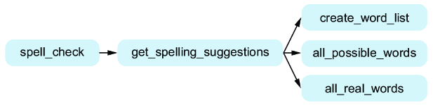
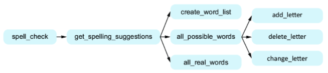
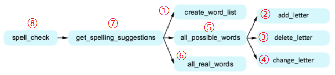
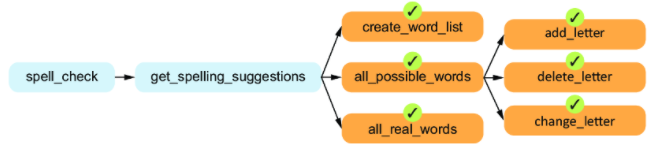
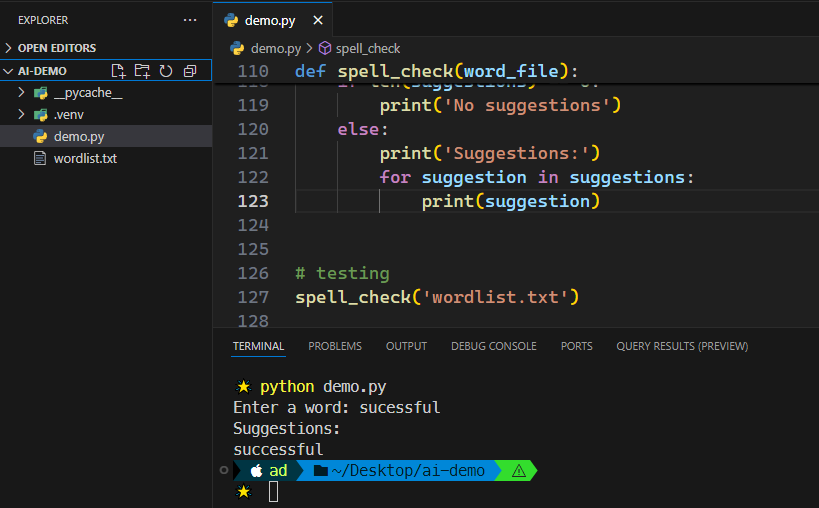

# Ch07: Problem decomposition


> **本章概要**
>
> - 理解问题分解的重要性
> - 掌握自顶向下的设计方法并用以指导编程
> - 实战：基于自顶向下设计的单词拼写建议程序

---

## 1 概述

与人类相同，`Copilot` 无法圆满完成一项描述模糊的任务。问题分解其实也是将任务具体化的重要组成部分。问题的合理分解对于后续高质量代码实现的重要性再怎么强调都不为过。对于大型项目而言，问题分解是合理控制复杂度的唯一途径。

本章通过 **自顶向下** 的设计思路来指导问题分解，并通过一个具体的单词拼接建议程序演示该方法的落地实践。

强大的问题分解能力需要日复一日的刻意练习。在与 AI 交互的过程中，多问几个类似 `what...if...` 句式的问题，可以较好地拓展问题本身，有利于从更通用、更宏观的角度重新审视当前的问题——这也是培养函数式思维方式（`functional thinking`）的有效切入点。函数式编程思想的核心之一就是问题分解：一个大而模糊的问题通过各个功能点的有效拆分，最终可以细化到不同抽象层次的众多子问题上。当最底层的这些子问题都能通过某个函数来解决时，最初的大问题也迎刃而解。

> [!tip]
>
> **小贴士**
>
> 虽然函数式编程思想近年来得到了很大推广，但由于各种历史原因目前仍属于小众话题，在开发圈也出现了两极分化的趋势：要么将其妖魔化，认为它对数学功底要求甚高，后期调试扩展困难，唯恐避之而不及；要么将其万能化，认为万事万物皆可函数式编程，所有底层代码都可以用它重写一遍。
>
> 其实最合理的态度应该是折中路线：可以先了解函数式的思维方式，具体实践上再将其与其他开发范式（如面向对象编程、面向过程编程等）相结合，提高代码的整体质量。


## 2 问题描述

本章内容较为简单，直接引入后面的演示案例来拆解知识点。演示项目是一个基于 `Python` 简化版单词拼写建议程序，通过设计一个目标函数并传入一个可能存在拼写问题的英文单词、一组标准单词，最终得到该写法对应的参考单词。之所以称为简化版，是由于该程序只考虑三种情况的拼写问题：

1. 传入单词比标准单词 **多一个** 英文字母：`catt` :arrow_right: `cat`；
2. 传入单词比标准单词 **少一个** 英文字母： `mor` :arrow_right: `​more`；
3. 传入单词与标准单词之间 **只存在一个不同的** 英文字母：`sukcessful` :arrow_right: `successful`；


## 3 问题分解演示

先梳理 **输入**、**过程处理**、**输出** 三个环节的任务描述：

|   阶段   | 任务描述                       |                             示例                             |
| :------: | ------------------------------ | :----------------------------------------------------------: |
|   输入   | 即描述目标函数所需的各种参数。 |          共两个参数：一个待测单词，以及一组标准单词          |
| 过程处理 | 描述对传入参数的具体操作。     | 以 `ried` 为例，可以：<br/>1. 新增一个字母：`fried`；<br/>2. 删除一个字母：`red`；<br/>3. 替换一个字母：`reed` |
|   输出   | 返回最后的处理结果             |         以 `ried` 为例，返回：`fried`、`red`、`reed`         |


### 3.1 初步拆分

最初的函数名根据 “单词拼写检查” 的含义推定为 `spell_check`，从处理顺序上主要分三步：输入字符串、处理字符串、输出检查结果。

其中第一步和第三步很简单，分别使用 `input` 函数和 `print` 函数就能实现，不用拆分为独立的子问题，也就无需定义独立的函数。

第二步显然是需要定义函数的。根据上述表格的梳理，可以确定其主要功能是返回一组拼写建议，因此该函数可命名为 `get_spelling_suggestions`。

接下来按照表格对 `get_spelling_suggestions` 再次拆分，具体如下：


### 3.2 输入环节

首先考察输入环节，即确定参数个数、参数名称、传参方式等。

作为 `get_spelling_suggestions` 参数之一的 **待测单词** 其实就是一个字符串，从上节讨论中的 `input` 函数手动输入即可，可命名为 `possible_word`。

第二个参数需要认真考虑一下传参方式：这是一个单词列表；为了得到该列表，是直接硬编码到函数中好呢，还是通过一个文件名读取好呢？

从可维护性和可扩展性考虑，显然是后者。

既然是传一个包含所有参考单词的文件名，即文件名对应的完整路径字符串，那么问题又来了：该字符串究竟如何传入函数呢？也通过 `input` 函数传入吗？

这就涉及一个通用处理手法：参数配置——在调用最初的 `spell_check` 函数时，传入该字符串，将其 **配置** 到最外层函数，以供内部函数读取。根据含义，该参数可命名为 `word_file`。

这样就确定了 `get_spelling_suggestions` 的两个参数：

1. `possible_word`：表示待测字符串，从上一步 `input` 函数手动输入；
2. `word_file`：表示参考单词所在的文件名，从调用 `spell_check` 函数时以参数的形式完成手动配置；


### 3.3 过程处理环节

有了刚才分析得到的两个参数 `possible_word` 和 `word_file`，过程处理环节又可以进一步拆分为三个子环节：

（1）生成标准单词组：根据 `word_file` 读取文件内容，得到参考单词组 `word_list`。该函数可命名为 `create_word_list`，参数为 `file_name`，返回一个单词列表；

（2）生成所有潜在单词：根据此前确定的简化要求（增一、删一、改一），基于 `possible_word` 生成各种情况下的候选词列表。函数名可设计为 `all_possible_words`，参数就是 `possible_word`，返回一个潜在单词列表（`possible_words`）；

（3）过滤无效字符串：利用 `word_list` 将 `possible_words` 中的无效字符串清除，得到最终的拼写建议单词组。该函数可命名为 `all_real_words`，接收参数为 `word_list` 和 `possible_words`，返回筛选后的标准单词列表。

至此，就得到了第一版的问题分解示意图：



**图 7.1 经过初步分解后得到的函数结构示意图**

如图所示，右上角的 `create_word_list` 函数无需再次分解，利用 `Python` 的 `open` 命令即可完成；

第二个子函数 `all_possible_words` 其实又包含三个相互独立的情况，因此可以再次拆分成三个独立的函数，最后将处理结果汇总即可：

1. 新增一个英文字母：函数名 `add_letter`，考虑在每个字符的左右两侧新增 `a-z` 的字母，然后返回处理结果；
2. 删除一个英文字母：函数名 `delete_letter`，考虑删除不同位置的字母，将剩余部分汇总后作为处理结果返回；
3. 替换一个英文字母：函数名 `change_letter`，与删除类似，将每个字符替换为除它本身以外的其他字母，再将替换结果汇总后返回；

显然，这三个子函数都接收一个参数 `possible_word`，并且都返回一个候选词列表。于是示意图可以再次改写为：



**图 7.2 按新增、删除、修改三种情况再次拆分得到的函数结构示意图**

至此，所有的子函数均已拆分到原子级别，无需继续拆分。接下来考虑各函数的代码实现。

> [!note]
>
> **注意**
>
> 实际操作过程中，每个问题应该拆分到什么程度算 **原子级别** 需根据具体情况确定，没有放之四海而皆准的统一标准。同样，这也是一个需要日积月累才能精进的本领。需要特别注意的是，本节给出的拆分思路也不是唯一的，例如我最开始设想的就是用标准单词去逐一匹配这三种情况，和作者思路恰恰相反。作者也强调，问题分解过程不可能每次都能一步到位，更多的情况是通过不断摸索试错，很可能是在拆分方案多次验证失败后才会得到一个较为满意的最终方案。


### 3.4 输出环节

从 `get_spelling_suggestions` 得到拼写建议 `suggestions` 后，使用 `for` 循环和 `print` 语句打印出所有建议即可：

```python
for suggestion in suggestions:
    print(suggestion) 
```


## 4 代码实现演示

根据自顶向下的设计思路，拆分问题是 **从上到下** 逐级展开的；具体的函数代码实现则是 **自下而上** 逐级归纳完成的。根据这个指导原则，具体实现顺序如下：



**图 7.3 各个主函数、子函数的代码实现顺序示意图**

接下来利用前面章节介绍的函数设计方法，基于 `Copilot` 分别实现如下（函数签名及 `docstring` 均为手动输入，其余为 `Copilot` 生成）：

1. `create_word_list()`：

```python
def create_word_list(filename):
    '''
    filename is the name of a file that has one English word per line.

    Return a list of the words in the file.
    '''
    with open(filename, 'r') as f:
        words = [line.strip() for line in f]
    return words
```

2. `add_letter()`：（先处理 `all_possible_words` 的每个子函数）

```python
def add_letter(word):
    '''
    word is a string with at least one letter.

    Return a list of all the strings that can be obtained by
    adding one letter to word.
    '''
    letters = 'abcdefghijklmnopqrstuvwxyz'
    result = []
    for i in range(len(word) + 1):
        for letter in letters:
            result.append(word[:i] + letter + word[i:])
    return result
```

3. `delete_letter()`：

```python
def delete_letter(word):
    '''
    word is a string with at least one letter.

    Return a list of all the strings that can be obtained by
    deleting one letter from word.

    >>> delete_letter('carf')
    ['arf', 'crf', 'caf', 'car']
    >>> delete_letter('a')
    ['']
    '''
    result = []
    for i in range(len(word)):
        result.append(word[:i] + word[i + 1:])
    return result
```

这一步引入了测试用例，因此可以在下方添加测试语句：

```python
import doctest
doctest.testmod(verbose = True)
```

4. `change_letter()`：

```python
def change_letter(word):
    '''
    word is a string with at least one letter.

    Return a list of all the strings that can be obtained by
    changing one letter to another letter in word.
    '''
    letters = 'abcdefghijklmnopqrstuvwxyz'
    result = []
    for i in range(len(word)):
        for letter in letters:
            if letter != word[i]:
                result.append(word[:i] + letter + word[i + 1:])
    return result
```

5. `all_possible_words()`：有了第 2、3、4 步的子函数，这一步只需将其结果汇总即可：

```python
def all_possible_words(word):
    '''
    word is a string with at least one letter.

    Return a list of all the strings that can be obtained by
    adding one letter to word, deleting one letter from word,
    or changing one letter in word.
    '''
    result = []
    result += add_letter(word)
    result += delete_letter(word)
    result += change_letter(word)
    return result
```

6. `all_real_words()`：

```python
def all_real_words(word_list, possible_words):
    '''
    word_list is a list of English words.
    possible_words is a list of possible words.

    Return a list of words from possible_words that are in word_list.
    >>> english_words = ['scarf', 'cat', 'card', 'cafe']
    >>> possible_words = ['carfe', 'card', 'cat', 'cafe']
    >>> all_real_words(english_words, possible_words)
    ['card', 'cat', 'cafe']
    '''
    result = []
    for word in possible_words:
        if word in word_list:
            result.append(word)
    return result
```

至此，`get_spelling_suggestions()` 函数的所有子函数均已实现完毕，上述过程可以实现一个做一个标记，如下图 7.4 所示：



**图 7.4 一边实现子函数一边做标记，可以有效避免错漏**

接着拼接第 1 步、第 5 步和第 6 步中的处理结果，得到第 7 步 `get_spelling_suggestions()` 函数的代码实现：

```python
def get_spelling_suggestions(word_file, possible_word):
    '''
    word_file is the name of a file that has one English word per line.
    possible_word is a string that may or may not be a real word.

    Return the list of all possible unique corrections 
    for possible_word.
    '''
    word_list = create_word_list(word_file)
    possible_words = all_possible_words(possible_word)
    real_words = all_real_words(word_list, possible_words)
    return list(set(real_words))
```

进而得到最终的 `spell_check()` 实现：

```python
def spell_check(word_file):
    '''
    word_file is the name of a file that has one English word per line.
    Ask user for a word.
    Print all possible corrections for the word, one per line.
    '''
    word = input('Enter a word: ')
    suggestions = get_spelling_suggestions(word_file, word)
    if len(suggestions) == 0:
        print('No suggestions')
    else:
        print('Suggestions:')
        for suggestion in suggestions:
            print(suggestion)
```


## 5 功能测试

将本章附带的单词表文件 `wordlist.txt` 放入当前项目根目录，与示例代码 `demo.py` 平级，可以测得如下结果：



**图 7.5 实测单词拼写建议程序（符合预期）**

不同的待测内容得到的提示结果也截然不同：

```powershell
> python demo.py    
Enter a word: ried
Suggestions:
pried
riled
riend
ied  
fried
rie  
tried
pied 
tied 
dried
red  
rid  
died 
reed 
rien 
lied 
cried
rind
```


## 6 小结复盘

问题分解能力在 AI 辅助编程中至关重要，它同时也是控制大型问题复杂度的不二法门。`GitHub Copilot` 经过两年多的更新迭代，目前提供的参考代码段质量已经很高了。能否充分挖掘 AI 辅助编程的潜力，关键在于能否有效拆分并描述问题。建议大家在实测过程中不要复制粘贴文中的函数签名和注释内容，而是主动尝试手动输入（最好保持英文描述），效果会更好。

根据实战感受复盘如下：

1. 问题分解的关键在于确定输入输出；
2. 具体分解到什么程度才算合适，需要结合实际情况综合考虑；
3. 分解子问题按自顶向下方向进行；实现代码则需要按自底向上方向进行；
4. 每个子函数需结合第三章介绍的方法，明确给出函数签名和表述完整的 `docstring`，从而提高 `Copilot` 的正确率；
5. 对于逻辑较复杂的子函数，可以在注释中引入测试用例，并用 `doctest` 模块进行验证；
6. 问题分解能力的提高并非一蹴而就，需要大量刻意练习；最初确定方案时大概率无法一步到位，需要耐心验证，逐步找到最合理的方案。

另外，本文提到的词汇表文件 `wordlist.txt` 可在这里免费获取：

链接：`https://pan.baidu.com/s/1P5UClTKD1-xAscDH8Fravg?pwd=dwx5`
提取码：`dwx5`
