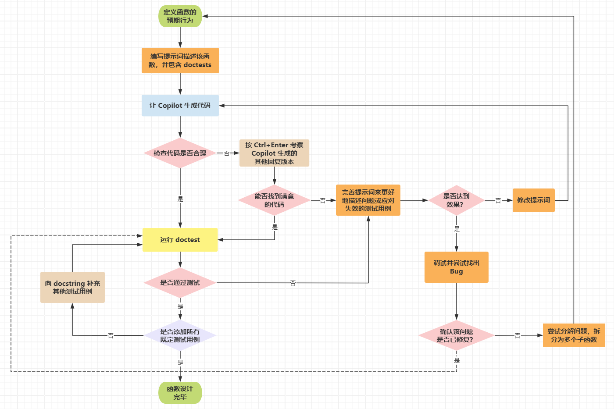

# Ch08: Debugging and better understanding your code

---

> **本章概要**
>
> - 确定 `Bug` 的来源
> - 用 `Copilot` 修复 `Bug` 的方法
> - 用 `Copilot` 调试代码的方法
> - 利用 `VS Code` 的调试工具（`debugger`）查看代码运行情况

本章主要介绍了 `VSCode` 调试工具在 `AI` 辅助编程中的具体应用。


## 1 Debug 一词的由来

将计算机中的错误称为 `Bug`、并且将调试代码中的问题叫做 `debug` 有一个著名的典故，这里略作补充：早年间的计算机元件还用的是继电器，不是现在的真空管。**Grace Hopper** 博士在用 `Mark II Aiken Relay Calculator` 运行一系列余弦回归测试时意外发现了一处错误，最终通过观察找到了问题根源——一个真正的 `Bug`（蛾子）——如图 8.1 所示。操作人员小心翼翼地移除了这个虫子，并且很负责任地把它订在了当天的日志手册中，于是就诞生了全世界第一个计算机 `Bug`：


**图 8.1 计算机系统内的史上第一个 Bug（1945 年 9 月 9 日）**


## 2 Bug 的分类

主要分为两大类：

1. 语法错误：再熟练的开发者，也不敢保证代码 100% 不出语法错误。用 `Copilot` 写代码几乎可以杜绝此类 Bug；但坏消息是，这类 `Bug` 通常并没有多少含金量；
2. 逻辑错误：调试难度较大，含金量也够高，虽然完全没有语法问题，但最终效果差强人意，修复这类问题时少则几个字或几行，严重的可能会重构整个模块或系统。只可惜 `Copilot` 目前还难以胜任所有的逻辑错误调试。


## 3 调试代码的方法

目前书中介绍的方法：

1. 换用 `Copilot` 提示代码的其他版本；
2. 修改 `Copilot` 提示词，绕过问题；
3. 在 `Python` 代码中使用像 `print` 这样的语句手动纠错；
4. 使用 `VS Code` 的调试工具（`Debugger`）；

随后，书中给出了 `VSCode` 中 `Run and Debug` 模块的具体操作方法。因为内容过于简单，且与浏览器调试工具非常类似，这里不再赘述。

这里仅强调一点，代码调试并没有因为 `AI` 的爆发而诞生出完全不同的手法，还是那些老生常谈：

1. **渐进式追问**：演示过程中，作者先用 `Copilot Chat` 模式进行询问，刻意问得很模糊，因此第一次并没有理解作者的本意，继续追问后才找到问题；
2. **提示词工程**：与方法一相反，这种策略更注重提示词的前期设计，因此效果也更好；
3. **指定具体位置**：适用于已经找到问题、需要让 `AI` 提供修复意见时，通过在指定位置插入一行注释来实现；
4. **自己动手**：代码调试更多的情况是求人不如求己，简单的 `Bug` 自己动手就好，不必费力去 **讨好** `Copilot`。


## 4 引入调试环节的函数设计流程图

比较值得关注的，是引入调试后的函数设计流程图。为了方便复习，这里重绘了一版：



**图 8.3 引入调试环节的 AI 函数设计流程图**


## 5 实战演练

有了上述新版流程图，作者又利用前面演示过的案例进行实战：

```python
def most_students(classroom):
    '''
    classroom is a list of lists
    Each ' ' is an empty seat
    Each 'S' is a student

    Find the most students seated consecutively in a row
 
    >>> most_students([['S', ' ', 'S', ' ', 'S', 'S'],\
                       ['S', ' ', 'S', 'S', 'S', ' '],\
                       [' ', 'S', ' ', 'S', ' ', ' ']])
    3
    '''
    max_count = 0
    for row in classroom:
        count = 0
        for seat in row:
            if seat == 'S':
                count += 1
            else:
                if count > max_count:
                    max_count = count
                count = 0
    return max_count

import doctest
doctest.testmod(verbose=True)
```

代码存在的主要问题是测试用例没有考虑边界条件，因此第一次通过测试并不能说明代码没有问题；在追加了边界条件的用例后，结合 `VSCode` 的调试工具，最终 `Copilot` 给出了正确版本：

```python
def most_students(classroom):       
  '''
    classroom is a list of lists
    Each ' ' is an empty seat
    Each 'S' is a student
 
    Find the most students seated consecutively in a row
 
    >>> most_students([['S', ' ', 'S', 'S', 'S', 'S'],\
                       ['S', ' ', 'S', 'S', 'S', ' '],\
                       [' ', 'S', ' ', 'S', ' ', ' ']])
    4
    '''
    def most_students(classroom):
    max_count = 0
    for row in classroom:
        count = 0
        for seat in row:
            if seat == 'S':
                count += 1
                if count > max_count:
                    max_count = count
            else:
                count = 0
    return max_count
```

但我在实测时，`Copilot` 是绕了一圈的，并没有像书中提示的那样智能（用了两次 `max()` 函数）：

```python
def most_students(classroom):
    '''
    classroom is a list of lists
    Each ' ' is an empty seat
    Each 'S' is a student

    Find the most students seated consecutively in a row

    >>> most_students([['S', ' ', 'S', 'S', 'S', 'S'],\
                       ['S', ' ', 'S', 'S', 'S', ' '],\
                       [' ', 'S', ' ', 'S', ' ', ' ']])
    4
    '''
    max_students = 0
    for row in classroom:
        count = 0
        for seat in row:
            if seat == 'S':
                count += 1
            else:
                max_students = max(max_students, count)
                count = 0
        max_students = max(max_students, count)
    return max_students
```


## 6 几个注意事项

一个有助于代码调试的免费线上资源 **Python Tutor**（`https://pythontutor.com/`），用可视化的界面自动生成代码执行过程，可以帮助开发快速梳理代码逻辑和潜在的 `Bug`。

调试能力与上一章介绍的问题分解能力，都是需要一定的刻意练习才能积累起来，目前的 `AI` 辅助能力并不能让人捷足先登。

问题分解地越细致，`Copilot` 返工的次数以及后续调试代码的次数就有望大幅降低。

最后的建议可以说是开发人员的血泪教训总结出来的：调试代码时 **千万不要放过任何一个** 函数或功能点。

