# Ch09: Automating tedious tasks

> **本章摘要**
>
> - 程序员编写工具的原因
> - 确定工具所需的模块
> - 示例1：自动清理电子邮件中的缩进符号 `>`
> - 示例2：自动操作 `PDF` 文件
> - 示例3：自动删除多个图片库中的重复图片

本章将从三个典型的日常低效问题入手，进一步演示 `ChatGPT` 这样的 `AI` 工具在工具脚本编写方面的落地应用，并结合具体的演示情况进行评价。从这一章开始，介绍的内容实操性都很强，建议模仿流程进行实践演练。


## 1 编写工具的原因

程序员经常自嘲说自己很 **懒**，背后的潜台词其实只是 **不想重复造轮子**（即践行 `DRY` 原则，`Don't Repeat Yourself`）罢了。每当遇到一些高频低效的机械型重复劳动，其敏锐的职业第六感（`spidey-sense`）会将该任务快速抽象为一个相对通用的脚本处理流程，并通过某个脚本语言进行实现，从而形成某个脚本工具，达到解放双手，**一键到位** 的目的。

这里其实有个不大不小的坑：低效重复究竟要达到什么程度才值得动手编写工具脚本呢？

很遗憾，这个问题并没有放之四海而皆准的标准答案，传统路径通常少不了要苦哈哈地手动尝试几轮，直到某一天实在受不了这样的低效重复了，才开始慢慢总结规律，最后诉诸脚本；而如今有了 `AI` 工具，前期的探索阶段就可以大幅缩减，最终只需要预判一下这个任务今后是否会经常执行就可以了，从 0 到 1 的脚本实现过程自此也就相对不那么望而生畏了。


## 2 确定工具所需的模块

面对陌生的任务场景，确定脚本工具的依赖项成了新的拦路虎。以前这类问题都是通过搜索引擎在各大技术论坛中大海捞针，获取灵感后再改造成自己需要的代码逻辑。现在这个过程也简化了，在 `VSCode` 的 `Copilot chat` 模块利用直接对话就能知道想要的内容，连知识迁移这部都省了，取而代之的是开发者的提问方式和问题整合能力。这样的过渡究竟算不算进步现在下结论还为时尚早，因为大脑从某种程度上可能并不认可这样的“减负”，对某个领域的认知深度从此或将完全取决于提问的质量和大模型的训练结果，颇有点被大模型驯化的味道，让人细思极恐。

扯远了，回到正题。本章主要还是从构建基于 `Python` 脚本的工具函数进行演示，因为函数具备天然的灵活性，可以很好地解决后续扩展的问题（扩充参数列表就行了）。这里选取了三个不同的典型案例，接下来逐一进行考察。


## 3 示例1：自动清理电子邮件中的缩进符号

### 3.1 明确需求

如果电子邮件回复次数较多，新邮件就会自动产生一些缩进符号来标识每一轮交谈的内容：

```markdown
> > > Hi Leo,
> > > > > Dan -- any luck with your natural language research?
> > > Yes! That website you showed me
https://www.kaggle.com/
> > > is very useful. I found a dataset on there that collects
a lot
> > > of questions and answers that might be useful to my research.
> > > Thank you,
> > > Dan
```

其实在国内类似的场景并不多见，工作交流有一大堆现成的工具：企微、QQ、钉钉……根本轮不到电子邮件登场，更何况这么标准的格式可能还得手动设置为纯文本模式才能看到；但作为辅助编程在日常办公中的第一个案例，关注演示的重点即可。最终想要的处理结果如下：

```markdown
Hi Leo,
Dan -- any luck with your natural language research?
Yes! That website you showed me
https://www.kaggle.com/
is very useful. I found a dataset on there that collects
a lot
of questions and answers that might be useful to my research.
Thank you,
Dan
```

按作者的思路，原始文本已经复制到了剪贴板（例如通过 `Ctrl+C`），然后执行该工具脚本，再粘贴出来就是处理后的结果了（有点反人类，忍忍吧）。

### 3.2 方案海选

为此，需要与 `Github Copilot` 多轮交互，从多个候选方案中择优。先给出我们的需求：

```markdown
I would like to write a Python program that accesses the clipboard and lets me copy and paste using the clipboard. How can I do this?
```

当前的 `GPT-4.1` 模型（2025-8-1）给我的回复是：

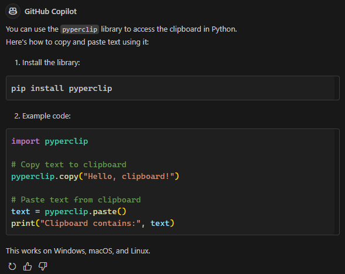

**图 9-1：Github Copilot 最新模型的实测回复内容**

虽然这个方案解决了跨平台的兼容性问题，但由于我们不想引入第三方模块，于是继续提问：

```markdown
Is there a way I can do it without having to install a Python module?
```

此时 `Copilot` 根据我当前的 Windows 系统，直接跳过了书中演示的两个中间环节，给出了基于 `subprocess` 标准模块的第二版（说明大模型一直在更新，且越来越智能了）：

> Yes, you can use built-in modules and system commands, but it depends on your operating system.
>
> **On Windows**, you can use `subprocess` with `clip` (copy) and `powershell Get-Clipboard` (paste):
>
> ```python
> import subprocess
> 
> # Copy to clipboard
> def copy_to_clipboard(text):
>     process = subprocess.Popen(['clip'], stdin=subprocess.PIPE, close_fds=True)
>     process.communicate(input=text.encode('utf-8'))
> 
> # Paste from clipboard
> def paste_from_clipboard():
>     result = subprocess.run(
>         ['powershell', '-command', 'Get-Clipboard'],
>         capture_output=True, text=True
>     )
>     return result.stdout.strip()
> 
> # Example usage
> copy_to_clipboard("Hello, clipboard!")
> print("Clipboard contains:", paste_from_clipboard())
> ```
>
> No extra modules needed—just Python’s standard library.

但是，我们不想让脚本与平台绑定，因此再次追问：

```markdown
Does that work on Linux or macOS too?
```

这一回 `Copilot` 又分别给出了提到的两个平台的具体脚本实现，比原书中的概括性描述精准太多了：

> No, the previous example is specific to Windows.
>
> **For Linux**, you can use `xclip` or `xsel` (these must be installed):
>
> ```python
> import subprocess
> 
> def copy_to_clipboard(text):
>     subprocess.run(['xclip', '-selection', 'clipboard'], input=text.encode('utf-8'))
> 
> def paste_from_clipboard():
>     result = subprocess.run(['xclip', '-selection', 'clipboard', '-o'], capture_output=True)
>     return result.stdout.decode('utf-8')
> 
> # Example usage
> copy_to_clipboard("Hello, clipboard!")
> print("Clipboard contains:", paste_from_clipboard())
> ```
>
> **For macOS**, use `pbcopy` and `pbpaste`:
>
> ```python
> import subprocess
> 
> def copy_to_clipboard(text):
>     subprocess.run(['pbcopy'], input=text.encode('utf-8'))
> 
> def paste_from_clipboard():
>     result = subprocess.run(['pbpaste'], capture_output=True)
>     return result.stdout.decode('utf-8')
> 
> # Example usage
> copy_to_clipboard("Hello, clipboard!")
> print("Clipboard contains:", paste_from_clipboard())
> ```
>
> These methods require the respective clipboard utilities to be available on your system.

经过上述三轮探索，权衡下来安装 `pyperclip` 第三方模块的版本倒也不是那么一无是处，于是就定它了。

需要注意的是，**方案海选** 这一步看似简单，实际操作中变数最大，耗费的时间精力可能远比传统方式多得多：因为大模型的本质是一个概率模型，受模型的升级、模块的更新换代等因素的影响，同一个问题可能得到完全不同的回复内容；评价这些方案时，要是再缺少相应的技术储备，在最糟糕的情况下可能真得挨个试一遍，想想头皮都发麻……


### 3.3 脚本实现

接下来是具体的脚本实现。首先安装第三方模块：

```python
pip install pyperclip
```

然后按照前面介绍的固定结构，通过声明函数签名和 `docstring` 文档字符串，引导 `Copilot` 按 `pyperclip` 的版本实现具体代码。最终结果如下（从 `L10` 开始）：

```python
import pyperclip
 
def clean_email():
    '''
    The clipboard contains lines of text.
    Clean up the text by removing any > or space
    characters from the beginning of each line.
    Replace the clipboard with the cleaned text.
    '''
    text = pyperclip.paste()
    lines = text.split('\n')
    cleaned_lines = []
    for line in lines:
        cleaned_line = line.lstrip('> ').strip()
        cleaned_lines.append(cleaned_line)
    cleaned_text = '\n'.join(cleaned_lines)
    pyperclip.copy(cleaned_text)
    print("Cleaned text copied to clipboard.")
    
if __name__ == "__main__":
    clean_email()
    
# Example usage:
# 1. Copy some text to the clipboard that contains lines starting with '>' or spaces    
# 2. Run this script
# 3. The cleaned text will be copied back to the clipboard
```

复制最开始的原始文本，然后用 `python demo.py` 执行该脚本：

```cmd
> python demo.py
```

再用 <kbd>Ctrl</kbd> + <kbd>V</kbd> 粘贴到某个空白文本框进行验证，居然真的直接就搞定了：

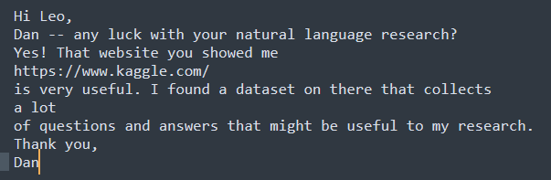

**图 9-2：最终工具脚本的测试验证结果（通过测试）**

得益于大模型的升级，原书中的报错与代码调试环节也省了，但这并不能说明今后的回复内容都这么完美，切莫掉以轻心。真遇到问题了也只能具体分析。

这个案例只能算开胃菜，还有很多细节有待完善，这里就不展开了。最后再总结一下几个要点：

1. 明确需求：准确描述想要的最终效果；
2. 方案海选：多问几次 `Copilot`，并根据提供的多个方案进行综合评估，最终敲定技术路线；
3. 工具实现：按照选好的方案实现脚本，引导 `Copilot` 在具体的函数签名下，基于 `docstring` 的描述生成最终脚本；
4. 脚本测试与调试：测试如果遇阻，可继续追问 `Copilot`，直到顺利实现既定效果；
5. 脚本优化：根据实际情况酌情完善细节，但切忌过于追求完美。


## 4 示例2：自动操作 PDF 文件

本示例明显比之前的“开胃菜”要难一些：不仅业务场景变复杂了，操作流程也考虑了一些新的报错情况，需要中途更换其他第三方模块。这样的示例才比较贴合真实环境——不是每次问 `Copilot` 都会那么一帆风顺。

### 4.1 明确需求

已知文件夹 `reports` 中有 100 份 `PDF` 格式的报告文件（`1.pdf`、`2.pdf`，…… `100.pdf`），同级目录下的 `covers` 文件夹则存有这 100 份报告对应的封面文件，格式也是 `PDF` 的（`Cover1.pdf`、`Cover2.pdf`，…… `Cover100.pdf`）。现在需要利用 `Copilot` 编写一个基于 `Python` 的工具脚本，将这 100 份封面批量添加到各自对应的报告文件，并将合并后的新报告文件放到 `final` 文件夹下，如图 9-3 所示：

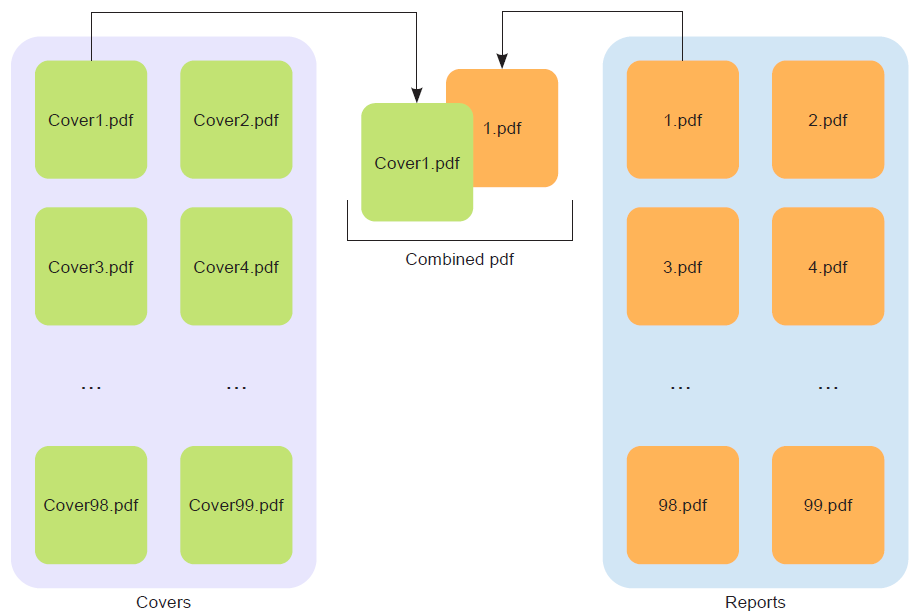

**图 9-3：示例 2 中批量合并 PDF 报告内容与对应封面文件示意图**

当然这里的封面和报告的内容也是用类似方法批量生成的，确保封面与报告内容的一对一关系（包括大小写组合规则的统一）就是开发者自己的事了，这些都属于数据整理或清洗的准备工作（示例文件详见 PC 端上传的同步配套压缩包）。


### 4.2 方案海选

和示例 1 一样，先直接用 `Github Copilot` 最新的 `GPT-4.1` 提问：

```markdown
I need to write a Python program that merges .pdf files. How do I do this?
```

得到如下回复（目测比原书回复更简练）：

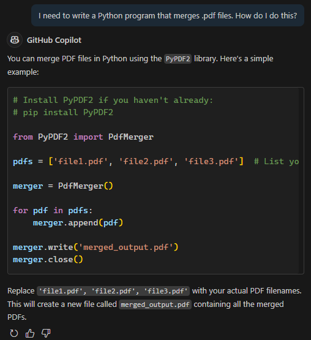

方案海选阶段我们仍然希望不安装第三方模块，因此继续追问：

```markdown
Is there a way I can do it without having to install a Python module?
```

得到如下回复：

> **GitHub Copilot**
>
> Python does not include built-in support for PDF manipulation, so you need an external library like `PyPDF2` or `pypdf` to merge PDFs directly in Python.
>
> **Alternatives without installing a Python module:**
>
> - Use online PDF merging tools (e.g., Smallpdf, PDF Merge).
> - Use command-line tools like `pdftk` or `Ghostscript` if you have them installed.
> - On Windows, you can use Microsoft Print to PDF to combine files manually.
>
> If you must use Python, installing a module is required for PDF merging.

这次明显比最初只提示 `pdftk` 更加全面了，但同样绕不开第三方模块（话又说回来，堂堂一门编程语言为甚要和下游厂商深度绑定呢？），因此只能放弃挣扎。为了货比三家，还是继续拓展一下都有哪些模块可用。于是再问：

```markdown
Are there other Python .pdf libraries that I should consider?
```

同样得到一版最新的工具列表（这才过了多久啊，`PyPDF2` 就停更了么……）：

> **Github Copilot**
>
> Yes, there are several Python libraries for working with PDFs. Here are some popular options:
>
> 1. **PyPDF2 / pypdf**
>    - Good for merging, splitting, and basic manipulation.
>    - `pypdf` is the actively maintained fork of `PyPDF2`.
> 2. **PdfPlumber**
>    - Great for extracting text, tables, and metadata from PDFs.
>    - Not focused on merging, but excellent for data extraction.
> 3. **PDFMiner**
>    - Powerful for text extraction and analysis.
>    - Not designed for merging or creating PDFs.
> 4. **ReportLab**
>    - Used for creating PDFs from scratch.
>    - Can also manipulate existing PDFs, but more complex.
> 5. **pdfrw**
>    - Can read and write PDF files.
>    - Useful for merging, splitting, and rotating pages.
>
> **For merging PDFs, `pypdf` and `pdfrw` are the most straightforward choices.**
> If you need advanced PDF creation, consider `ReportLab`. For extraction, use `pdfplumber` or `PDFMiner`.

为了方便海选，再让它做个优缺点对比，这可是 `Copilot` 的基本功 [^1]：

```markdown
Can you summarize the strengths and weaknesses of these libraries in tabular form?
```

整理后的结果几乎是秒出：

> **Github Copilot**
>
> | Library            | Strengths                                                    | Weaknesses                                                   |
> | ------------------ | ------------------------------------------------------------ | ------------------------------------------------------------ |
> | **pypdf / PyPDF2** | Easy to use for merging, splitting, rotating, and basic manipulation; actively maintained (`pypdf`) | Limited support for complex PDF features (forms, annotations); not ideal for text extraction |
> | **pdfrw**          | Can read/write PDFs; good for merging, splitting, rotating; pure Python | Documentation is sparse; less active development; may struggle with complex PDFs |
> | **ReportLab**      | Powerful for creating PDFs from scratch; supports graphics and charts | Steep learning curve for beginners; not focused on editing existing PDFs |
> | **pdfplumber**     | Excellent for extracting text, tables, and metadata; easy to use for data extraction | Not designed for merging or editing PDFs; extraction may not be perfect for all layouts |
> | **PDFMiner**       | Advanced text extraction and analysis; supports layout analysis | Slow on large files; not for merging or creating PDFs; complex API |
>
> Let me know if you want recommendations based on your specific use case!

这个结果和原书大同小异，只不过还是要排除不支持合并功能的 `pdfplumber` 和 `PDFMiner`。经过上述分析对比后，就可以比较放心地选用第一个推荐模块 `pypdf` 来完成任务了（`Copilot` 应该是基于我的需求做了默认排序）。


### 4.3 脚本实现

先本地安装 `PyPDF2`

```bash
pip install PyPDF2
```

然后还是以工具函数的方式，让 `Copilot` 根据人为指定的签名和 `docstring` 生成 `Python` 代码（从 `L15` 开始生成代码）：

```python
import PyPDF2
 
def add_covers(report_dir, cover_dir, final_dir):
    '''
    report_dir is a directory of reports named 1.pdf, 2.pdf, and so on.
    These files may be one page or more than one page.
 
    cover_dir is a directory of covers, with one cover per report.
    The filenames in this directory are cover1.pdf, cover2.pdf, and 
    so on. Each of these files is one page.
 
    Add the cover to the beginning of each report,
    and store all resulting pdfs in final_dir.
    '''
    import os
    if not os.path.exists(final_dir):
        os.makedirs(final_dir)
    for i in range(1, 100):  # Assuming a maximum of 99 reports
        report_path = os.path.join(report_dir, f"{i}.pdf")
        cover_path = os.path.join(cover_dir, f"cover{i}.pdf")
        final_path = os.path.join(final_dir, f"final{i}.pdf")
        if os.path.exists(report_path) and os.path.exists(cover_path):
            with open(report_path, 'rb') as report_file, open(cover_path, 'rb') as cover_file:
                report_reader = PyPDF2.PdfReader(report_file)
                cover_reader = PyPDF2.PdfReader(cover_file)
                
                writer = PyPDF2.PdfWriter()
                writer.add_page(cover_reader.pages[0])
                for page in report_reader.pages:
                    writer.add_page(page)
                with open(final_path, 'wb') as final_file:
                    writer.write(final_file)
    print(f"Added covers to reports and saved in {final_dir}")
    
if __name__ == "__main__":
    import argparse
    parser = argparse.ArgumentParser(description='Add covers to reports.')
    parser.add_argument('report_dir', type=str, help='Directory containing reports')
    parser.add_argument('cover_dir', type=str, help='Directory containing covers')
    parser.add_argument('final_dir', type=str, help='Directory to save final PDFs')
    
    args = parser.parse_args()
    
    add_covers(args.report_dir, args.cover_dir, args.final_dir)
    
# demo.py - A script to add covers to reports using PyPDF2
# Usage: python demo.py <report_dir> <cover_dir> <final_dir>
```

上述代码直接将参数放到了命令行，执行起来更灵活也更方便了。准备好下列文件夹和脚本文件后，就可以测试了：


**图 9-5：测试前的项目结构（final 为新建的空文件夹）**

然后运行下列命令完成测试：

```bash
> python demo.py 'reports' 'covers' 'final'
```

果然如作者所说，又是一键搞定的节奏……：

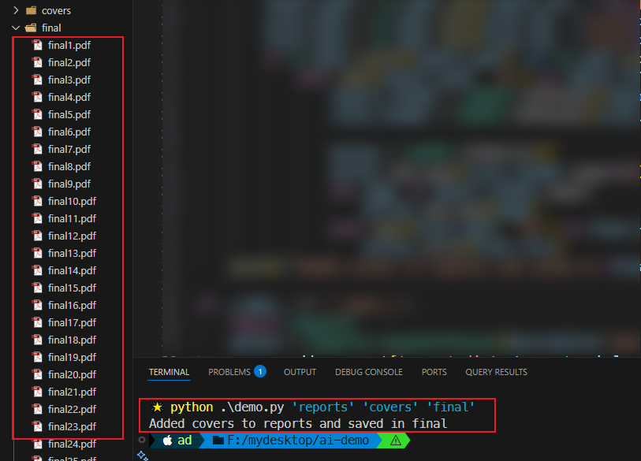

**图 9-6：实测合并脚本效果图（无报错、均符合预期）**

原书提到的两个问题在最新版大模型中已不复存在：一个是缺少了 `import os` 语句，另一个是 `PdfFileReader` 方法的失效。第一个问题过于简单就不分析了，但第二个问题的消失还是有必要验证一下的：是开源作者主动改了，还是 `Copilot` 修改调用方法了？

火速定位到模块的 `Github` 页面（详见 [这里](https://github.com/py-pdf/pypdf/blob/7d07401f456267480eb8deac85e3fde2f6927366/pypdf/__init__.py)），然后通过版本号 `3.0.1` 定位到了变更说明的具体位置：

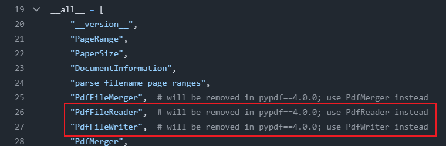

**图 9-7：定位到 Github 社区官方变更方法名的位置**

而这个 `pypdf` 的 `4.0.0` 版对应的是 `PyPDF2` 的 `3.0.0`（详见 [这里](https://github.com/py-pdf/pypdf/compare/3.0.0...3.1.0)）：

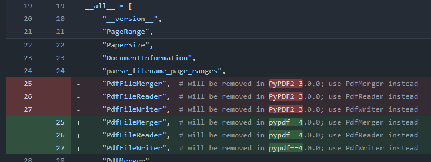

**图 9-8：进一步定位到 PyPDF2 的具体版本**

该变更对应的日期是 2022 年 12 月，确实如作者所说，在原书第一版的编写过程中就已经修复了：

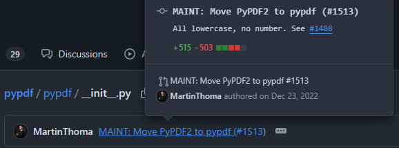

**图 9-9：查看源码变更方法名的具体日期（这就是用 Git 托管的好处）**

于是验证无误：本来想作为教学案例的接口失效报错，被模块作者提前当作 Bug 给修复了（在没有提前沟通的情况下，要是在公开出版物中被这样点名无异于宣告模块作者的社会性死亡）。

但是真实工作场景下，遇到特别小众的第三方模块，接口破坏性变更的情况就太多了：你通常会以用户的身份发起一个 `issue` 提议来提醒作者更新（要是能帮忙修复这个 Bug 就更好了，直接提 `PR` 还能写到今后的简历里）。想解决这个问题通常等不到源码更新，此时就面临新的抉择：

1. 退回到某个历史版本；
2. 使用报错信息中的推荐方案；
3. 换用新的第三方模块。

由于第二条路往往靠的是源码作者的职业素养，小众的模块一般都没有这么贴心的服务，因此直接忽略。接下来重点尝试剩下的两种方式：切换历史版本和换新库。

#### 1 切换历史版本

先清空 `final` 文件夹，并按照旧接口的写法修改代码（即目标函数的 `L24`、`L25`）：

```python
# before
report_reader = PyPDF2.PdfReader(report_file)
cover_reader = PyPDF2.PdfReader(cover_file)
# after
report_reader = PyPDF2.PdfFileReader(report_file)
cover_reader = PyPDF2.PdfFileReader(cover_file)
```

报错情况如下：

```cmd
python .\demo.py 'reports' 'covers' 'final'
Traceback (most recent call last):
  File "F:\mydesktop\ai-demo\demo.py", line 44, in <module>
    add_covers(args.report_dir, args.cover_dir, args.final_dir)
  File "F:\mydesktop\ai-demo\demo.py", line 24, in add_covers
    report_reader = PyPDF2.PdfFileReader(report_file)
                    ^^^^^^^^^^^^^^^^^^^^^^^^^^^^^^^^^
  File "F:\mydesktop\ai-demo\venv\Lib\site-packages\PyPDF2\_reader.py", line 1974, in __init__
    deprecation_with_replacement("PdfFileReader", "PdfReader", "3.0.0")
  File "F:\mydesktop\ai-demo\venv\Lib\site-packages\PyPDF2\_utils.py", line 369, in deprecation_with_replacement    deprecation(DEPR_MSG_HAPPENED.format(old_name, removed_in, new_name))
  File "F:\mydesktop\ai-demo\venv\Lib\site-packages\PyPDF2\_utils.py", line 351, in deprecation
    raise DeprecationError(msg)
PyPDF2.errors.DeprecationError: PdfFileReader is deprecated and was removed in PyPDF2 3.0.0. Use PdfReader instead.
```

根据提示，要用 `3.0.0` 之前的版本，于是运行以下命令退回到 `3.0.0` 之前的最新版：

```python
pip install "PyPDF2 < 3.0.0"
```

实测结果如下（回退成功）：

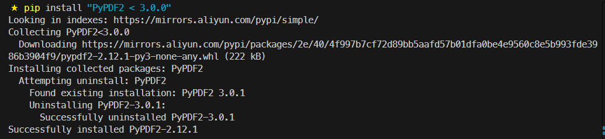

**图 9-10：将 PyPDF2 模块回退到 3.0.0 以前的最新版实测截图**

再次运行该脚本，合并就又成功了（截图略）。


#### 2 改用新的第三方模块

再来看另一条常见的解决方案：改用新的第三方模块。虽然有点冒险，好在有 `Copilot` 护航，可以很好地解决陌生工具库学习曲线陡峭的一系列问题。

由于 `Copilot` 的提示内容已经完全更新，这里就不按原书内容照搬 `PyMuPDF` 模块了。根据最新的推荐第三方模块，下一个备选项是 `pdfrw`，于是直接提问：

```markdown
How can I use the Python pdfrw library to merge .pdf files?
```

> **Github Copilot**
>
> You can use the `pdfrw` library to merge PDF files in Python as follows:
>
> ```python
> # Install pdfrw if you haven't already:
> # pip install pdfrw
> 
> from pdfrw import PdfReader, PdfWriter
> 
> pdfs = ['file1.pdf', 'file2.pdf', 'file3.pdf']  # List your PDF files here
> writer = PdfWriter()
> 
> for pdf in pdfs:
>     reader = PdfReader(pdf)
>     writer.addpages(reader.pages)
> 
> writer.write('merged_output.pdf')
> ```
>
> Replace `'file1.pdf', 'file2.pdf', 'file3.pdf'` with your actual PDF filenames.
> This will create a new file called `merged_output.pdf` containing all the merged PDFs.

这个回复同样很简洁，就它了。

先本地安装 `pdfrw` 模块：

```python
pip install pdfrw
```

然后清空刚才的 `PyPDF2` 的代码，改为 `pdfrw` 的即可：

```python
import os
from pdfrw import PdfReader, PdfWriter
 
def add_covers(report_dir, cover_dir, final_dir):
    '''
    report_dir is a directory of reports named 1.pdf, 2.pdf, and so on.
    These files may be one page or more than one page.
 
    cover_dir is a directory of covers, with one cover per report.
    The filenames in this directory are cover1.pdf, cover2.pdf, and so on.
    Each of these files is one page.
 
    Add the cover to the beginning of each report,
    and store all resulting pdfs in final_dir.
    '''
```

剩下的工作就是根据 `Copilot` 的回复按回车确认，直到代码生成结束。完整代码如下：

```python
import os
from pdfrw import PdfReader, PdfWriter
 
def add_covers(report_dir, cover_dir, final_dir):
    '''
    report_dir is a directory of reports named 1.pdf, 2.pdf, and so on.
    These files may be one page or more than one page.
 
    cover_dir is a directory of covers, with one cover per report.
    The filenames in this directory are cover1.pdf, cover2.pdf, and so on.
    Each of these files is one page.
 
    Add the cover to the beginning of each report,
    and store all resulting pdfs in final_dir.
    '''
    if not os.path.exists(final_dir):
        os.makedirs(final_dir)
    for i in range(1, 100):  # Assuming a maximum of 99 reports
        report_path = os.path.join(report_dir, f'{i}.pdf')
        cover_path = os.path.join(cover_dir, f'cover{i}.pdf')
        
        if not os.path.exists(report_path) or not os.path.exists(cover_path):
            continue
        
        report_pdf = PdfReader(report_path)
        cover_pdf = PdfReader(cover_path)
        
        writer = PdfWriter()
        writer.addpage(cover_pdf.pages[0])
        for page in report_pdf.pages:
            writer.addpage(page)
        final_pdf_path = os.path.join(final_dir, f'final{i}.pdf')
        writer.write(final_pdf_path)
        print(f'Created {final_pdf_path} with cover and report {i}.pdf')
        
if __name__ == '__main__':
    report_directory = 'reports'
    cover_directory = 'covers'
    final_directory = 'final_reports'
    
    add_covers(report_directory, cover_directory, final_directory)
    print('All reports processed with covers added.')
# This script adds covers to reports and saves them in a specified directory.
# Ensure you have pdfrw installed: pip install pdfrw
# Adjust the report_directory, cover_directory, and final_directory as needed.
```

从 `L39` 可知，`Copilot` 很贴心地自动新建了一个结果文件夹 `final_reports`，可以直接运行而不用担心覆盖之前的处理结果。运行命令：

```python
python demo.py
```

实测结果如下（完全符合预期）：

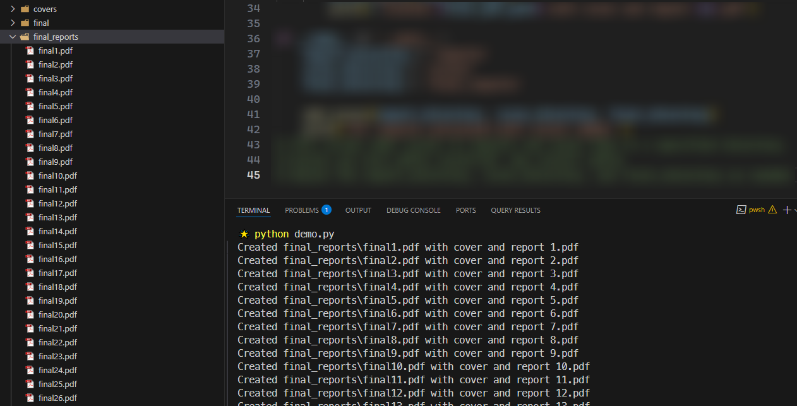

**图 9-11：改用 pdfrw 模块重写 PDF 合并工具脚本实测结果截图**

时隔近一年不得不承认，尽管 `Copilot` 用到的 `GPT-4.1` 模型可能不如 `Claude 3.5` 强大，但其具备的辅助编程能力已经可以胜任日常环境下的绝大部分重复性强的任务了。


### 4.4 基本流程梳理

最后再复盘梳理一下本示例场景下的基本处理流程（尤其是涉及中途变更 Python 模块的情况），如图 9-12 所示：

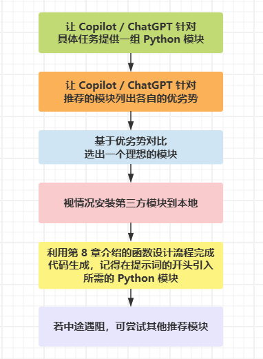

**图 9-12：考虑换用其他 Python 模块时的 Copilot 辅助编程基本流程**


## 5 示例3：自动合并手机相册

### 5.1 确认需求

这个应用场景就很常见了：一大家子人出门旅游一大圈后，想把所有人拍的旅游相片汇总到一块。此时每人手机中的照片都不全，还可能有彼此重复的图片。为了对得起本章最后一个出场的压轴案例，再上点难度：文件名相同的图片未必是同一张图片，内容相同的图片文件名也可能不一样。要求：利用 `Python` 脚本实现这样的相册批量去重汇总。

整理一下需求：已知某个演示目录下有两个图片目录 `pictures1` 和 `pictures2`，分别包含 `98` 张和 `112` 张格式均为 `.png` 的图片。其中内容重复的共有 `10` 张，且同名图片的内容未必相同。编写一段 `Python` 脚本来合并两个图片目录，要求对同名不同内容的图片重命名（每重复一次，新文件名末尾追加一个下划线 `_`）。

图片同名或内容重复情况如下图 9-13 所示：

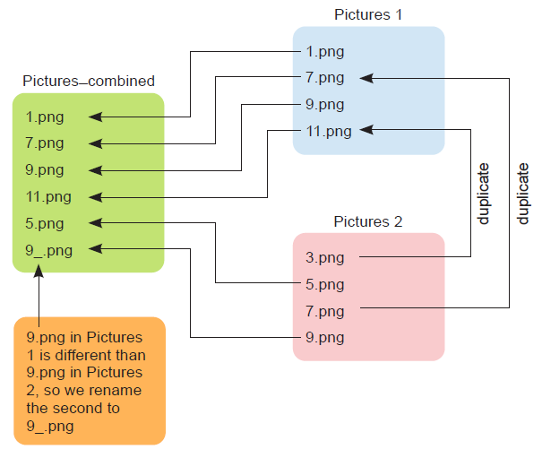

**图 9-13：图片去重合并过程中可能出现的同名、同质及重命名规则示意图**


### 5.2 方案海选

先询问拷贝文件的方法，直接对话 `GIthub Copilot`：

> **我**：I need to write a Python program that copies files. How do I do this?
>
> **GIthub Copilot**：You can use Python’s built-in `shutil` module to copy files. Here’s a simple example:
>
> ```python
> import shutil
> 
> # Copy file from source to destination
> source = 'path/to/source/file.txt'
> destination = 'path/to/destination/file.txt'
> 
> shutil.copy2(source, destination)  # copy2 preserves metadata
> ```
>
> Replace the paths with your actual file locations. This will copy the file and preserve its metadata.

虽然 `GPT-4.1` 也是答的 `shutil` 模块，但没有像书中那样主动提示重复操作会覆盖之前的目标文件，可能是出现了些许弱化吧，好在问题不大。

接着再进一步确认 `shutil` 是否为内置模块：

> **我**：Is this shutil module built into Python?
>
> **GIthub Copilot**：Yes, the `shutil` module is built into Python’s standard library. You do not need to install anything extra to use it.

确实是，复制逻辑就这样吧；再来看去重的操作，文件名并不能作为内容相同的依据，需要另想办法：

> **我**：Using Python, how can I determine whether .png files are the same?
>
> **GIthub Copilot**：To determine whether two `.png` files are the same in Python, you can compare their contents using a hash function. Here’s an example using `hashlib`:
>
> ```python
> import hashlib
> 
> def file_hash(filepath):
>     hasher = hashlib.sha256()
>     with open(filepath, 'rb') as f:
>         for chunk in iter(lambda: f.read(4096), b''):
>             hasher.update(chunk)
>     return hasher.hexdigest()
> 
> file1 = 'image1.png'
> file2 = 'image2.png'
> 
> if file_hash(file1) == file_hash(file2):
>     print("The .png files are the same.")
> else:
>     print("The .png files are different.")
> ```
>
> This compares the actual file contents, not just file names or metadata.

这次的提示内容就和书中完全不同了，简单测了一下，和 `filecmp.cmp()` 方法效果一样；但这里要处理的是多个图片的去重问题，因此进一步深入：

> **我**：What if I have hundreds of .png files and I want to find duplicates—is that approach you gave me still good?
>
> **GIthub Copilot**：Yes, using hashes is still a good approach for finding duplicates among hundreds of `.png` files. You can compute the hash for each file and group files with the same hash value. Here’s how you can do it:
>
> ```python
> import os
> import hashlib
> from collections import defaultdict
> 
> def file_hash(filepath):
>     hasher = hashlib.sha256()
>     with open(filepath, 'rb') as f:
>         for chunk in iter(lambda: f.read(4096), b''):
>             hasher.update(chunk)
>     return hasher.hexdigest()
> 
> folder = 'path/to/your/pngs'
> hash_map = defaultdict(list)
> 
> for filename in os.listdir(folder):
>     if filename.lower().endswith('.png'):
>         full_path = os.path.join(folder, filename)
>         h = file_hash(full_path)
>         hash_map[h].append(filename)
> 
> # Print duplicates
> for files in hash_map.values():
>     if len(files) > 1:
>         print("Duplicate files:", files)
> ```
>
> This will print lists of duplicate `.png` files found in the folder.

这次的效果就好多了：`Copilot` 没有像书中那样针对两个图片文件夹执行双重 `for` 循环，而是利用文件的哈希值来和指定文件夹中的所有图片进行比较。虽然只给出了单个文件夹路径的解决方案，实际改造时可以变更为多个文件夹。

最后再确认一遍用到的模块都是内置模块就行了：

> **我**：Are these modules used above, i.e. os, hashlib and collections all built into Python?
>
> **GIthub Copilot**：Yes, `os`, `hashlib`, and `collections` are all built into Python’s standard library. You do not need to install anything extra to use them.

至此，所有的技术难点都已经探明了。这里暂时不考虑代码的性能，牢记“先完成再完美”的道理，不要过早或过分优化代码。


### 5.3 设计思路

下面按照自上而下的设计思路对目标问题进行拆解。为了保护原始数据，应该将合并后的图片放到一个新的文件夹下，并且支持多文件夹合并。因此，可以将最顶层的函数命名为 `make_copies`。它有两个参数：一是待合并的相册文件夹路径数组，即支持多相册合并；另一个是新相册文件夹的路径，用于存放所有不重复的图片。函数签名如下：

```python
def make_copies(dirs, target_dir)
```

该函数将遍历每一个相册文件夹，并将其中的每一张图片同目标文件夹内的所有图片进行重复判定，以此决定是否复制到新文件夹：

- 若图片内容重复，则不执行复制；
- 若不重复，则复制到指定的新文件夹。根据文件名是否需要变更，这里又分两种情况：
  - 若文件名不重复，则保留该文件名，直接复制；
  - 若文件名重复，则按指定命名规则（加下划线）重命名后，再执行文件复制。

对于第一个逻辑分支，可以交给一个子函数 `make_copy()` 来处理；第二个分支在 `make_copy()` 内部，其中包含一个重命名的逻辑，同理，可以交给另一个子函数 `get_good_filename()` 来处理。

于是整个脉络就清晰了：


### 5.4 脚本实现

有了刚才的自上而下设计，实现过程则要反着来，每个函数都按照此前介绍过的套路，确定好函数签名、`docstring` 注释等等，最后让 `Github Copilot` 负责每个函数的脚本实现即可。

先来看 `get_good_filename()` 函数的签名，所需参数无非当前文件的完整路径，即 `fname`。一旦判定文件已存在，则在文件名末尾追加一个下划线，然后再次判定是否存在，直到不重复为止。因此函数签名和提示词可以设计如下：

```python
def get_good_filename(fname):
    '''
    fname is the name of a png file.
    
    While the file fname exists, add an _ character
    right before the .png part of the filename;
    e.g. 9595.png becomes 9595_.png.
    
    Return the resulting filename.
    '''
```

接着再来分析 `make_copy()` 函数，它是在遍历过程中，用于判定每张图片是否可以复制到目标文件夹的核心逻辑，因此必须包含一个图片路径和一个目标文件夹路径，具体设计如下：

```python
def make_copy(fname, target_dir):
    '''
    fname is a filename like pictures1/1262.png.
    target_dir is the name of a directory.
    
    Compare the file fname to all files in target_dir.
    If fname is not identical to any file in target_dir, copy it to target_dir
    '''
```

最后是最顶层的 `make_copy()` 函数，它将依赖 `make_copy()` 函数完成相册的遍历及后续处理，提示词设计如下：

```python
def make_copies(dirs, target_dir):
    '''
    dirs is a list of directory names.
    target_dir is the name of a directory.
 
    Check each file in the directories and compare it to all files 
    in target_dir. If a file is not identical to any file in 
    target_dir, copy it to target_dir
    '''
```

剩下的工作就是不停地按回车键，直到 `Github Copilot` 自动补全每个函数的函数体部分。

实测过程中发现，在 `demo.py` 文件中补全代码有时候并不能和 `Copilot Chat` 窗口中的内容保持一致，判定时又出现了书中的 `filecmp` 模块，生成了一段全新的代码逻辑。这很可能是 `VSCode` 在补全时意外调用了其他大模型。解决方案也很简单：清空旧代码，并按照 `Copilot Chat` 上下文将最关键的那句 `import hashlib` 复制到 `demo.py` 中，这样 `Copilot` 就知道按 `hashlib` 的方式补全剩余代码了。

补全所有函数后，再根据情况调用最外层函数即可：

```python
if __name__ == "__main__":
    dirs = ['pictures1', 'pictures2']
    target_dir = 'pictures_combined'
    if not os.path.exists(target_dir):
        os.makedirs(target_dir)
    make_copies(dirs, target_dir)
```

最终在命令行运行 `python demo.py` 即可验证结果：

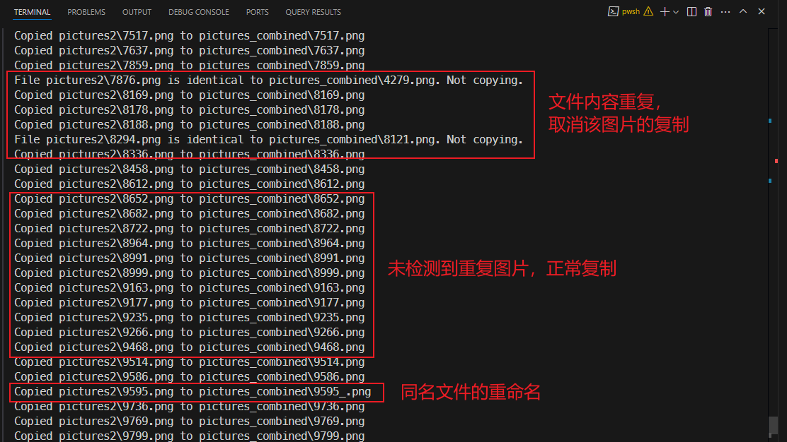

最后验证新文件夹的数量是否为 200：

```powershell
$ (ls ./pictures_combined).Count
200
```

大功告成。


## 6 本章小结

- 对于枯燥且机械重复的日常任务，可以尝试编制自动化工具来批量完成；
- 工具编程可充分利用现成的 Python 模块，无需事必躬亲；
- 活用 `Copilot Chat` 来决定具体依赖哪些 Python 模块；
- 在与 `Copilot` 对话时，可以通过优缺点对比完成方案海选阶段；
- Python 提供了大量开箱即用的工具模块：剪切板操作、PDF 操作、文件操作……


---

[^1]: 以表格形式输出是我后来加的，为了方便作对比。这里的提示词我都尽量坚持用英文，以免因中文数据集训练不足而导致提示内容出现较大的偏差。现在也应该没人再质疑掌握英文的重要性了吧。

