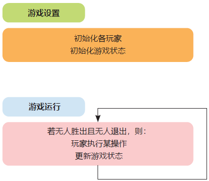
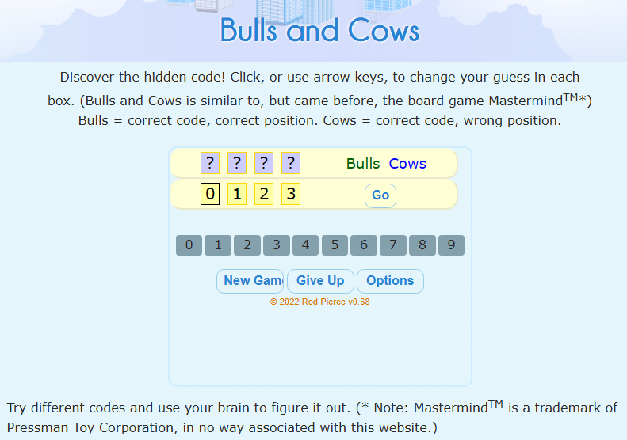
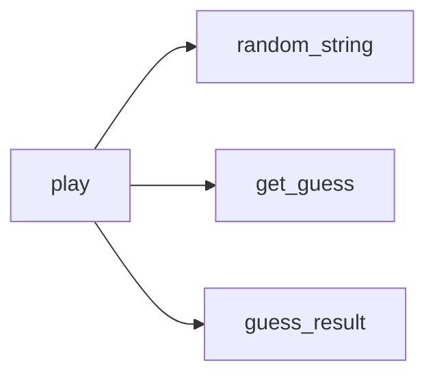
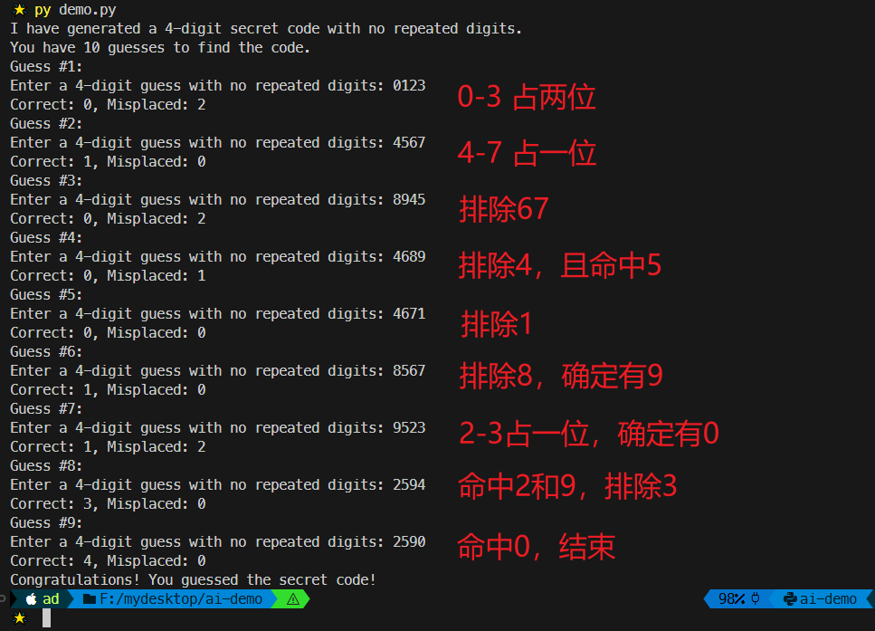
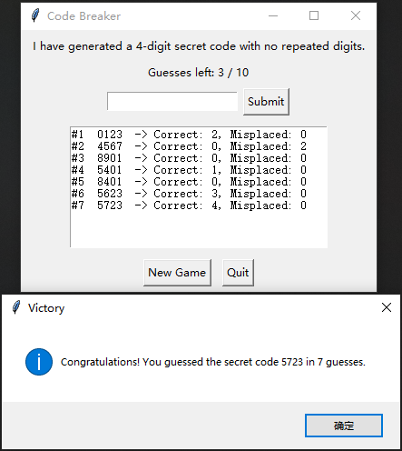
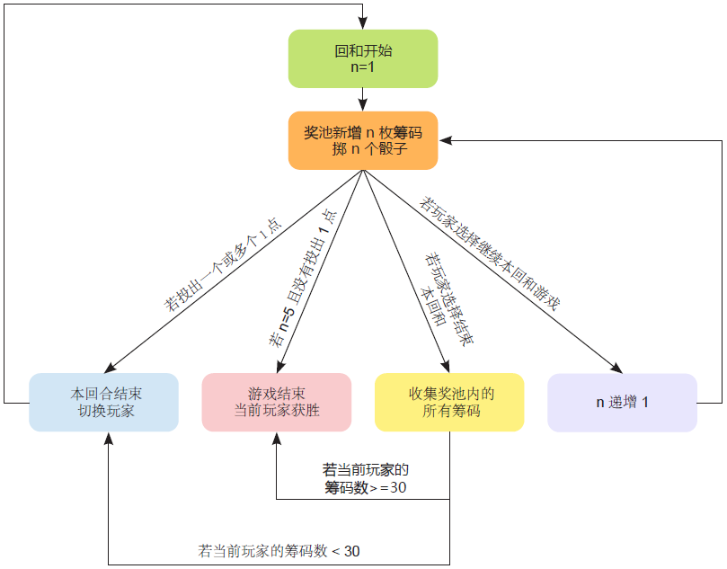

# Ch10: Making some games


> **本章概要**
>
> - 在程序中引入随机性；
> - 猜数游戏的设计与实现；
> - 掷骰游戏的设计与实现。

本章聚焦 AI 辅助编程在小型游戏中的落地应用。从随机性的使用入手，分别演示了两个小游戏的设计过程和 AI 辅助实现过程，旨在进一步强化问题分解能力和自顶向下的设计思维的培养。


## 10.1 关于游戏编程

本章重点介绍 2D 桌游。这类游戏应用通常包括两个阶段：

- 游戏准备阶段：对应 **设置函数（setup function）**，负责游戏的初始化；
- 游戏运行阶段：对应 **更新函数（update function）**，负责根据玩家操作或时间流逝来改变游戏状态；

以棋牌类游戏为例，通常由玩家轮流操作，若无人胜出则视为平局并重新开始。每次操作都会设计游戏状态的变更（棋盘布局、玩家资源等）。

基本流程如图所示：



**图 10.1 大多数电子游戏的基本流程**

入门游戏编程，推荐使用 `Python` 的 `pygame` 模块；深入钻研游戏设计可尝试 `Unity` 搞 3D 游戏开发。本章只基于 `Python` 基础语法简要演示 AI 编程在游戏开发中的具体应用，不涉及上述工具。


## 10.2 随机性的引入

通过 `Python` 内置模块 `random` 实现：

```python
>>> import random
>>> random.randint(0, 9)
5 # 值域：[0, 9)
>>> random.random()
0.27305746549408105 # 值域：[0, 1)
```

典型场景：

- 对方操作（骰子数、前进步数、攻击造成的伤害值等）；
- 谜题初始化布局（扫雷雷区分布等）；
- 表示事件概率（通常以浮点数形式）。


## 10.3 实战1：Bulls & Cows

### 10.3.1 玩法说明

类似 `Wordle` 词云游戏——

- 开局后，系统会生成一个无重复数字的四位数作为谜底；
- 玩家通过系统提示的命中和半命中数据反复尝试不同的数字组合，直到完全猜对为止（胜出）；
- 为了适当加大难度，本例还有 **最大尝试次数** 的限制：超过最大次数仍未能猜中谜底则宣布失败，游戏结束。

所谓的命中，就是指数字和所在的数位均和谜底一致的情况，其数量用 `Bulls` 表示；数字正确但数位错误，则为半命中，用 `Cows` 表示。

对 `Wordle` 不熟的朋友可以访问书中提供的 [免费网页版](https://www.mathsisfun.com/games/bulls-and-cows.html) 试玩：



**图 10.2 Bulls and Cows 线上免费版截图**


### 10.3.2 自上而下的设计思路

先用伪代码设计游戏流程：

```markdown
游戏设置阶段：
    随机生成谜底（secret_code）

游戏运行阶段：
while 尚未胜出 and 还有尝试次数:
    提示玩家输入猜测值（guess）
    读取有效的猜测值
    对比 gress 与 secret_code：
    if gress == secret_code:
        游戏胜出，提示玩家
    else
        给出 guess 的对比结果
    刷新总猜测次数

若玩家剩余次数为 0，则公布谜底，游戏结束。
```

根据伪代码，假设最顶层函数的名称为 `play`，则可以分为以下三个子函数：

1. `random_string`：用于系统生成四位字符串谜底，并确保每位数字不重复。谜底的数据类型之所以不能为整型数字，主要是不支持首位为 `0` 的情况，其次在提取每位数字时也不如字符串方便。
2. `get_guess`：用于生成玩家猜测结果，其中涉及一系列校验规则（位数也为 `4`、纯数字、无重复等），因此用该函数单独处理。
3. `guess_result`：有了谜底和猜测值，就可以计算对比结果了，即分别统计 `Bulls` 和 `Cows` 的值。这一步也较为繁琐，也放到子函数单独处理。

由于胜出条件就是简单的字符串比较，因此无需子函数；而尝试次数（假设为 10 次）的迭代和更新可以换成 `for` 循环，这样就不用手动维护剩余次数了，并且一旦遍历完所有次数都没猜对，则直接公布答案，宣布游戏结束。

这样 `play` 函数与三个子函数就可以确立为如下结构：



上述分析过程出现了两处硬编码：最大尝试次数 10 和谜底（或猜测值）的总位数 4。这在程序设计中叫做 **魔数（magic number）**。设计应用时应尽量避免出现魔数，可以改为从 `play` 函数传参：

```python
def play(num_digits=4, num_guesses=10):
```

运行过程中，参数 `num_guesses` 用于控制最外层 `for` 循环；而参数 `num_digits` 则可以分别传入前两个子函数，于是有了如下签名：

```python
def random_string(length=4):
    # snip
    
def get_guess(length=4):
    # snip
```

而最后的 `guess_result` 的参数列表就是以上两个子函数的返回值：

```python
def guess_result(guess, secret_code):
```

至此，问题分解环节就全部结束了，接下来是自底向上实现各个函数，用到的方法也是 `GitHub Copilot` 的实时补全功能，依据是紧跟在每个函数签名后的 `docstring` 描述。


### 10.3.3 自底向上的函数实现过程

根据上一节的问题拆解，先从子函数开始补全具体逻辑，再组合到顶层的 `play` 函数中。

#### 1 补全 random_string 函数

这里沿用第 7 章介绍的 `docstring` 的用法，先补全 `random_string` 的功能描述：

```python
def random_string(length=4):
    '''
    length is an integer
    
    Return a string of the given length, where each character 
    is a digit from 0 to 9, and with no repeated digits.
    '''
```

通过回车换行，`Copilot` 会逐行补全代码实现。经过一年多的打磨，`AI` 助手直接给出了最优方案：

```python
def random_string(length=4):
    # -- snip --
    digits = list('0123456789')
    random.shuffle(digits)
    return ''.join(digits[:length])
```


#### 2 补全 get_guess 函数

同理可得 `get_guess` 的功能描述内容，先说明参数列表，再给出整体的功能描述：

```python
def get_guess(length=4):
    '''
    length is an integer.
 
    Keep asking the player to enter a string where each character 
    is a digit from 0 to 9, until they enter a valid guess.
    A valid guess has the given length and has no repeated digits.
    '''
```

可能是吸收了第一版的训练数据，`Copilot` 直接给出了带校验提示信息的最佳版本，可读性大幅增强了：

```python
def get_guess(length=4):
    # -- snip --
    while True:
        guess = input(f'Enter a {length}-digit guess with no repeated digits: ')
        if len(guess) != length:
            print(f'Your guess must be {length} digits long.')
            continue
        if not guess.isdigit():
            print('Your guess must only contain digits from 0 to 9.')
            continue
        if len(set(guess)) != length:
            print('Your guess must not have repeated digits.')
            continue
        return guess
```


#### 3 补全 guess_result 函数

比较意外的是 `guess_result` 的补全结果，先按书中提示添加功能描述。为了增强代码的健壮性，还追加了两个测试用例：

```python
def guess_result(guess, secret_code):
    '''
    guess and secret_code are strings of the same length.
 
    Return a list of two values:
    the first value is the number of indices in guess where
    the character at that index matches the character at the
    same index in secret_code; the second value is the 
    number of indices in guess where the character at that 
    index exists at a different index in secret_code.
    
    >>> guess_result('3821', '1862')
    [1, 2]
    >>> guess_result('1234', '4321')
    [0, 4]
    '''
```

首次补全时，`Copilot` 给出了看似简洁的版本：

```python
def guess_result(guess, secret_code):
    # -- snip --
    correct_position = sum(g == s for g, s in zip(guess, secret_code))
    correct_digit = sum(min(guess.count(d), secret_code.count(d)) for d in set(guess)) - correct_position
    return [correct_position, correct_digit]
```

上述代码灵活运用了 `Python` 的列表展开式写法，统计命中数还算好懂，但半命中数的思路就有点过于跳跃了。为此，可以让 `Copilot` 给出解释：

> **我**：解释一下第52行（即上述代码第 4 行）
>
> **Copilot**：第52行是这一行：
>
> ```python
> correct_digit = sum(min(guess.count(d), secret_code.count(d)) for d in set(guess)) - correct_position
> ```
>
> 解释（简短）：
>
> - 先对 `guess` 中每个不同的数字 d（`set(guess)`）计算两者出现次数的较小值：`min(guess.count(d), secret_code.count(d))`，这给出“在两者中都出现的该数字的最大配对数”（处理重复数字）。
> - 对所有不同数字求和，得到“位置不考虑时共有多少个匹配的数字”。
> - 再减去 `correct_position`（前一行计算的完全位置匹配数），得到“存在于 `secret_code` 但位置不同的数字数目”。
>
> 举例：`guess='3821', secret='1862'`：
>
> - 各数字 `min` 总和 `= 3`（数字 1、2、8 三个在两边都出现）；
> - `correct_position = 1`（数字 8 在同一位置）；
> - `correct_digit = 3 - 1 = 2`（两位数字存在但位置不同）。
>
> 注意：这种写法清晰且能处理重复数字，但每次 `count` 是线性扫描，复杂度较高（字符串较长或大量调用时可优化）。

注意到最后一句，每次 `count` 会由于线性扫描产生性能问题，为什么旧版演示中没有这样写呢？仔细检查我的函数文档，原来 `Copilot` 没有理解 `guess_result` 的两个参数值都是做了去重处理的，因此用 `min` 函数 + `count` 函数来统计 `Cows` 的值。这再一次说明 `Copilot` 即便在同一语境下，仍然有可能丢失上下文中的关键信息，给出的代码实现只局限于当前函数，无法从全局理解该函数的实际作用（莫非是 `Copilot` 免费模型的锅？）。

找到原因就好办了，要么修改 `docstring`，要么直接在 `Copilot Chat` 窗口让它重写，于是有了以下改进版：

```python
def guess_result(guess, secret_code):
    # -- snip --
    # 第一步：位置完全相同的数字个数
    correct_position = sum(g == s for g, s in zip(guess, secret_code))
    
    # 第二步：数字存在但位置不同的个数
    # 由于 guess 和 secret_code 中都没有重复数字，
    # 只需检查 guess 中的每个数字是否在 secret_code 中出现过
    # 再排除已经在正确位置的数字
    correct_digit = sum(g in secret_code and g != s for g, s in zip(guess, secret_code))
    
    return [correct_position, correct_digit]
```

虽然没了 `min` 函数，但还是差点意思：明明是同一套遍历，却要重复运行一次来统计第二个指标，确实算不上智能。只能继续提示 `Copilot` 完善：

> **我**：还有点小问题，新版实现用了两次同样的 zip 遍历，其实两种情况可以放到一次遍历中进行
>
> **Copilot**：你说得对！可以在一次遍历中同时计算两个值。这样更高效：
>
> ```python
> def guess_result(guess, secret_code):
>     # -- snip --
>     correct_position = 0
>     correct_digit = 0
>     
>     for g, s in zip(guess, secret_code):
>         if g == s:
>             correct_position += 1
>         elif g in secret_code:
>             correct_digit += 1
>     
>     return [correct_position, correct_digit]
> ```
>
> 优化点：
>
> - 只遍历一次 `zip(guess, secret_code)`。
> - 在单次遍历中同时判断：位置是否相同，或数字是否存在但位置不同。
> - 时间复杂度：`O(n)`（n 为字符串长度）。
> - 代码逻辑清晰易懂。

到这里 `Copilot` 才给出书中的最佳实践版本。这说明 `LLM` 补全的内容还是离不开真人开发者的二次审核。信任依旧无法替代监督。


#### 4 补全 play 函数

补全所有子函数后，该轮到最顶层的 `play` 函数了。先添加函数 `docstring`：

```python
def play(num_digits=4, num_guesses=10):
    '''
    Generate a random string with num_digits digits.
    The player has num_guesses guesses to guess the random 
    string. After each guess, the player is told how many 
    digits in the guess are in the correct place, and how 
    many digits exist but are in the wrong place.
    '''
```

有了 `guess_result` 的小插曲，`play` 函数的实现非常顺利，直接给出“标准答案”了：

```python
def play(num_digits=4, num_guesses=10):
    # -- snip --
    secret_code = random_string(num_digits)
    print(f'I have generated a {num_digits}-digit secret code with no repeated digits.')
    print(f'You have {num_guesses} guesses to find the code.')
    for guess_num in range(num_guesses):
        print(f'Guess #{guess_num + 1}:')
        guess = get_guess(num_digits)
        correct_position, correct_digit = guess_result(guess, secret_code)
        print(f'Correct: {correct_position}, Misplaced: {correct_digit}')
        if correct_position == num_digits:
            print('Congratulations! You guessed the secret code!')
            return
            
    print(f'Sorry, you have used all your guesses. The secret code was {secret_code}.')
```


### 10.3.4 实测与完善

实测游戏前，先补全 `play` 函数的自动调用语句：

```python
if __name__ == '__main__':
    play()
```

然后在命令行中执行 `py demo.py`，实测过程如下：



**图 10.3 本地实测 Bulls and Cows 猜数游戏命令行版本**


纯命令行界面还是有点简陋，让 `Copilot` 提供一个 `GUI` 界面：

> **我**：你能将这个程序改为使用图形界面而不是文本界面吗？
>
> **Copilot**：下面把原来的命令行 `play` 替换为一个简单的 `tkinter` 图形界面实现；保留了 `random_string` 与 `guess_result` 的逻辑。将下面代码保存到 `f:\mydesktop\ai-demo\demo.py`（覆盖原文件或替换文件尾部的 `play` / **main** 部分）。
>
> （略）

由于 `GUI` 界面设计事件驱动编程，不适合作为 `Python` 入门知识演示，作者也没有深入考察，只是提供了一个参考资料[^1]。感兴趣的朋友可以自行深挖。

这里直接给出 `VSCode GitHub Copilot` 默认模型给出的 `GUI` 版实现：

```python
import random
# 替换命令行 play 为 tkinter GUI 实现
import tkinter as tk
from tkinter import messagebox

def random_string(length=4):
    '''
    length is an integer
    
    Return a string of the given length, where each character 
    is a digit from 0 to 9, and with no repeated digits.
    '''
    digits = list('0123456789')
    random.shuffle(digits)
    return ''.join(digits[:length])
    
def guess_result(guess, secret_code):
    '''
    guess and secret_code are strings of the same length.
 
    Return a list of two values:
    the first value is the number of indices in guess where
    the character at that index matches the character at the
    same index in secret_code; the second value is the 
    number of indices in guess where the character at that 
    index exists at a different index in secret_code.
    
    >>> guess_result('3821', '1862')
    [1, 2]
    >>> guess_result('1234', '4321')
    [0, 4]
    '''
    correct_position = 0
    correct_digit = 0
    
    for g, s in zip(guess, secret_code):
        if g == s:
            correct_position += 1
        elif g in secret_code:
            correct_digit += 1
    
    return [correct_position, correct_digit]


class CodeBreakerGUI:
    def __init__(self, master, num_digits=4, num_guesses=10):
        self.master = master
        self.num_digits = num_digits
        self.num_guesses = num_guesses
        self.secret_code = ''
        self.attempts = 0

        master.title('Bulls & Cows - Code Breaker Game')

        self.info_label = tk.Label(master, text='')
        self.info_label.pack(padx=10, pady=6)

        self.attempts_label = tk.Label(master, text='')
        self.attempts_label.pack(padx=10)

        entry_frame = tk.Frame(master)
        entry_frame.pack(pady=6)
        self.guess_entry = tk.Entry(entry_frame, width=20)
        self.guess_entry.pack(side=tk.LEFT, padx=(0,6))
        self.submit_btn = tk.Button(entry_frame, text='Submit', command=self.submit_guess)
        self.submit_btn.pack(side=tk.LEFT)

        self.history_text = tk.Text(master, width=40, height=10, state='disabled')
        self.history_text.pack(padx=10, pady=6)

        control_frame = tk.Frame(master)
        control_frame.pack(pady=6)
        self.new_btn = tk.Button(control_frame, text='New Game', command=self.new_game)
        self.new_btn.pack(side=tk.LEFT, padx=6)
        self.quit_btn = tk.Button(control_frame, text='Quit', command=master.quit)
        self.quit_btn.pack(side=tk.LEFT, padx=6)

        self.new_game()

    def new_game(self):
        self.secret_code = random_string(self.num_digits)
        self.attempts = 0
        self.info_label.config(text=f'I have generated a {self.num_digits}-digit secret code with no repeated digits.')
        self.update_attempts()
        self.clear_history()
        self.guess_entry.delete(0, tk.END)
        self.guess_entry.focus_set()
        self.submit_btn.config(state='normal')

    def update_attempts(self):
        remaining = self.num_guesses - self.attempts
        self.attempts_label.config(text=f'Guesses left: {remaining} / {self.num_guesses}')

    def append_history(self, text):
        self.history_text.config(state='normal')
        self.history_text.insert(tk.END, text + '\n')
        self.history_text.see(tk.END)
        self.history_text.config(state='disabled')

    def clear_history(self):
        self.history_text.config(state='normal')
        self.history_text.delete('1.0', tk.END)
        self.history_text.config(state='disabled')

    def validate_guess(self, guess):
        if len(guess) != self.num_digits:
            messagebox.showwarning('Invalid guess', f'Guess must be {self.num_digits} digits long.')
            return False
        if not guess.isdigit():
            messagebox.showwarning('Invalid guess', 'Guess must contain only digits 0-9.')
            return False
        if len(set(guess)) != self.num_digits:
            messagebox.showwarning('Invalid guess', 'Digits must not repeat.')
            return False
        return True

    def submit_guess(self):
        guess = self.guess_entry.get().strip()
        if not self.validate_guess(guess):
            return
        self.attempts += 1
        correct_position, correct_digit = guess_result(guess, self.secret_code)
        self.append_history(f'#{self.attempts}  {guess}  -> Correct: {correct_position}, Misplaced: {correct_digit}')
        self.update_attempts()
        self.guess_entry.delete(0, tk.END)
        if correct_position == self.num_digits:
            messagebox.showinfo('Victory', f'Congratulations! You guessed the secret code {self.secret_code} in {self.attempts} guesses.')
            self.submit_btn.config(state='disabled')
        elif self.attempts >= self.num_guesses:
            messagebox.showinfo('Game Over', f'Sorry, you used all guesses. Secret code was: {self.secret_code}')
            self.submit_btn.config(state='disabled')

if __name__ == '__main__':
    root = tk.Tk()
    app = CodeBreakerGUI(root, num_digits=4, num_guesses=10)
    root.mainloop()
```

实测效果如下（明显更智能）：



**图 10.4 由 Copilot Chat 提供的 GUI 版 Bulls and Cows 游戏实测界面**


## 10.4 实战2：Bogart

### 10.4.1 游戏规则

本章要演示开发的第二个小游戏名叫 `Bogart`，是一款根据同名游戏改编简化后的双人掷骰子游戏。原版游戏最初是为华盛顿州西雅图的 **Dalmuti's Restaurant** 餐馆设计的，后来经过修订更名为 `Crash` 出售。由于这也是本书上一版的最后一个实战案例，难度也是压轴级的，看看它的游戏规则就知道了——

开局前，奖池内先由系统放入 1 枚筹码（chip），随机选取一方掷骰子。若点数为 1 则出局，直接换人；否则由玩家决定是继续：

- 如果放弃，则拿走奖池内的所有筹码，换另一玩家掷骰子（系统又从放 1 枚筹码、掷 1 个骰子开始）；
- 如果继续，则系统将向奖池内再投放 2 枚筹码，同时骰子数也变为 2，然后再投掷；

投掷过程中，只要出现一次 1 点，就直接出局换人；否则再次决定是否继续：放弃则拿走奖池筹码并换人；继续则系统再投放 3 枚筹码，骰子也变为 3 个……以此类推，直到任一玩家获得的筹码超过 30 枚、或者骰子已经追加到 5 个的一方，为最终获胜方，游戏方才结束。


### 10.4.2 游戏流程拆解

要开发这样一款游戏，最核心的任务在于梳理出它的游戏流程图（这一步作者完全让开发者解决，不借助 AI）：



该游戏原始版本的说明我也看了，有必要补充两个细节：

- 原本是设计的 2 至 6 人同时参与，随机选一人开始后沿顺时针切换玩家，本例简化为两人互换；
- 原版每次追加筹码都是从一个筹码库（**Bank**）直接追加，而不是让玩家自掏腰包。


### 10.4.3 自顶向下的流程设计

对照上面梳理的游戏流程，就可以大体梳理出如下的执行顺序：

1. 初始化奖池，并让 **玩家 1** 和 **玩家 2** 的筹码归零（游戏设置阶段的任务）；
2. 随机选择 **玩家 1** 或 **玩家 2** 开始游戏（游戏设置阶段的任务）；
3. 进入游戏运行阶段：在游戏结束前，循环执行下列操作：
   1. 打印奖池筹码数、**玩家 1** 筹码数、以及 **玩家 2** 的筹码数。
   2. 当前玩家体验一轮完整回合（投掷、决定）。
   3. 若当前玩家决定拿钱走人，则拿走奖池筹码，奖池筹码数归零。
   4. 换另一位玩家开始游戏。
4. 游戏结束：打印赢得比赛的玩家名称（**玩家 1** 或 **玩家 2**）。

仔细观察上述流程，看看哪些节点可以直接编程，哪些需要抽取子函数独立完成。很明显，除了 `3.2`、`3.3`、`3.4` 以外，其余步骤都是简单的赋值和结果输出，不涉及很复杂的游戏交互逻辑，因此都可以不创建子函数完成。于是剩下这三个步骤：

2. 当前玩家体验一次完整回合。
3. 若当前玩家决定拿钱走人，则拿走奖池筹码，奖池筹码数归零。
4. 换另一位玩家开始游戏。

其中


---

[^1]: 该参考资料是由作者 **A. Sweigart** 编写的《Invent Your Own Computer Games with Python》第 4 版，2016 年由 **No Starch Press** 出版发行。中译本《Python游戏编程快速上手 第4版》。

