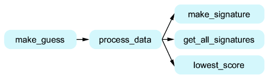
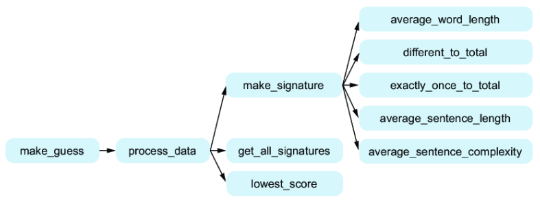

# Ch11: Creating an authorship identification program


> **本章概要**
>
> - 作者识别程序的自顶向下设计方案；
> - 了解代码重构及其必要性。

本章是第二版新增内容，算是弥补了第一版在案例选取上略显陈旧的问题。本章围绕基于机器学习的作者识别程序，完整演示了其从设计到实现的全流程。虽然还有一些细节还有深入讨论，但对于本书定位的目标人群——初步具备编程意识的开发小白而言，已经可以一窥机器学习的神奇了，至少知道一些耳熟能详的热词是怎样落地的了。


## 11.1 需求描述

构建一款 AI 应用程序，来识别某部悬疑小说（摘要）可能的作者（即作者身份认定）。已知四个不同作家的小说作品选段，现有另外四个未知选段，要求利用该 AI 应用，分别识别出最有可能的作者。


## 11.2 关于机器学习

本章探讨的作者识别，属于机器学习（**Machine Learning**）的范畴。机器学习是人工智能的一个重要分支，旨在帮助计算机通过数据 **学习** 来进行预测。

机器学习包含多种形式，本章采用的是 **监督学习（supervised learning）**。在本章介绍的监督学习中，需要提前制备训练数据集，其中包含 **训练对象** 及其 **已知类别（或标签）**。这里的对象即小说文本，类别（标签）即对应的作者。

对未知小说选段的作者识别，本质上是对该文本内容的归类，归到具体某位作者名下。


## 11.3 确定识别策略

本例采用的策略是为每个选段内容创建一个签名，已知作者的选段签名称为 **已知签名（*known signatures*）**，待识别的小说选段签名则称为 **未知签名（*unknown signature*）**。每个签名都基于文本内容的一组统计特征合成，例如每句平均单词数、句子的平均复杂度等，具体格式为一个特征数组。通过遍历已知签名，再利用一个基于经验的加权算法得到一组量化的文本内容差异指标，最终通过该指标的最小值匹配到最有可能的作者。

示例文件的基本结构如下：

```bash
F:\MYDESKTOP\CH11
│   unknown1.txt
│   unknown2.txt
│   unknown3.txt
│   unknown4.txt
│
└───known_authors
        Arthur_Conan_Doyle.txt
        charles_dickens.txt
        jane_austen.txt
        mark_twain.txt
```

可以看到，已知选段的文件名即为对应的作者。


## 11.4 小说选段的特征提取

本例选取了五个量化的文本统计特征来生成每个选段的签名，它们分别是——

- 单词的平均长度（Average word length）
- 不同单词的数量在总单词数中的占比（Different words divided by total words）
- 仅出现一次的词数在总单词数中的占比（Words used exactly once divided by total words）
- 每句话的平均单词数（Average number of words per sentence）
- 句子的平均复杂度（Average sentence complexity）：即每句话的短语个数。

这五个指标按顺序排列后，形成的统计结果就能形成该文字内容的一个特征向量。


## 11.5 自顶向下的设计思路

顶部函数命名为 `make_guess`，其内容包含三个阶段：

- 输入阶段：可能需要传一个目标文件的路径，无需单独创建子函数；
- 数据处理阶段：这是整个程序的核心逻辑，命名为 `process_data`，肯定需要再次细分子函数；
- 输出阶段：同输入阶段，无非就是打印一下最匹配的作者，也不用单独创建子函数。

在数据处理阶段，也可以梳理出三个子任务：

- 生成未知文本的签名：命名为 `make_signature`，即分别实现上节提到的五个文本特征，最终获得一组特征向量；
- 找出每本已知作者的文本签名：命名为 `get_all_signatures`。每个训练文本都可以用第一个子任务生成签名，然后与对应作者进行关联（通过字典等数据类型）；
- 对比未知签名和已知签名，找出最接近的那一个：命名为 `lowest_score`，从命名上也能大概猜到，这一步用到的对比算法会产生一个差异值。只要找到最小的差异值，对应的作者就是此次预测的最终结果。

于是，初步方案设计如下：



接下来破译 `make_signature` 的具体逻辑。按照提取的不同文本特征，需要创建五个不同的统计函数，它们分别是——

- `average_word_length`：顾名思义，就是先对每个单词的长度求和，然后除以总的单词数；
- `different_to_total`：统计给定文本共出现了多少个不同的单词，将其总数除以总的单词数；
- `exactly_once_to_total`：统计给定文本中只出现过一次的单词的总数，然后将其除以总的单词数；
- `average_sentence_length`：即统计每句话的平均单词数；
- `average_sentence_complexity`：这个稍微陌生点，统计的是给定文本的所有短句的数量，与句子总量的比值。它考察的是该作者是否擅长写短语或短句。

于是设计图又可以完善为如下版本：




