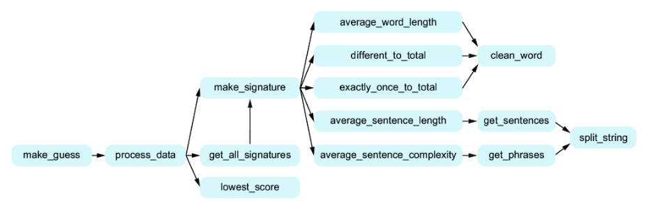
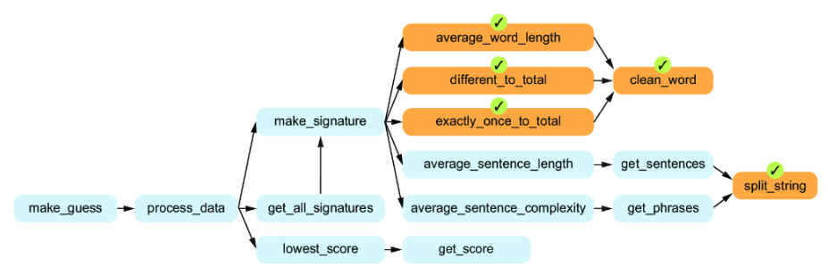
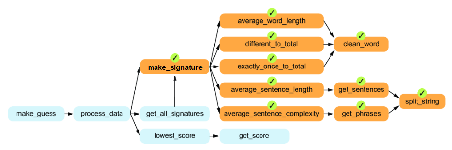
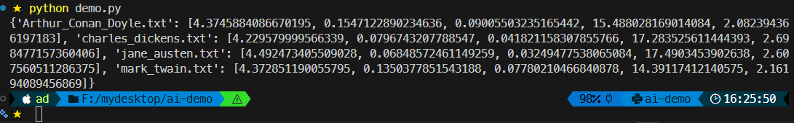
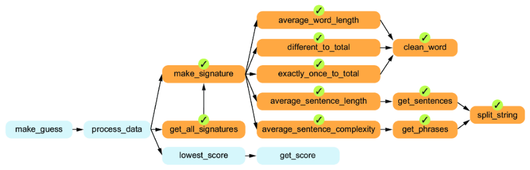
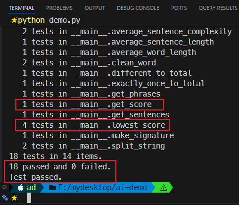
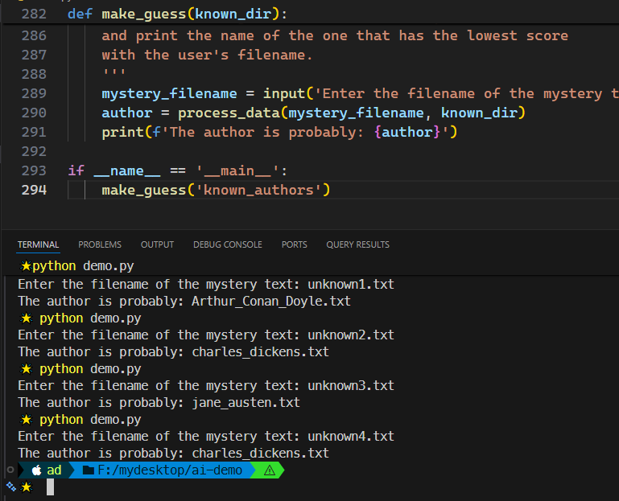

# Ch11: Creating an authorship identification program


> **本章概要**
>
> - 作者识别程序的自顶向下设计方案；
> - 了解代码重构及其必要性。

本章是第二版新增内容，基于监督学习的作者识别程序，完整演示了其从设计到实现的全流程，算是弥补了第一版在案例选取上略显陈旧的问题。虽然还有一些细节未能深入讨论，但对于本书定位的目标人群——初步具备编程意识的开发小白而言，已经可以一窥机器学习的神奇了，至少知道一些耳熟能详的热词是怎样落地的了。


## 11.1 需求描述

构建一款 AI 应用程序，来识别某部悬疑小说（摘要）可能的作者（即作者身份认定）。已知四个不同作家的小说作品选段，现有另外四个未知选段，要求利用该 AI 应用，分别识别出最有可能的作者。


## 11.2 关于机器学习

本章探讨的作者识别，属于机器学习（**Machine Learning**）的范畴。机器学习是人工智能的一个重要分支，旨在帮助计算机通过 **数据学习** 来进行 **预测**。

机器学习包含多种形式，本章采用的是 **监督学习（supervised learning）**。在本章介绍的监督学习中，需要提前制备训练数据集，其中包含 **训练对象** 及其 **已知类别（或标签）**。这里的对象即小说文本，类别（标签）即对应的作者。

对未知小说选段的作者识别，本质上是对该文本内容的归类，归到具体某位作者名下。


## 11.3 确定识别策略

本例采用的策略是为每个选段内容创建一个签名，已知作者的选段签名称为 **已知签名（*known signatures*）**，待识别的小说选段签名则称为 **未知签名（*unknown signature*）**。每个签名都基于文本内容的一组统计学特征进行合成，例如每句平均单词数、句子的平均复杂度等，具体格式为一个特征数组。通过遍历已知签名，再利用一个基于平时经验的加权算法得到一组量化的文本内容差异指标，最终通过该指标的最小值匹配到最有可能的作者。

示例文件的基本结构如下：

```bash
F:\MYDESKTOP\CH11
│   unknown1.txt
│   unknown2.txt
│   unknown3.txt
│   unknown4.txt
│
└───known_authors
        Arthur_Conan_Doyle.txt
        charles_dickens.txt
        jane_austen.txt
        mark_twain.txt
```

可以看到，已知选段的文件名即为对应的作者。


## 11.4 小说选段的特征提取

本例选取了五个量化的文本统计特征来生成每个选段的签名，它们分别是——

- 单词的平均长度（Average word length）
- 不同单词的数量在总单词数中的占比（Different words divided by total words）
- 仅出现一次的词数在总单词数中的占比（Words used exactly once divided by total words）
- 每句话的平均单词数（Average number of words per sentence）
- 句子的平均复杂度（Average sentence complexity）：即每句话的短语个数。

这五个指标按顺序排列后，形成的统计结果就能形成该文字内容的一个 **特征向量**。


## 11.5 自顶向下的设计思路

顶部函数命名为 `make_guess`，其内容包含三个阶段：

- 输入阶段：可能需要传一个目标文件的路径，无需单独创建子函数；
- 数据处理阶段：这是整个程序的核心逻辑，命名为 `process_data`，肯定需要再次细分子函数；
- 输出阶段：同输入阶段，无非就是打印一下最匹配的作者，也不用单独创建子函数。

重点分析数据处理阶段。它也可以梳理出三个子任务：

- 生成未知文本的签名：命名为 `make_signature`，即分别实现上节提到的五个文本特征，最终获得一组特征向量；
- 找出每本已知作者的文本签名：命名为 `get_all_signatures`。每个训练文本都可以用第一个子任务生成签名，然后与对应作者进行关联（通过字典等数据类型）；
- 对比未知签名和已知签名，找出最接近的那一个：命名为 `lowest_score`，从命名上也能大概猜到，这一步用到的对比算法会产生一个差异值。只要找到最小的差异值，对应的作者就是此次预测的最终结果。

于是，初步方案设计如下：


接下来破译 `make_signature` 的具体逻辑。按照提取的不同文本特征，需要创建五个不同的统计函数，它们分别是——

- `average_word_length`：顾名思义，就是先对每个单词的长度求和，然后除以总的单词数；
- `different_to_total`：统计给定文本共出现了多少个不同的单词，将其总数除以总的单词数；
- `exactly_once_to_total`：统计给定文本中只出现过一次的单词的总数，然后将其除以总的单词数；
- `average_sentence_length`：即统计每句话的平均单词数；
- `average_sentence_complexity`：这个稍微陌生点，统计的是给定文本的所有短句的数量，与句子总量的比值。它考察的是该作者是否擅长写短语或短句。

于是设计图又可以完善为如下版本：


上图展示的五个统计维度，还可以进一步拆分出公共部分。例如，前三个特征与字词相关，虽然可以用 `split` 方法将字符串按空格拆分为多个英文单词，但当中可能还混入了标点符号，需要做进一步的数据清洗，于是可以抽离出一个公共函数 `clean_word`。而在最后两个与句子相关的特征中，可以分别提取出获取短语和获取单句两个子任务，并且二者只存在分隔符的不同，处理流程基本是相同的，因此还可以再提炼出一个公共方法 `split_string`。

分析到这里，作者顺便提了一下拆分的粒度问题：如何判断这样的问题拆分是恰到好处的呢？既不显得笼统，又不致于过度拆分？这个问题还真没有标准公式可以照搬，都是根据经验慢慢摸索来的。按照作者的意思，指导原则就是试错：通过对比拆分前后程序的可控性来综合判断（同样是定性结论，无法定量描述）。

> [!tip]
>
> **把握问题拆分合理的度的 DeepSeek 版解释**
>
> 这个问题 `DeepSeek` 给出的答案更加令人信服——遵循两个基本原则：一是 **高内聚、低耦合**；二是 **单一职责原则**。
>
> 具体的评价维度是：
>
> 1. 可命名性：能否用一个 **精确、清晰、不含“且”、“或”** 的名字来描述这个子模块或函数；
> 2. 可测试性：能否为这个子模块/函数**独立地**（不依赖其他未完成的复杂模块）编写一个**简单**的单元测试；
> 3. 可理解性：其他程序员（或者一个月后的你自己）能否在 **几分钟内** 看懂该模块的代码和功能，而无需深入内部细节；
> 4. 可实现性：能否用 **一段清晰的、自然的语言提示词** 向AI描述这个子任务，并期望AI能生成基本正确、可用的代码。
>
> 窃以为 `DeepSeek` 给出的这四个黄金准则很好地揭示了问题拆分环节的精髓。

至于 `get_all_signature`，可以看做 `make_signature` 的批量操作，区别在于生成的签名还需要与对应的作者进行关联，即通过字典来实现。

最后是 `lowest_score` 的拆分。根据前面确定的思路，已知签名中的每个元素都要与未知签名计算出一个加权后的差异值，然后再找出这些差异值的最小值。因此单独计算两个签名的差异值就可以单列出一个子函数，方便后续反复调用。根据实现的功能，命名为 `get_score`。

综上，可以再次更新演示案例的设计图：




## 11.6 各函数的具体实现

还是从各叶子节点开始。

### 11.6.1 实现 clean_word

首先是 `clean_word` 函数，参数是一个待清洗的单词字符串 `word`，返回一个全部小写的、首尾不含标点符号的纯单词字符串：

```python
def clean_word(word):
    '''
    word is a string.

    Return a version of word in which all letters have been
    converted to lowercase, and punctuation characters have been
    stripped from both ends. Inner punctuation is left untouched.
    
    >>> clean_word('Pearl!')
    'pearl'
    >>> clean_word('card-board')
    'card-board'
    '''
```

按回车后，`Copilot` 补全的内容如下：

```python
import string
return word.strip(string.punctuation).lower()
```

将 `import` 语句放到源码文件的首行，得到最终版本：

```python
import string

def clean_word(word):
    '''
    word is a string.

    Return a version of word in which all letters have been
    converted to lowercase, and punctuation characters have been
    stripped from both ends. Inner punctuation is left untouched.
    
    >>> clean_word('Pearl!')
    'pearl'
    >>> clean_word('card-board')
    'card-board'
    '''
    return word.strip(string.punctuation).lower()
```


### 11.6.2 实现 average_word_length

然后是 `average_word_length` 函数，统计每个单词的平均长度：

```python
def average_word_length(text):
    '''
    text is a string of text.

    Return the average word length of the words in text.
    Do not count empty words as words.
    Do not include surrounding punctuation.
    
    >>> average_word_length('A pearl! Pearl! Lustrous pearl! \
Rare. What a nice find.')
    4.1
    '''
    words = text.split()
    cleaned_words = [clean_word(word) for word in words if clean_word(word)]
    total_length = sum(len(word) for word in cleaned_words)
    if len(cleaned_words) == 0:
        return 0.0
    return total_length / len(cleaned_words)
```

最新版实现更精简，且考虑了除数为零的情况，更加智能。注意第 9 行和第 10 行长句换行的写法，第 10 行不能缩进，否则会引入多余的空白符号。


### 11.6.3 实现 different_to_total

这一步是计算出现过的单词的总数与总单词数的对比，考察的是文本单词的分散程度：

```python
def different_to_total(text):
    '''
    text is a string of text.

    Return the number of unique words in text
    divided by the total number of words in text.
    Do not count empty words as words.
    Do not include surrounding punctuation.

    >>> different_to_total('A pearl! Pearl! Lustrous pearl! \
Rare. What a nice find.')
    0.7
    '''
    words = text.split()
    cleaned_words = [clean_word(word) for word in words if clean_word(word)]
    unique_words = set(cleaned_words)
    if len(cleaned_words) == 0:
        return 0.0
    return len(unique_words) / len(cleaned_words)
```

新版实现更加依赖列表的展开式写法，也比原版更精简。


### 11.6.4 实现 exactly_once_to_total

`exactly_once_to_total` 函数用于计算给定文本中只出现过一次的单词在总单词数中的占比：

```python
def exactly_once_to_total(text):
    '''
    text is a string of text.
    
    Return the number of words that show up exactly once in text
    divided by the total number of words in text.
    Do not count empty words as words.
    Do not include surrounding punctuation.
    
    >>> exactly_once_to_total('A pearl! Pearl! Lustrous pearl! \
Rare. What a nice find.')
    0.5
    '''
    words = text.split()
    cleaned_words = [clean_word(word) for word in words if clean_word(word)]
    total_words = len(cleaned_words)
    word_count = {}
    for word in cleaned_words:
        word_count[word] = word_count.get(word, 0) + 1
    exactly_once_count = sum(1 for count in word_count.values() if count == 1)
    if total_words == 0:
        return 0.0
    return exactly_once_count / total_words
```

和原书中动态维护集合元素的思路不同，这里直接使用字典来统计单词出现的次数，更加符合人类直觉，也更容易理解，`doctest` 测试也是通过的。


### 11.6.5 实现 split_string

从这一步开始，进入句子相关的两个特征提取逻辑。该函数用于将指定字符串按指定的分隔符进行拆分，若分隔符为短语分隔符，则拆分为短语；若为单句分隔符，则拆分为不同的单句：

```python
def split_string(text, separators):
    '''
    text is a string of text.
    
    separators is a string of separator characters.
    
    Split the text into a list using any of the one-character
    separators and return the result.
    Remove spaces from beginning and end
    of a string before adding it to the list.
    Do not include empty strings in the list.
    
    >>> split_string('one*two[three', '*[')
    ['one', 'two', 'three']
    >>> split_string('A pearl! Pearl! Lustrous pearl! Rare. \
What a nice find.', '.?!')    
    ['A pearl', 'Pearl', 'Lustrous pearl', 'Rare', \
'What a nice find']
    '''
    result = []
    current_word = ''
    for char in text:
        if char in separators:
            cleaned_word = current_word.strip()
            if cleaned_word:
                result.append(cleaned_word)
            current_word = ''
        else:
            current_word += char
    cleaned_word = current_word.strip()
    if cleaned_word:
        result.append(cleaned_word)
    return result
```

最新版的 `Copilot` 补全结果和原书一致，其实这里也存在一个是否需要重构的问题：`L24` 至 `L26` 与后面的 `L30` 至 `L32` 明显重复了，是否有必要重构为一个通用方法呢？根据《JUnit 实战》第三版中提到的三次原则，也不是非重构不可。对于这样的情况，建议最好等所有功能都实现了再回过头来考察，以免出现提前过度优化的情况。

至此，整个特征提取环节的叶子节点就都实现了：




### 11.6.6 提取句子特征的逻辑实现

有了 `split_string` 函数，就能将涉及句子特征的四个函数快速实现了：

首先是 `get_sentences`：

```python
def get_sentences(text):
    '''
    text is a string of text.
    
    Return a list of the sentences from text.
    Sentences are separated by a '.', '?' or '!'.
    
    >>> get_sentences('A pearl! Pearl! Lustrous pearl! Rare. \
What a nice find.')
    ['A pearl', 'Pearl', 'Lustrous pearl', 'Rare', \
'What a nice find']
    '''
    return split_string(text, '.?!')
```

于是可以进一步实现 `average_sentence_length`：

```python
def average_sentence_length(text):
    '''
    text is a string of text.
    
    Return the average number of words per sentence in text.
    Do not count empty words as words.
    
    >>> average_sentence_length('A pearl! Pearl! Lustrous pearl! \
Rare. What a nice find.')
    2.0
    '''
    sentences = get_sentences(text)
    total_words = 0
    for sentence in sentences:
        words = sentence.split()
        cleaned_words = [clean_word(word) for word in words if clean_word(word)]
        total_words += len(cleaned_words)
    if len(sentences) == 0:
        return 0.0
    return total_words / len(sentences)
```

接着是 `get_phrases`：

```python
def get_phrases(sentence):
    '''
    sentence is a sentence string.
    
    Return a list of the phrases from sentence.
    Phrases are separated by a ',', ';' or ':'.
    
    >>> get_phrases('Lustrous pearl, Rare, What a nice find')
    ['Lustrous pearl', 'Rare', 'What a nice find']
    '''
    return split_string(sentence, ',;:')
```

然后是基于 `get_phrases` 构建的 `average_sentence_complexity`：

```python
def average_sentence_complexity(text):
    '''
    text is a string of text.
    
    Return the average number of phrases per sentence in text.
    
    >>> average_sentence_complexity('A pearl! Pearl! Lustrous \
pearl! Rare. What a nice find.')
    1.0
    >>> average_sentence_complexity('A pearl! Pearl! Lustrous \
pearl! Rare, what a nice find.')
    1.25
    '''
    sentences = get_sentences(text)
    total_phrases = 0
    for sentence in sentences:
        phrases = get_phrases(sentence)
        total_phrases += len(phrases)
    if len(sentences) == 0:
        return 0.0
    return total_phrases / len(sentences)
```

可以看到，新版实现中均增加了对除数为零的讨论，虽然代码行多了两行，但能让程序更加健壮。


### 11.6.7 实现 make_signature

这样，生成签名的 `make_signature` 函数所需要的所有子函数就全部完成了，`make_signature` 自身的实现简直不要太轻松，分别调用具体的子函数即可（但是提示词同样要严谨）：

```python
def make_signature(text):
    '''
    The signature for text is a list of five elements:
    average word length, different words divided by total words, 
    words used exactly once divided by total words,
    average sentence length, and average sentence complexity.
    
    Return the signature for text.    
    
    >>> make_signature('A pearl! Pearl! Lustrous pearl! \
Rare, what a nice find.')
    [4.1, 0.7, 0.5, 2.5, 1.25]
    '''
    return [
        average_word_length(text),
        different_to_total(text),
        exactly_once_to_total(text),
        average_sentence_length(text),
        average_sentence_complexity(text)
    ]
```

至此，演示程序最核心的功能模块就实现完毕了：




### 11.6.8 实现 get_all_signatures

这一步即平时经常听到的 **数据训练**：把现有的已知作者的文本内容逐一生成对应的特征向量，然后存入某个字典中备用。为了方便实现，训练数据统一放到一个文件夹下，训练时只需传入该路径，就能结合 `Python` 遍历文件夹的特性和刚才创建的 `make_signature` 函数，完成所有数据的特征向量提取工作：

```python
def get_all_signatures(known_dir):
    '''
    known_dir is the name of a directory of books.
    For each file in directory known_dir, determine its signature.
    
    Return a dictionary where each key is
    the name of a file, and the value is its signature.
    '''
    import os
    signatures = {}
    for filename in os.listdir(known_dir):
        if filename.endswith('.txt'):
            filepath = os.path.join(known_dir, filename)
            with open(filepath, 'r', encoding='utf-8') as f:
                text = f.read()
            signatures[filename] = make_signature(text)
    return signatures
```

最新版实现已经修复了第一版中没有提前导入 `os` 模块的问题，同样将其提到文件首行即可：

```python
import os
def get_all_signatures(known_dir):
    '''
    known_dir is the name of a directory of books.
    For each file in directory known_dir, determine its signature.
    
    Return a dictionary where each key is
    the name of a file, and the value is its signature.
    '''
    signatures = {}
    for filename in os.listdir(known_dir):
        if filename.endswith('.txt'):
            filepath = os.path.join(known_dir, filename)
            with open(filepath, 'r', encoding='utf-8') as f:
                text = f.read()
            signatures[filename] = make_signature(text)
    return signatures
```

这里可以简单测试一下，添加如下语句后在命令行执行 `python demo.py`：

```python
if __name__ == '__main__':
    print(get_all_signatures('known_authors'))
```

实测结果如下：



这就是用于作者识别的训练结果。

至此，函数实现的总进度如下：




### 11.6.9 实现匹配算法

即分别实现 `get_score` 和 `lowest_score` 函数。

究竟该如何对比两个特征向量，最后得到一个代表二者差异的量化指标呢？本例用到的算法是 **对各特征分量的差异加权求和**：

```math
D = \sum_{i=1}^{5} |x_i - y_i| \times w_i
```

因此，`get_score` 至少需要三个参数：未知签名向量、已知签名向量字典、以及权重列表：

```python
def get_score(signature1, signature2, weights):
    '''
    signature1 and signature2 are signatures.
    weights is a list of five weights.
        
    Return the score for signature1 and signature2.
        
    >>> get_score([4.6, 0.1, 0.05, 10, 2],\
                  [4.3, 0.1, 0.04, 16, 4],\
                  [11, 33, 50, 0.4, 4])
    14.2
    '''
    score = 0.0
    for i in range(5):
        score += weights[i] * abs(signature1[i] - signature2[i])
    return score
```

虽然第 14 行直接写成 5 也不影响结果，但为了避免出现魔数，同时也为了程序的可扩展性，还是应该改为动态计算：

```python
def get_score(signature1, signature2, weights):
    # -- snip --
    score = 0.0
    for i in range(len(signature1)):
        score += weights[i] * abs(signature1[i] - signature2[i])
    return score
```

有了 `get_score`，就可以放到 `lowest_score` 批量调用了：

```python
def lowest_score(signatures_dict, unknown_signature, weights):
    '''
    signatures_dict is a dictionary mapping keys to signatures.
    unknown_signature is a signature.
    weights is a list of five weights.
    Return the key whose signature value has the lowest 
    score with unknown_signature.
    
    >>> d = {'Dan': [1, 1, 1, 1, 1],\
             'Leo': [3, 3, 3, 3, 3]}
    >>> unknown = [1, 0.8, 0.9, 1.3, 1.4]
    >>> weights = [11, 33, 50, 0.4, 4]
    >>> lowest_score(d, unknown, weights)
    'Dan'
    '''
    lowest_key = None
    lowest_value = float('inf')
    for key, signature in signatures_dict.items():
        score = get_score(signature, unknown_signature, weights)
        if score < lowest_value:
            lowest_value = score
            lowest_key = key
    return lowest_key
```

再加入调试语句验证测试用例是否通过：

```python
if __name__ == '__main__':
    import doctest
    doctest.testmod(verbose=True)
```

实测结果：




### 11.6.10 实现 process_data

这一步就是集成刚实现的三个子函数，完成 `process_data` 函数的核心逻辑：

```python
def process_data(mystery_filename, known_dir):
    '''
    mystery_filename is the filename of a mystery book whose 
                     author we want to know.
    known_dir is the name of a directory of books.
    
    Return the name of the signature closest to 
    the signature of the text of mystery_filename.
    '''
    with open(mystery_filename, 'r', encoding='utf-8') as f:
        mystery_text = f.read()
    mystery_signature = make_signature(mystery_text)
    known_signatures = get_all_signatures(known_dir)
    weights = [11, 33, 50, 0.4, 4]
    return lowest_score(known_signatures, mystery_signature, weights)
```

上述实现纠正了旧版中默认字符集不匹配的问题，但也存在用户体验不够友好的问题，例如需要同时指定训练数据的文件夹路径和待检测的文本文件名。可以进行如下优化：训练路径相对固定，可以作为最终函数的配置项先行调用，执行过程中通过 `input` 函数动态填写要识别的文本内容的文件名，实时生成识别结果。这样用户体验更好。于是将 `process_data` 作为内部函数集成到最外层的 `make_guess` 函数中，具体实现如下：

```python
def make_guess(known_dir):
    '''
    Ask user for a filename.
    Get all known signatures from known_dir,
    and print the name of the one that has the lowest score 
    with the user's filename.
    '''
    filename = input('Enter filename: ')
    print(process_data(filename, known_dir))
```

实测结果（包含 4 个待识别文本）：



可以看到，所有 4 个示例文本全部通过实测，分别查看具体内容即可核对预测结果的正确性。经核实，全部预测成功，大功告成！


## 11.7 小结与复盘

本例通过一个监督学习的极简案例，将全书的核心知识点进行了一次综合应用。AI 辅助编程的关键在于前期对问题的拆解，中途对各模块、各子函数的签名设计、提示词模板设计，以及最后必要的测试用例的验证。通过反复实践自顶向下的问题拆分思想和自底向上的函数实现顺序，本质上是对开发者的逻辑思维水平有了更高的要求，不仅需要实现具体的功能模块，更需要简洁有力的语言进行描述，以及覆盖各种边界条件的测试用例的设计。这样才能让 AI 工具在特定的上下文中发挥最大优势，尽可能避免由于 LLM 自身的原因所产生的不确定性。

上述实现流程还有很多提升空间，例如权重的设计与微调、训练结果的缓存设计、通用模块的提取和重构等等，需要开发者不断实践，丰富 AI 辅助编程的实战经验，在人脑的主导下高效完成更多低效重复的繁琐开发任务。
