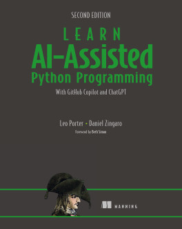

# 《Learn AI-assisted Python Programming, Second Edition》Learning Notes


## 1. Profiles



|    **Title**    | **Learn AI-assisted Python Programming, Second Edition** [ISBN: 9781633435995] |
| :-------------: | :----------------------------------------------------------: |
|   **Author**    |              **Leo Porter and Daniel Zingaro**               |
| **Publication** |                     **Manning, 2024.9**                      |
|    **Pages**    |                           **336**                            |

> **Introduction**
>
> **Whether you know Python or not, this book will help you write amazing Python code using the latest versions of Copilot or ChatGPT.
> 无论您是否了解 Python，这本书将帮助您使用最新版本的 Copilot 或 ChatGPT 编写出色的 Python 代码。**
>
> Once, to be a programmer you had to write every line of code yourself. Now tools like `GitHub Copilot` can instantly generate working programs based on your description in plain English. An instant bestseller, *Learn AI-Assisted Python Programming* has taught thousands of aspiring programmers how to write Python the easy way—with the help of AI. It’s perfect for beginners, or anyone who’s struggled with the steep learning curve of traditional programming.
> 曾几何时，成为一名程序员需要自己编写每一行代码。现在，像 `GitHub Copilot` 这样的工具可以根据你用简单英语描述的内容即时生成可工作的程序。这本畅销书《**Learn AI-Assisted Python Programming**》已经教会了成千上万的有志程序员如何借助 AI 轻松完成 `Python` 编程。它非常适合初学者或任何在传统编程的陡峭学习曲线上挣扎的人。
>
> In *Learn AI-Assisted Python Programming, Second Edition* you’ll learn how to:
> 在第二版的《**Learn AI-Assisted Python Programming**》中，您将学习如何：
>
> - Write fun and useful Python applications—no programming experience required!
>   编写有趣且实用的 Python 应用程序——无需编程经验！
> - Use the `GitHub Copilot` AI coding assistant to create Python programs
>   使用 `GitHub Copilot` AI 编程助手创建 Python 程序
> - Write prompts that tell `Copilot` exactly what to do
>   编写提示，告诉 `Copilot` 确切该做什么
> - Read Python code and understand what it does
>   阅读 Python 代码并理解其功能
> - Test your programs to make sure they work the way you want them to
>   编写测试程序，确保它们按你想要的方式工作
> - Fix code with prompt engineering or human tweaks
>   修复代码，使用提示词工程或人工干预
> - Apply Python creatively to help out on the job
>   创造性地应用 Python 来帮助工作
>
> AI moves fast, and so the new edition of *Learn AI-Assisted Python Programming, Second Edition* is fully updated to take advantage of the latest models and AI coding tools. Written by two esteemed computer science university professors, it teaches you everything you need to start programming Python in an AI-first world. You’ll learn skills you can use to create working apps for data analysis, automating tedious tasks, and even video games. Plus, in this new edition, you’ll find groundbreaking techniques for breaking down big software projects into smaller tasks AI can easily achieve.
> AI 发展迅速，因此《**Learn AI-Assisted Python Programming**》的新版本已全面更新，以利用最新的模型和 AI 编程工具。该书由两位受人尊敬的计算机科学大学教授撰写，教你在以 AI 为首的世界中开始编程 Python 所需的一切技能。你将学习可以用来创建数据分析、自动化繁琐任务甚至电子游戏的应用程序的技能。此外，在这个新版本中，你还会发现将大型软件项目分解为 AI 可以轻松实现的小任务的突破性技术。
>
> **about the technology 关于技术**
>
> The way people write computer programs has changed forever. Using GitHub Copilot, you describe in plain English what you want your program to do, and the AI generates it instantly.
> 人们编写计算机程序的方式已经永远改变。使用 GitHub Copilot，您可以用简单的英语描述您希望程序执行的操作，AI 会立即生成它。
>
> **about the book 关于这本书**
>
> This book shows you how to create and improve Python programs using AI—even if you’ve never written a line of computer code before. Spend less time on the slow, low-level programming details and instead learn how an AI assistant can bring your ideas to life immediately. As you go, you’ll even learn enough of the Python language to understand and improve what your AI assistant creates.
> 本书向您展示如何使用 AI 创建和改进 Python 程序——即使您从未编写过一行计算机代码。减少在缓慢、低级编程细节上的时间，而是学习 AI 助手如何立即将您的想法变为现实。在此过程中，您甚至会学到足够的 Python 语言，以理解和改进您的 AI 助手所创建的内容。
>
> **what's inside 里面有什么**
>
> - Prompts for working code
>   用于正式工作代码的提示词
> - Tweak code manually and with AI help
>   手动和借助 AI 帮助调整代码
> - AI-test your programs
>   用 AI 测试您的程序
> - Let AI handle tedious details
>   让人工智能处理繁琐的细节
>
> **about the reader 目标读者**
>
> If you can move files around on your computer and install new programs, you can learn to write useful software!
> 如果你可以在电脑上移动文件并安装新程序，你就可以学会编写有用的软件！
>
> **about the authors 关于作者**
>
> Dr. **Leo Porter** is a Teaching Professor at UC San Diego. Dr. **Daniel Zingaro** is an Associate Teaching Professor at the University of Toronto.
> 莱欧·波特博士是加州大学圣地亚哥分校的教学教授。丹尼尔·辛加罗博士是多伦多大学的副教学教授。


## 2. Outlines

Status available：:heavy_check_mark: (Completed) | :hourglass_flowing_sand: (Working) | :no_entry: (Not Started) | :orange_book: (Finish reading)

| No.  |                        Chapter Title                         |          Status          |
| :--: | :----------------------------------------------------------: | :----------------------: |
| Ch01 | [Introducing AI-assisted programming with GitHub Copilot](./Ch01-Introducing_AI-assisted_programming_with_GitHub_Copilot.md) |    :heavy_check_mark:    |
| Ch02 | [Getting started with Copilot](./Ch02-Getting_started_with_Copilot.md) | :hourglass_flowing_sand: |
| Ch03 |     [Designing functions](./Ch03-Designing_functions.md)     |        :no_entry:        |
| Ch04 | [Reading Python code: Part 1](./Ch04-Reading_Python_code_Part_1.md) |        :no_entry:        |
| Ch05 | [Reading Python code: Part 2](./Ch05-Reading_Python_code_Part_2.md) |        :no_entry:        |
| Ch06 | [Testing and prompt engineering](./Ch06-Testing_and_prompt_engineering.md) |        :no_entry:        |
| Ch07 |   [Problem decomposition](./Ch07-Problem_decomposition.md)   |        :no_entry:        |
| Ch08 | [Debugging and better understanding your code](./Ch08-Debugging_and_better_understanding_your_code.md) |        :no_entry:        |
| Ch09 | [Automating tedious tasks](./Ch09-Automating_tedious_tasks.md) |        :no_entry:        |
| Ch10 |       [Making some games](./Ch10-Making_some_games.md)       |        :no_entry:        |
| Ch11 | [Creating an authorship identification program](./Ch11-Creating_an_authorship_identification_program.md) |        :no_entry:        |
| Ch12 |       [Future directions](./Ch12-Future_directions.md)       |        :no_entry:        |


Powershell script for generating markdown files in batch:

```powershell
# Create 13 empty markdown files named Ch##.md:
for($i=1; $i -le 12; $i=$i+1){ New-Item -Name "Ch$('{0:d2}' -f $i).md"; }
```

 
